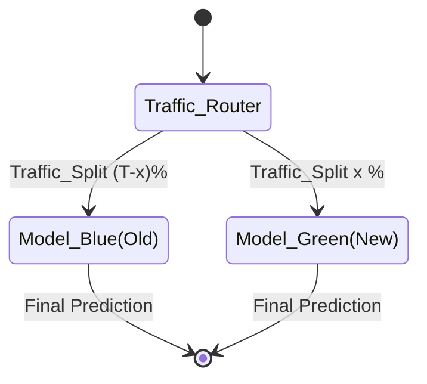

```mermaid
stateDiagram-v2 

[*] --> Traffic_Router 

Traffic_Router --> Model_Blue(Old) : Traffic_Split (T-x)%
Traffic_Router --> Model_Green(New) : Traffic_Split x %


Model_Blue(Old) --> [*] : Final Prediction
Model_Green(New) --> [*] : Final Prediction
```

In Blue Green Deployment, we switch from Blue model to Green model. This can happen drastically or gradually - depending on the code.