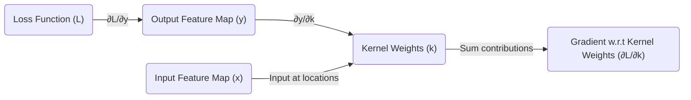

## Cross-Correlation Overview

In convolutional neural networks (CNNs), the forward pass involves a process known as cross-correlation. We typically have an input image or feature map denoted by $x$ and a kernel denoted by $k$. The cross-correlation operation is used to apply the kernel over the input image to produce an output feature map $y$.

The output at a particular location $(r, c)$ is calculated as follows:

$$
y(r, c) = (x * k)(r, c) = \sum_{a=0}^{k_1-1} \sum_{b=0}^{k_2-1} x(r + a, c + b) k(a, b)
$$

where $k_1$ and $k_2$ are the dimensions of the kernel, and the summations iterate over the spatial extent of the kernel.

## Backpropagation for Convolutional Layers

Backpropagation in CNNs aims to compute the gradient of the loss function with respect to each weight in the network. For a convolutional layer, this involves computing the gradient of the loss with respect to each element in the kernel.

Let's denote $L$ as the loss function, $h^{l}$ as the output of the $l^{th}$ layer, and $k$ as the kernel. The gradients are computed using the chain rule:

$$
\frac{\partial L}{\partial h^{l-1}} = \frac{\partial L}{\partial h^{l}} \frac{\partial h^{l}}{\partial h^{l-1}}
$$

and

$$
\frac{\partial L}{\partial k} = \frac{\partial L}{\partial h^{l}} \frac{\partial h^{l}}{\partial k}
$$

where $\frac{\partial L}{\partial h^{l-1}}$ is the gradient that will be passed back to the previous layer, and $\frac{\partial L}{\partial k}$ is the gradient used to update the kernel weights.

---
## Backpropagation: Derivative over All Output Pixels

In the backpropagation process for convolutional neural networks, the gradient of the loss function with respect to the kernel weights (the derivative of the loss function with respect to the kernel) is a crucial component for updating the weights during training. Here, we're focusing on how this gradient is computed by taking into account all the upstream gradients from the output pixels.

### Understanding the Chain Rule Application

The gradient computation involves applying the chain rule to propagate errors from the output back to the weights. Given an output feature map $y$, the kernel weights $k$, and the loss function $L$, we need to compute $\frac{\partial L}{\partial k(a', b')}$, which is the gradient of the loss function with respect to each weight in the kernel.

This gradient is calculated by accumulating the gradient contributions from all the pixels in the output feature map. The chain rule over all output pixels is mathematically expressed as:

$$
\frac{\partial L}{\partial k(a', b')} = \sum_{r=0}^{H-1} \sum_{c=0}^{W-1} \frac{\partial L}{\partial y(r, c)} \frac{\partial y(r, c)}{\partial k(a', b')}
$$

### Derivative of Output with Respect to Kernel

The derivative of the output $y(r, c)$ with respect to a kernel weight $k(a', b')$ is simply the value of the input at the corresponding location, which can be denoted as $x(r + a', c + b')$. Therefore, we have:

$$
\frac{\partial y(r, c)}{\partial k(a', b')} = x(r + a', c + b')
$$

### Calculating the Gradient Contributions

The final gradient with respect to the kernel weights is a sum of the products of the derivatives of the loss with respect to the output and the input at the corresponding locations. This is similar to the cross-correlation operation but in the context of gradients, and it is mathematically expressed as:

$$
\frac{\partial L}{\partial k(a', b')} = \sum_{r=0}^{H-1} \sum_{c=0}^{W-1} \frac{\partial L}{\partial y(r, c)} x(r + a', c + b')
$$

This equation shows that we are effectively performing a cross-correlation between the upstream gradient and the input feature map to calculate the gradient with respect to the kernel weights.

### Implementing the Gradient Calculation

In practice, this gradient calculation is implemented by flipping the kernel and performing cross-correlation between the flipped kernel and the upstream gradients. This approach ensures that the correct contributions of each weight to the gradient are accounted for, considering the overlapping nature of the convolution operation.

The diagram visualizes the flow from the loss function through the output feature map, considering the input feature map locations that correspond to each kernel weight, finally leading to the gradient with respect to the kernel weights.

> Most memory usage occurs in convolution layer

