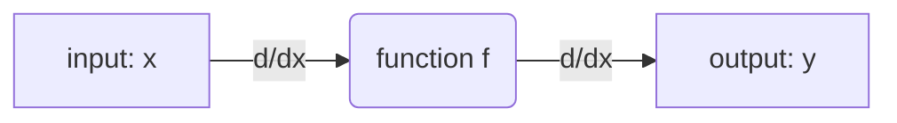
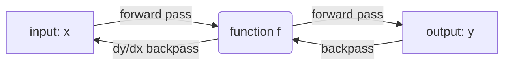

#DL 
## Need for Computation Graphs

> Basically to decompose a model into basic components, that are differentiable, to support gradient computations for [[gradient descent]]. The computation graph tends to be a Directed Acyclic Graph

- **Representation**: Computation graphs provide a visual and mathematical representation of complex functions, especially useful in neural networks.
- **Forward Flow Modeling**: They enable the modeling of the forward flow of data through a function, helping in understanding and debugging the process.
- **Gradient Flow**: Crucial for understanding how gradients (derivatives) flow through a network during backpropagation, which is essential for training neural networks.

## Automatic Differentiation (AutoDiff)

Automatic Differentiation is a key technique used in machine learning to compute derivatives efficiently. There are two primary modes of AutoDiff:

### Forward-mode AutoDiff

- **Gradient Propagation**: In forward-mode AutoDiff, gradients are calculated and passed forward through the network simultaneously with the function evaluation.
- **Use-case**: More efficient for functions with fewer inputs than outputs, as it computes derivatives one input at a time.
- **Mechanism**: It computes the derivative of each operation or function with respect to its inputs and passes these derivatives forward through the graph.
> In Forward mode, the denominator is a constant. (dx)
> Forward-mode is generally good when the number of inputs (n) is much less than outputs (m)




### Reverse-mode AutoDiff

- **Backpropagation**: This mode starts from the output and calculates gradients by moving backward through the network, which is why it's often referred to as backpropagation in the context of neural networks.
- **Common Usage**: More commonly used in machine learning, especially in training deep neural networks.
- **Efficiency**: Particularly efficient for functions with more outputs than inputs, as it computes all partial derivatives of output with respect to a single input in one backward pass.
- **Mechanism**: It involves a forward pass to compute function values, followed by a backward pass to compute gradients with respect to each input.

> In  reverse mode, the denominator is a constant. (dy)


Both modes of AutoDiff are crucial in different scenarios and understanding them helps in optimizing the training and performance of machine learning models.


## Numerator and Denomiator Layout

When discussing the Jacobian matrix in the context of partial derivatives of a function with respect to a vector of variables, the arrangement of the partial derivatives in the matrix can follow either the numerator layout or the denominator layout. These terms are based on the position of the differential in the fraction notation for derivatives.

Here is how you can describe both layouts using markdown for a function vector **f** with components $( f_1, f_2, f_3 )$ and a weight vector **w** with components $( w_1, w_2 )$.

### Numerator Layout:
In the numerator layout, the derivatives are arranged such that the rows correspond to the components of the function vector **f**, and the columns correspond to the components of the weight vector **w**. 

The Jacobian matrix **J** in the numerator layout for a function **f** with respect to weights **w** would be:

```markdown
J = 
| ∂f₁/∂w₁ ∂f₁/∂w₂ |
| ∂f₂/∂w₁ ∂f₂/∂w₂ |
| ∂f₃/∂w₁ ∂f₃/∂w₂ |
```

The shape of the Jacobian matrix in the numerator layout would be [3,2], representing 3 functions and 2 weights.

### Denominator Layout:
Conversely, in the denominator layout, the derivatives are arranged such that the rows correspond to the components of the weight vector **w**, and the columns correspond to the components of the function vector **f**.

The Jacobian matrix **J** in the denominator layout for a function **f** with respect to weights **w** would be:

```markdown
J = 
| ∂f₁/∂w₁ ∂f₂/∂w₁ ∂f₃/∂w₁ |
| ∂f₁/∂w₂ ∂f₂/∂w₂ ∂f₃/∂w₂ |
```

The shape of the Jacobian matrix in the denominator layout would be [2,3], representing 2 weights and 3 functions.