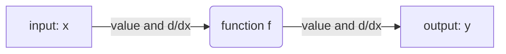
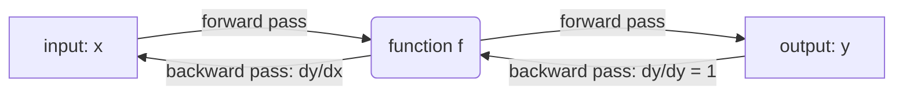

---
tags:
  - "ds-foundations"
---

A computational graph breaks a model into elementary differentiable operations so that gradients for [[Gradient Descent|gradient descent]] can be computed mechanically. Nodes are operations or variables, edges carry intermediate values, and for a single evaluation the graph is a directed acyclic graph (DAG).

## Why Use a Computational Graph

- **Representation.** A large function becomes a chain of small operations whose local derivatives are known.
- **Forward flow.** Evaluating the nodes in topological order computes the output and records the intermediate values needed later.
- **Gradient flow.** The chain rule becomes a local rule at each node, which is how backpropagation sends gradients through a network.

Frameworks build graphs in two styles. **Define-and-run** (static) systems construct the graph first and then execute it with different inputs. **Define-by-run** (dynamic) systems, such as PyTorch, record the graph while ordinary code runs, so loops and branches can change it on every iteration.[^baydin]

## Automatic Differentiation

Automatic differentiation (AD) evaluates exact derivatives of the program, to machine precision, by propagating derivative values alongside the ordinary computation. Consider $f : \mathbb{R}^n \to \mathbb{R}^m$ with $n$ inputs and $m$ outputs.[^baydin]

### Forward Mode

Each intermediate value $v_i$ carries a tangent $\dot{v}_i = \partial v_i / \partial x_j$ for one chosen input $x_j$. The *denominator* $\partial x_j$ is fixed for the whole pass.

- One forward pass gives one column of the Jacobian: the derivatives of **all outputs** with respect to **one input**.
- The full Jacobian needs $n$ passes, so forward mode suits $n \ll m$.
- Seeding the tangents with a vector $r$ computes a Jacobian–vector product $J r$ in a single pass.

```mermaid
graph LR
    A[input: x] -->|value and d/dx| B(function f)
    B -->|value and d/dx| C[output: y]
```

### Reverse Mode

The first phase runs forward and stores the intermediate values. The second phase propagates adjoints $\bar{v}_i = \partial y / \partial v_i$ from the output back to the inputs. Here the *numerator* $\partial y$ is fixed.

- One reverse pass gives one row of the Jacobian: the derivatives of **one output** with respect to **all inputs**.
- The full Jacobian needs $m$ passes, so reverse mode suits $m \ll n$.
- A training loss is a scalar ($m = 1$) with millions of parameters, so one reverse pass yields the whole gradient. Backpropagation is reverse-mode AD applied to that loss.
- The cost is memory: stored intermediates can grow with the number of operations. Checkpointing trades recomputation for memory.

For the whole Jacobian, forward mode costs about $n \cdot c \cdot \mathrm{ops}(f)$ and reverse mode about $m \cdot c \cdot \mathrm{ops}(f)$, where $\mathrm{ops}(f)$ is the cost of evaluating $f$ and $c$ is a small constant (below 6, typically 2–3).[^baydin]

```mermaid
graph LR
    A[input: x] -- forward pass --> B(function f)
    B -- forward pass --> C[output: y]
    C -- backward pass: dy/dy = 1 --> B
    B -- backward pass: dy/dx --> A
```

## Worked Example

The survey by Baydin et al. uses this function:[^baydin]

$$
y = f(x_1, x_2) = \ln x_1 + x_1 x_2 - \sin x_2, \qquad (x_1, x_2) = (2, 5)
$$

**Step 1: forward trace.** Introduce one intermediate per elementary operation:

$$
v_1 = \ln x_1 = 0.693, \quad v_2 = x_1 x_2 = 10, \quad v_3 = \sin x_2 = -0.959
$$

$$
y = v_1 + v_2 - v_3 = 11.652
$$

**Step 2: forward mode for $\partial y / \partial x_1$.** Seed $\dot{x}_1 = 1$ and $\dot{x}_2 = 0$, then apply each local derivative:

$$
\dot{v}_1 = \frac{\dot{x}_1}{x_1} = 0.5, \quad \dot{v}_2 = \dot{x}_1 x_2 + x_1 \dot{x}_2 = 5, \quad \dot{v}_3 = \dot{x}_2 \cos x_2 = 0
$$

$$
\frac{\partial y}{\partial x_1} = \dot{v}_1 + \dot{v}_2 - \dot{v}_3 = 5.5
$$

Getting $\partial y / \partial x_2$ would need a second forward pass seeded with $\dot{x}_2 = 1$.

**Step 3: reverse mode for both inputs.** Seed $\bar{y} = 1$. Then $\bar{v}_1 = 1$, $\bar{v}_2 = 1$ and $\bar{v}_3 = -1$. Each input sums the contributions of every path that uses it:

$$
\bar{x}_1 = \bar{v}_1 \frac{1}{x_1} + \bar{v}_2 x_2 = 0.5 + 5 = 5.5
$$

$$
\bar{x}_2 = \bar{v}_2 x_1 + \bar{v}_3 \cos x_2 = 2 - 0.284 = 1.716
$$

One reverse pass produced both partial derivatives, while forward mode needed one pass per input. With millions of inputs and one scalar loss, that difference is why neural networks are trained with reverse mode. The summation in Step 3 is the multivariable chain rule: $x_1$ affects $y$ through both $v_1$ and $v_2$. These values were recalculated in Python.

## Pitfalls

- **Memory, not arithmetic, is often the limit.** Reverse mode must keep forward activations until the backward pass uses them.
- **Non-differentiable points.** Operations such as ReLU or $|x|$ have kinks, where frameworks return a chosen subgradient.
- **Differentiating an approximation.** AD differentiates the code as written, so the derivative of an approximating routine may be a poor approximation of the true derivative.[^baydin]

## Related Notes

- [[Backpropagation]] — Reverse mode applied to a network, with a worked two-layer example.
- [[Jacobians]] — Jacobian shapes, [[Jacobians#Numerator and Denominator Layout|numerator versus denominator layout]], and vector–Jacobian products.
- [[Gradient Descent]] — The manual, numerical, symbolic and automatic ways to get gradients.
- [[Vanishing & Exploding Gradients]] — What happens when many local derivatives are multiplied.
- [[Deep Learning]] — Where the graph sits in the training loop.

## References & Useful Links

[^baydin]: [Automatic Differentiation in Machine Learning: a Survey (Baydin et al., JMLR 2018)](https://arxiv.org/abs/1502.05767) — Forward and reverse modes, cost bounds, memory trade-offs, static versus dynamic graphs, and the worked example used above.

- [The Matrix Calculus You Need for Deep Learning (Parr and Howard)](https://explained.ai/matrix-calculus/index.html) — Forward versus backward differentiation from a dataflow perspective and the vector chain rule.