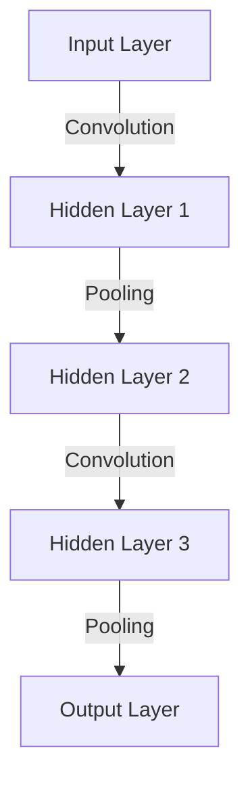

#dl 
### Convolutional Networks

> Convolutional networks, also referred to as CNNs,  are neural networks that uses convolution in plae of general matrix multiplication in at least one of their layers.
### Key Concepts

- **Grid Topology:** CNNs handle data in a grid pattern, suitable for 1-D (like audio signals) or 2-D data (like images).
- **Convolution Operation:** Fundamental to CNNs, it involves a mathematical operation that combines two functions to form a third one, emphasizing the contribution of nearby input features.
- **Pooling:** A downsampling operation that reduces dimensions, commonly included in CNN architectures to make the detection of features invariant to scale and orientation.
- **Layers:** CNNs typically use convolution in place of general matrix multiplication in at least one of their layers.

### Convolution Operation

Convolution is a mathematical operation on two functions, expressed as:

$$
s(t) = (x * w)(t)
$$

- $x(t)$: **Input signal**.
- $w(a)$: Weighting function, typically a **kernel** or **filter** in CNNs.
- $s(t)$: **Smoothed signal**, output of the convolution.

It is an integral that computes the overlap between $x(t)$ and a reversed and translated version of $w(a)$. Convolution is beneficial for noisy data, providing a weighted average that emphasizes recent measurements more strongly.

### Convolution Network Example

# Links

- [Exploring Convolutional Networks for End-to-End Learning][https://arxiv.org/abs/XXXX.XXXXX]
![Convolution Youtube Link][https://www.youtube.com/watch?v=KuXjwB4LzSA] 
![Probability Explainations][https://www.youtube.com/watch?v=IaSGqQa5O-M]