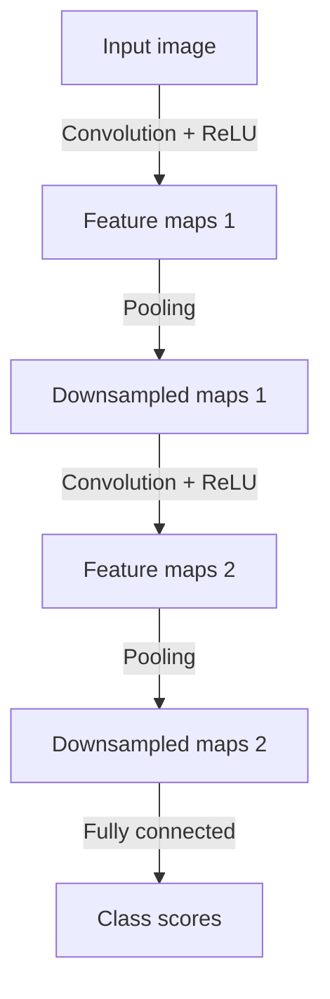

---
tags:
  - "ds-foundations"
---

Convolutional networks (CNNs) are neural networks that use convolution in place of general matrix multiplication in at least one of their layers. They are specialised for data with a known grid-like topology: time series as a 1-D grid of samples, and images as a 2-D grid of pixels.[^goodfellow]

## Key Concepts

- **Grid topology.** Inputs such as audio signals (1-D) or images (2-D, with colour channels as depth) have neighbours whose relationships matter.
- **Local connectivity.** Each output unit looks only at a small spatial region of the input, its *receptive field*, but through the full input depth.[^cs231n-cnn]
- **Parameter sharing.** The same filter is applied at every position. This assumes a feature useful in one place is useful elsewhere, and it reduces the parameter count dramatically.[^cs231n-cnn]
- **Convolution layers.** Several learnable filters each produce one activation map; the maps are stacked along the depth dimension.
- **Pooling.** A fixed operation, most often a max over $2 \times 2$ windows with stride 2, that downsamples each depth slice. It reduces spatial size, parameters and computation in later layers, and helps control overfitting.[^cs231n-cnn] Because it summarises a neighbourhood, the output changes little when a feature shifts slightly within a pooling window. Pooling does **not** make features invariant to scale or rotation.

## Convolution Operation

In one dimension, convolution combines an input signal $x$ with a weighting function (kernel) $w$ to produce a new signal $s$:

$$
s(t) = (x * w)(t) = \int x(a) \, w(t - a) \, da
$$

For discrete signals the integral becomes a sum:

$$
s(t) = \sum_{a} x(a) \, w(t - a)
$$

- $x$: the **input**, for example a noisy sensor reading over time.
- $w$: the **kernel** or **filter**.
- $s$: the output, or **feature map**. With a smoothing kernel it is a weighted average of nearby inputs.

The classic motivation is a noisy measurement: a weighted average that gives more weight to recent readings smooths the signal. In a CNN the kernel weights are learned rather than designed.

In two dimensions, most deep-learning libraries compute **cross-correlation**, which is convolution without flipping the kernel. PyTorch's `Conv2d` documentation describes its operator as a valid 2-D cross-correlation.[^pytorch-conv] Because the kernel is learned, the flip makes no practical difference. For a single-channel input $x$ and a $k_1 \times k_2$ kernel $k$:

$$
y(r, c) = \sum_{a=0}^{k_1 - 1} \sum_{b=0}^{k_2 - 1} x(r + a, \, c + b) \, k(a, b)
$$

## Dimension Formulae

**Notation.** Input width $W$, filter size $F$, stride $S$, zero-padding $P$ on each side, $C_{\text{in}}$ input channels and $K$ filters.

**Convolution output width** (height is analogous):[^cs231n-cnn]

$$
W_{\text{out}} = \left\lfloor \frac{W - F + 2P}{S} \right\rfloor + 1
$$

The output depth equals $K$. PyTorch's general formula adds dilation $d$ (spacing between kernel elements), and reduces to the formula above when $d = 1$:[^pytorch-conv]

$$
W_{\text{out}} = \left\lfloor \frac{W + 2P - d(F - 1) - 1}{S} + 1 \right\rfloor
$$

**Parameters in a convolution layer**, including one bias per filter:

$$
\text{params} = (F \cdot F \cdot C_{\text{in}} + 1) \cdot K
$$

**Pooling output width.** Pooling has no parameters, and its output width is:

$$
\frac{W - F}{S} + 1
$$

With stride 1, the following padding preserves the spatial size:[^cs231n-cnn]

$$
P = \frac{F - 1}{2}
$$

## Worked Example

**Inputs.** A $32 \times 32 \times 3$ image (CIFAR-10 size) and a convolution layer with $K = 16$ filters of size $5 \times 5$.

**Step 1: output size with stride 1 and padding 2.**

$$
W_{\text{out}} = \frac{32 - 5 + 2 \times 2}{1} + 1 = 32
$$

The output volume is $32 \times 32 \times 16$.

**Step 2: parameters.**

$$
(5 \cdot 5 \cdot 3 + 1) \cdot 16 = 76 \cdot 16 = 1{,}216
$$

**Step 3: output size with stride 2 and no padding.**

$$
W_{\text{out}} = \left\lfloor \frac{32 - 5}{2} \right\rfloor + 1 = 13 + 1 = 14
$$

**Step 4: comparison with a fully connected layer.** Mapping the same $32 \times 32 \times 3$ input to a $32 \times 32 \times 16$ output with a dense layer needs:

$$
3{,}072 \times 16{,}384 = 50{,}331{,}648 \ \text{weights}
$$

Local connectivity and parameter sharing reduce the layer from about 50 million weights to about 1,200 parameters, while still producing a full-resolution output. The values were recalculated in Python.

## Convolutional Network Example

A common pattern stacks convolution layers with non-linearities, periodically downsamples with pooling, and ends with fully connected layers that produce class scores.[^cs231n-cnn]

```mermaid
graph TD
    A[Input image] -->|Convolution + ReLU| B[Feature maps 1]
    B -->|Pooling| C[Downsampled maps 1]
    C -->|Convolution + ReLU| D[Feature maps 2]
    D -->|Pooling| E[Downsampled maps 2]
    E -->|Fully connected| F[Class scores]
```

## CNN Backpropagation

[[CNN - Backward Prop]] derives the gradients. In short, the backward pass of a convolution, for both the input and the weights, is also a convolution, with spatially flipped filters.[^cs231n-cnn]

## CNN Different Architectures

[[CNN Different Architectures]] covers AlexNet, VGG and related designs. Rather than designing an architecture from scratch, a practical default is to fine-tune a pretrained model; see [[Transfer Learning]].[^cs231n-cnn]

## Limitations and Pitfalls

- **Parameter sharing can be the wrong assumption.** For centred, structured inputs such as aligned face images, different positions need different features, and locally connected layers without sharing may fit better.[^cs231n-cnn]
- **Memory versus parameters.** Most memory and compute are spent on activations in early convolution layers, while most parameters often sit in the final fully connected layers. In VGGNet the first fully connected layer holds about 100 million of 140 million parameters.[^cs231n-cnn]
- **Hyperparameters that do not fit.** For example, $W = 10$, $F = 3$, $P = 0$, $S = 2$ gives a non-integer width:

  $$
  \frac{10 - 3}{2} + 1 = 4.5
  $$

  A library may then pad, crop or raise an error.

## Exercise

A $224 \times 224 \times 3$ input passes through a convolution with 64 filters of size $3 \times 3$, stride 1 and padding 1, followed by $2 \times 2$ max pooling with stride 2. Compute the output volume after each layer and the number of convolution parameters. Then change the convolution stride to 2 and recompute.

## Open Questions

- The link saved as "Exploring Convolutional Networks for End-to-End Learning" was a placeholder (`XXXX.XXXXX`). An arXiv title search on 27 September 2026 found no paper with that exact title. The closest match is "Exploring Convolutional Networks for End-to-End Visual Servoing" (Saxena et al., ICRA 2017), listed under References as a possible match. Replace it if a different paper was intended.

## References & Useful Links

[^goodfellow]: [Deep Learning, Chapter 9: Convolutional Networks (Goodfellow, Bengio and Courville)](https://www.deeplearningbook.org/contents/convnets.html) — Grid-like topology and the convolution-based definition of CNNs. Only the chapter opening was readable in this revision.
[^cs231n-cnn]: [CS231n: Convolutional Neural Networks](https://cs231n.github.io/convolutional-networks/) — Local connectivity, parameter sharing, output-size formula, pooling, layer patterns, VGG parameter counts, and backpropagation through convolution.
[^pytorch-conv]: [PyTorch 2.14: torch.nn.Conv2d](https://docs.pytorch.org/docs/2.14/generated/torch.nn.Conv2d.html) — Cross-correlation operator, dilation, and the exact output-shape formula.

- [But what is a convolution? (3Blue1Brown)](https://www.youtube.com/watch?v=KuXjwB4LzSA) — Saved convolution explainer. Title confirmed through YouTube's oEmbed metadata; the video itself was not reviewed.
- [Convolutions | Why X+Y in probability is a beautiful mess (3Blue1Brown)](https://www.youtube.com/watch?v=IaSGqQa5O-M) — Saved as "Probability explanations"; the title indicates convolution as the distribution of a sum of random variables. Title confirmed through YouTube's oEmbed metadata; the video itself was not reviewed.
- [Exploring Convolutional Networks for End-to-End Visual Servoing (Saxena et al., ICRA 2017)](https://arxiv.org/abs/1706.03220) — Closest arXiv match to the saved placeholder title. Abstract: a CNN trained end to end on colour images with synchronised camera poses for visual servoing.