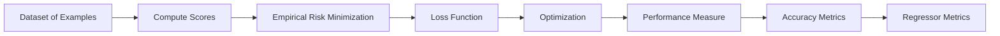

#dl 
# Evaluation/Accuracy Metrics

In evaluating machine learning models, accuracy metrics are crucial for understanding, diagnosing, and improving model performance. 

## Performance Measure for a Classifier

### Need for a Performance Measure
To optimize a classifier, it's essential to have a performance measure that:
- Penalizes the model for incorrect predictions.
- Allows modification of the model to reduce this penalty.
- Is known as an objective or loss function.

### Empirical Risk Minimization
In machine learning, empirical risk minimization is used to:
- Decrease the loss across the training dataset.
- Average the loss over the training data.

Given a dataset of examples $\{(x_i, y_i)\}_{i=1}^N$ where $x_i$ is an image and $y_i$ is an integer label, the loss over the dataset is the sum of losses over the examples:

$$
L = \frac{1}{N} \sum_{i=1}^{N} L_i(f(x_i, W), y_i)
$$

### Multiclass SVM Loss
For a given example $(x_i, y_i)$, the SVM loss is formulated as:

$$
L_i = \sum_{j \neq y_i} \max(0, s_j - s_{y_i} + 1)
$$

where $s$ is the scores vector from the function $f(x_i, W)$. This measures the margin by which the correct class score should exceed the incorrect class scores.

### Performance Measure for Probabilities
When using the softmax function to convert scores to probabilities, the suitable loss function is cross-entropy:

$$
L_i = -\log P(Y = y_i | X = x_i)
$$

This can be derived from the distance between two probability distributions (the model's output and the ground truth) or from a maximum likelihood estimation perspective, selecting probabilities that maximize the likelihood of the observed data.

## Accuracy Metrics

### Classification Accuracy
Accuracy is the ratio of correct predictions to the total number of predictions:

$$
Classification\ Accuracy = \frac{Total\ Correct\ Predictions}{Number\ of\ Predictions\ Made}
$$

However, it's not a useful metric when the percentage of a small class is very low.

### Logarithmic Loss / Log Loss
Log loss, which penalizes false classifications, is a good metric to compare model performances:

$$
Logarithmic\ Loss = \frac{-1}{N} \sum_{i=1}^{N}\sum_{j=1}^{M} y_{ij} \log(p_{ij})
$$

where $y_{ij}$ indicates if sample $i$ belongs to class $j$, and $p_{ij}$ is the probability of sample $i$ belonging to class $j$.

### Confusion Matrix
A confusion matrix is a table used to describe the performance of a classification model on a set of test data for which the true values are known. It allows visualization of the performance of an algorithm. [[Confusion Matrix & Metrics]]

### Multi-Class Classification Metrics
- **Macro-averaged precision**: Calculate precision for all classes individually and then average them.
- **Micro-averaged precision**: Calculate class-wise true positives and false positives, then use that to calculate overall precision.
- **Weighted precision**: Similar to macro, but with a weighted average based on class size.

## Regressor Metrics

### Mean Absolute Error (MAE)
This metric provides the average magnitude of errors in a set of predictions, without considering direction:

$$
Mean\ Absolute\ Error = \frac{1}{N} \sum_{i=1}^{N} |y_i - \hat{y}_i|
$$

MAE is preferred over MSE when dealing with outliers.

### Mean Absolute Percentage Error (MAPE)
MAPE measures the size of the error in percentage terms:

$$
Mean\ Absolute\ Percentage\ Error = \frac{100\%}{N} \sum_{i=1}^{N} \left| \frac{y_i - \hat{y}_i}{y_i} \right|
$$

### Mean Squared Error (MSE)
MSE is more sensitive to outliers than MAE and is used for gradient-based optimization:

$$
Mean\ Squared\ Error = \frac{1}{N} \sum_{i=1}^{N} (y_i - \hat{y}_i)^2
$$

### Root Mean Squared Error (RMSE)
RMSE is the square root of the mean squared error, providing scale-sensitive error measurement:

$$
RMSE = \sqrt{MSE}
$$

### Mean Squared Logarithmic Error (MSLE) and RMSLE
These are useful when underprediction is preferred over overprediction:

$$
MSLE = \frac{1}{N} \sum_{i=1}^{N} (\log(y_i + 1) - \log(\hat{y}_i + 1))^2
$$

### $R^2$ or Coefficient of Determination
$R^2$ indicates the proportion of the variance for the dependent variable that's explained by the independent variables:

$$
R^2 = \frac{Explained\ Variance}{Total\ Variance}
$$

### Adjusted $R^2$
Adjusted $R^2$ accounts for the number of predictors in the model:

$$
R_{adj}^2 = 1 - \left[\frac{(1-R^2)(n-1)}{n-k-1}\right]
$$

where $n$ is the number of observations and $k$ is the number of predictors.

To visualize the concepts from the slides, we can create a Mermaid diagram illustrating the performance measure for a classifier.

Further Reading on these metrics can be found in the provided Medium articles:
- [Metrics to Evaluate Your Machine Learning Algorithm](https://towardsdatascience.com/metrics-to-evaluate-your-machine-learning-algorithm-f10ba6e38234)
- [Your Ultimate Data Science, Statistics & Mathematics Cheat Sheet](https://towardsdatascience.com/your-ultimate-data-science-statistics-mathematics-cheat-sheet-d688a48ad3db)