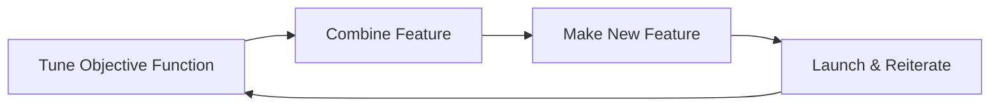

> Coming up with features is difficult, time-consuming, and requires expert knowledge. Applied machine learning often requires carful engineering of the features and dataset - Andrew NG

Feature Engineering is used for
- Getting the most out of the data
	- Here, you make the data useful 
	- Increasing predictive quality
	- Reducing dimensionality with feature engineering

- Feature engineering can be difficult and time consuming, but also very important to success
- Squeezing the most out of data through feature engineering enables models to learn better
- Concentrating predictive information in fewer features enables more efficient use of compute resource

## Main Preprocessing Operations
- Data Cleansing
- Feature Tuning
- Representation transformation
- Feature Extraction
- Feature Construction

## Feature Engineering Flow Chart

## Feature Engineering Techniques

Numerical Range
- [[Feature Scaling | Normalization & Standardization]]

Grouping
- Bucketizing
- Bag of words

Other Techniques
- [[Dimensionality Reduction]]
	- [[PCA]]
	- [[T-SNE]]

[[Feature Cross]]

## Pre-processing Training Dataset

Pros | Cons
--|--
Run-once | Transformations reproduced at serving
Compute on entire dataset | Slower iterations

## Feature Transformation within the model

Pros | Cons
--|--
Easy Iterations | Expensive transforms
Transformation guarantees | Long model latency
. | Transformations per batch : Skew

 