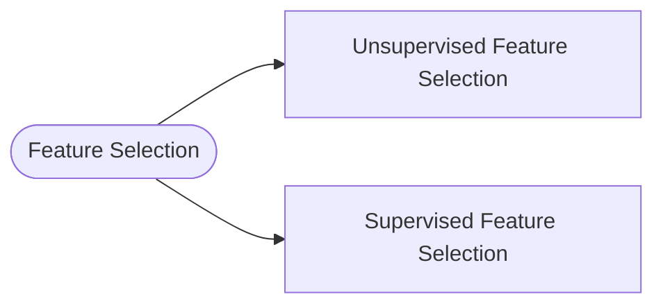
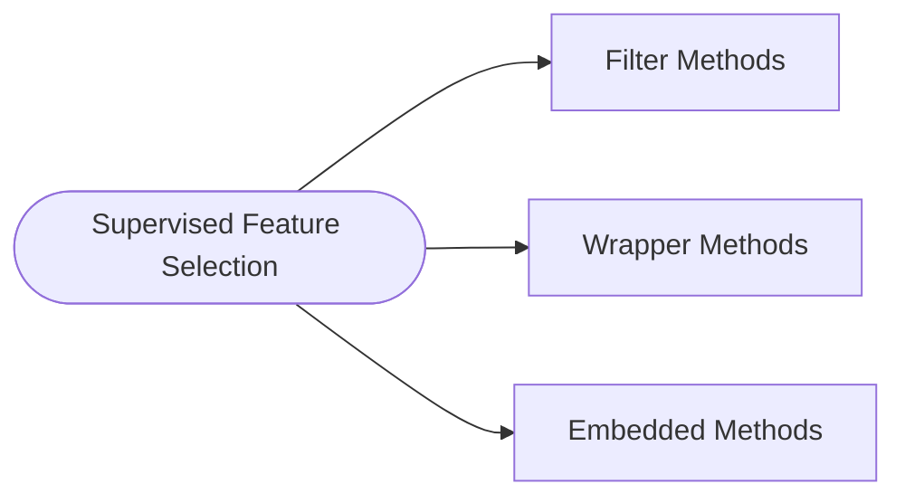
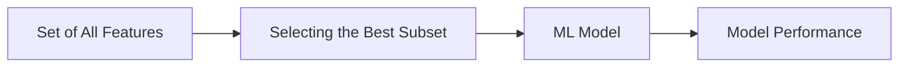
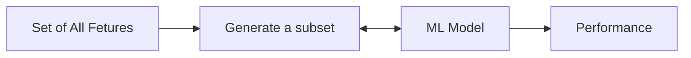

### What is Feature Selection ?

Feature selection is a part of data science project. The steps that preceed feature selection are

- [[Feature Engineering]]
- Missing Value Treatment
- Normalization
- Imbalanced Dataset
- `Feature Selection`

There is a concept of [[Dimensionality Reduction| Curse of dimensionality]], wherein due to large number of features, the model may not perform well. 

## Need for Feature Selection
- Reduce storage and I/O requirements
- Minimize training and inference costs

## Types of Feature Selection




`Unsupervised Feature Selection`
- Features-target variable relationship not considered
- Removes redundant features (correlation)

`Supervised Feature Selection`
- Uses features-target variable relationship
- Selects those contributing the most

## Supervised Feature Selection




## `Filter Methods`

Have 3 types 
- Correlation
- Univariate Feature selection

**Correlation**
- Correlated features are usually redundant
	- And it's ideal to remove them
- Methods
	- Pearson Correlation
	- Univariate Feature Selection

For comparing feature comparision, to evaluate how close the features are we have
- Pearson's correlation: Linear relationships
- Kendall Tau Rank Correlation Coefficient : Monotonic relationships & small sample size
- Spearman's Rank Correlation Coefficient : Monotonic relationships
- Mutual Information
- F-test
- Chi-Squared test

**Univariate Feature Selection**

1. SelectKBest
2. SelectPercentile
3. GenericUnivariateSelect

**Correlation Filter Method Approach**




## `Wrapper Methods`

This is a search method that goes throught the data and finds the optimal selection 
- Forward Elimination
- Backward Elimination
- Recursive Feature Elimination



## `Embedded Methods`
Methods 
- [[L1 and L2 Regularization|L1 Regularization]]
- [[Feature Importance]]


### Variance Threshold

Here, based on the variance threshold features are identified which have variance below the threshold specified - the same will be removed 

```py
from sklearn.feature_selection import VarianceThreshold
var_threshold = VarianceThreshold(threshold=0)
var_threshold.fit(df)
```

### Univariate Feature Selection
`Scoring each feature against a target`

Some of the common methods in Uni-variate analysis are
- Mutual Information
- ANOVA F-test
- $chi^2$

Scikit methods
- SelectKBest - Keeps the top-k scoring features
- SelectPercentile - It keeps the top features which are in percentage specified by the user

### Scikit-learn Libararies
- sklearn.feature_selection.SelectFromModel
- sklearn.feature_selection.RFE(estimator=model,n_features_to_select=3)
