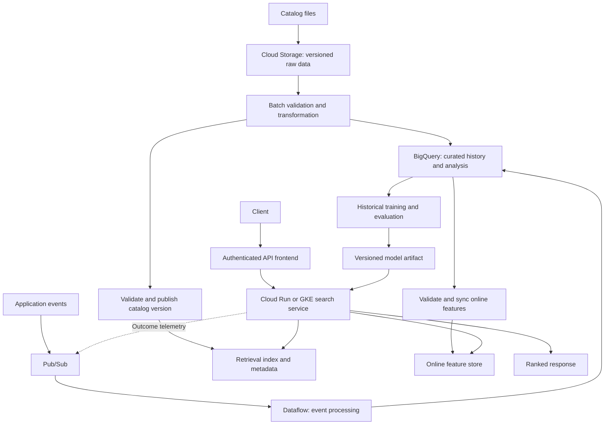

Google Cloud Platform (GCP) notes are organized here as a path from resource ownership and permissions to data processing, serving, and recovery. Start with the system's requirements, then use the individual service notes to compare concrete choices.

## Learning Path and Folder Coverage

All **28 existing notes in `GCP/`** received substantive review and expansion in the 26–27 September 2026 pass. This index connects them; it does not claim coverage of every Google Cloud product.

### 1. Establish the Boundaries

- [[Project in GCP]] — Resource hierarchy, environments, billing, and lifecycle.
- [[IAM]] — Principals, roles, inherited access, and permission diagnosis.
- [[Service Account]] — Workload identity, credential discovery, and build/runtime separation.
- [[VPC]] — Addressing, routing, traffic policy, and private connectivity.
- [[Cloud Load Balancing]] — Frontend selection, backend routing, and failure behavior.

**Checkpoint:** Trace one request's network path and identities. Explain why network reachability and authorization are separate checks.

### 2. Choose and Deliver Compute

- [[Compute Paradigm]] and [[Compute Types]] — Responsibility boundaries and workload-based selection.
- [[G Compute Engine (GCE)|Compute Engine]] — VM lifecycle, persistence, and interruption.
- [[G Container Engine|GKE]] — Kubernetes resources, rollout, and operating modes.
- [[G App Engine|App Engine]] — Platform environments and existing-application decisions.
- [[Cloud Run]] and [[Cloud Functions|Cloud Run functions]] — Request, job, and event execution.
- [[Cloud Build]] — Reproducible artifacts, identities, and release verification.

**Checkpoint:** Explain how a source revision becomes a running version, where state lives, and how a failed release is rolled back.

### 3. Match Storage to Access and Recovery

- [[GCP/Storage Options|Storage Options]] — Object, block, file, operational databases, and analytical stores.
- [[Cloud Storage]] — Location, storage class, versioned publication, and consistency.
- [[Cloud SQL, Cloud Spanner]] — Transactions, key design, scaling, and recovery boundaries.
- [[DataStore]] — Entities, indexed queries, current consistency, and transaction retries.
- [[Google File System]] — Historical metadata/data separation and the transition to Colossus.

**Checkpoint:** Name the source of truth, transaction boundary, backup policy, and tested recovery procedure for each data category.

### 4. Build Reliable Data Pipelines

- [[PubSub]] — Topics, subscriptions, acknowledgment, ordering, and duplicate handling.
- [[Data Flow|Dataflow]] — Beam pipelines, event time, windows, and late results.
- [[DataProc|Managed Spark / Dataproc]] — Cluster and serverless execution, skew, and output publication.
- [[Cloud Fusion|Cloud Data Fusion]] — Visual integration, runtime environments, and safe reruns.

**Checkpoint:** Explain what happens when a worker fails after writing output but before reporting success.

### 5. Analyze, Learn, and Serve Features

- [[BigQuery]] — Ingestion, schemas, analytical semantics, transactions, and cost.
- [[BigQuery Query CheatSheet]] — Deduplication, partition filtering, arrays, and metric denominators.
- [[BigQuery ML Cheatsheet]] — Historical features, temporal splits, training, evaluation, and predictions.
- [[Feature Store]] — Offline/online contracts, freshness, point-in-time correctness, and product lifecycle.
- [[Datalab]] — Historical notebook context and migration to supported environments.

**Checkpoint:** Reconstruct what information was available at prediction time. Separate feature freshness, model quality, and serving latency.

### 6. Practice Design Decisions

[[Major Exam Topics - Data Engineer vs Cloud Architect]] ties the material to scenario-based preparation. Use the official current guide for exam scope rather than treating this folder as a complete syllabus.

## An End-to-End Search Platform Example

This is an illustrative architecture assembled from the concepts above. It is not an assertion about the deployed implementation documented in [[Search2.0 architecture]].

### Follow the Data and Request

1. **Ingest:** identify each catalog version and event. Retain provenance for replay.
2. **Validate:** reject or quarantine malformed records; make schema changes explicit.
3. **Transform:** choose SQL, Beam, or Spark from the workload. Define duplicate and late-event policies.
4. **Publish:** expose complete catalog versions and validated feature snapshots. Do not publish partial output merely because some files exist.
5. **Serve:** authenticate the caller, retrieve candidates, fetch bounded features, rank, and return within the deadline.
6. **Observe:** record enough version and outcome information to trace quality and latency without exposing unnecessary sensitive data.
7. **Improve:** evaluate candidates, ranking, and user outcomes separately before changing the serving version.

The retrieval index is a logical component: choose its implementation through [[Candidate Generation]], [[Inverted Index]], [[Dense Retrieval]], and workload constraints. This diagram does not nominate one database for every search pattern.

## Failure and Recovery Discussion

| Failure | Design response to explain |
|---|---|
| Duplicate or older event | Idempotency key, version check, safe acknowledgment |
| Incomplete batch output | Stage, validate, then publish a completed version |
| Stale online features | Data-age signal and an explicit fallback policy |
| Slow downstream dependency | Deadline, bounded concurrency, defined partial response |
| Zone or region loss | Dependency-aware recovery plan and restore drill |
| Bad deployment | Trace artifact to revision and use a tested rollback |

A system can return fast responses with stale data, or fresh data with poor ranking. Track serving performance, data freshness, retrieval coverage, ranking relevance, and online outcomes as separate dimensions. Continue through [[Search Engineering]] for those concepts.

## Review Record and Remaining Validation

**Substantive content:** all 28 notes above were expanded with mechanics, scenarios, trade-offs, failure modes, exercises where useful, and primary-source references. Existing filenames and the Storage Options transfer-note embed were preserved. Tags are YAML properties; main explanations use native headings, with brief optional folded hints.

**Navigation changes:** this previously empty GCP index was populated, and a scoped review entry was added to [[Search Engineering]]. Linked notes outside this set were used for navigation, not newly fact-checked as part of the GCP pass.

**Document checks:** all 24 Mermaid diagrams passed syntax parsing; YAML properties, the build YAML example, code fences, footnotes, final reference placement, table-link escaping, and 157 internal note links passed structural checks. The original transfer-note embed remains in place. These checks do not establish rendered layout or cloud-runtime behavior.

**Validation boundary:** service claims were checked against official documentation and the GFS paper. Cloud commands, build configuration, SQL, models, deployments, and recovery exercises remain illustrative and were not run against a Google Cloud project. Rendered Obsidian layout remains unverified. Product lifecycle statements are dated in their notes; check them again before implementing a migration.

**Next practical work:** execute a selected lab in a designated project, verify permissions with its actual identities, measure cost and latency on representative data, and complete a recovery drill. The notes provide a process, not evidence that those operational checks have happened.

## References & Useful Links

- [BigQuery overview](https://docs.cloud.google.com/bigquery/docs/introduction) — Analytical platform context; detailed supporting references appear in each service note.
- [Dataflow overview](https://docs.cloud.google.com/dataflow/docs/overview) — Managed batch/stream pipeline context for the illustrative data path.
