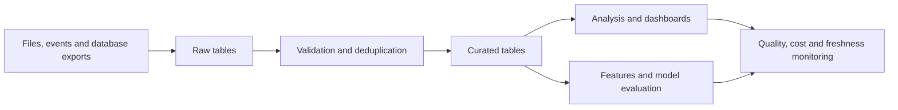

BigQuery is a managed data platform for analytical work. Its storage and compute layers are separated, and GoogleSQL supports queries over large datasets. Use it to understand behavior, prepare features, and evaluate systems; do not assume an analytical query belongs on a latency-sensitive application request path.[^overview]

## End-to-end analytical workflow

1. Define the row's meaning, identifiers, timestamps, and schema before ingestion.
2. Choose batch loading or streaming according to freshness and replay needs.
3. Retain enough provenance to reproduce a result: source version, event ID, transformation version, and load time.
4. Validate raw data, then publish curated tables with explicit deduplication and missing-data rules.
5. Run analysis using appropriate permissions, location, and cost controls.
6. Monitor data freshness and correctness as well as query failures.

Schema inference is a convenience for exploration. An explicit schema and compatibility checks are safer for repeatable production ingestion; do not rely on a remembered fixed sampling count.

## Tables, nested data, and views

A dataset groups resources and has a location and access configuration. Choose partitioning around common filters, and clustering around useful access patterns. These physical choices should follow observed queries rather than a universal cardinality rule.

A `STRUCT` groups named fields; an `ARRAY` represents repeated values. Repeated records can be modeled as arrays of structs. `UNNEST` expands repeated elements, which changes the row count and therefore the unit being aggregated.[^nested]

A logical view stores a query definition and executes that query when read. It is not a stored result or automatically a cheaper query. Use it to express a reusable interface and review access to underlying data.[^views]

## Transactions and workload fit

BigQuery supports multi-statement transactions with ACID properties and snapshot isolation. Supported statements and external-data behavior still have limits. The old claim that BigQuery has no transactions is incorrect.[^transactions]

Transaction support does not make it equivalent to [[Cloud SQL, Cloud Spanner]] for every operational workload. Compare access shape, concurrency, write behavior, latency, and economics. Similarly, “faster than [[Hive]]” requires a controlled workload comparison, not a blanket assertion.

## Performance and cost

Read only needed columns, filter eligible partitions, and avoid unnecessary join expansion. `WHERE` can reduce scanned data when pruning applies; an arbitrary filter is not automatically a cost reduction. Inspect the execution plan for skew, shuffle, and unexpectedly large intermediate results.[^performance]

Use query estimates or dry runs and, for on-demand queries, a maximum-bytes-billed limit where appropriate. `LIMIT` alone is not a reliable scan-cost control. Capacity-based and on-demand pricing require different cost reasoning; elapsed time, bytes read, and compute consumption are separate measurements.[^cost]

See [[BigQuery Query CheatSheet]] for concrete GoogleSQL examples and [[BigQuery ML Cheatsheet]] for a model workflow.

## Worked example: search click-through rate

Assume one deduplicated row per search request contains a nullable `clicked` value. Define click-through rate as clicked requests divided by requests with a known outcome. Report missing outcomes separately. Treating missing telemetry as “no click” changes the metric.

A request-weighted metric can be dominated by frequent queries. If the question is average quality across queries, define a different aggregation and weighting explicitly. Neither metric alone establishes ranking relevance or causality; connect the analysis to [[Search Evaluation]] and [[Click Bias]].

## Failure modes and exercise

Watch for duplicate event ingestion, joins multiplying rows, time-zone boundary errors, late events changing previous reports, and dashboards comparing differently filtered populations.

**Exercise:** A daily report doubles after adding a product-category join. Check join cardinality before concluding user activity increased.

## References & Useful Links

[^overview]: [BigQuery overview](https://docs.cloud.google.com/bigquery/docs/introduction) — Storage/compute separation and analytical capabilities.
[^nested]: [Nested and repeated columns](https://docs.cloud.google.com/bigquery/docs/nested-repeated) — Records, structs, and arrays.
[^views]: [Logical views](https://docs.cloud.google.com/bigquery/docs/views-intro) — Query-backed virtual tables.
[^transactions]: [Multi-statement transactions](https://docs.cloud.google.com/bigquery/docs/transactions) — ACID, snapshot isolation, and transaction boundaries.
[^performance]: [Optimize query computation](https://docs.cloud.google.com/bigquery/docs/best-practices-performance-compute) — Projection, pruning, joins, and execution plans.
[^cost]: [Estimate and control costs](https://docs.cloud.google.com/bigquery/docs/best-practices-costs) — Estimates, dry runs, billing limits, and `LIMIT` caveats.
