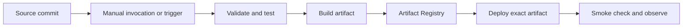

Cloud Build executes a build as a series of containerized steps. Use it to turn a source revision into tested, versioned artifacts, then connect those artifacts to an explicit deployment process.[^overview]

## End-to-end pipeline



A build succeeding proves its configured steps succeeded. It does not prove a deployment is healthy unless the workflow also checks the deployed application and reports that result.

## Configuration example

This illustrative `cloudbuild.yaml` expects a repository with a `Dockerfile` and an existing Artifact Registry Docker repository. Replace the substitution values. It builds and publishes an image; it does not deploy it.[^schema]

```yaml
steps:
  - name: gcr.io/cloud-builders/docker
    args:
      - build
      - -t
      - ${_REGION}-docker.pkg.dev/$PROJECT_ID/${_REPOSITORY}/search-api:$BUILD_ID
      - .
images:
  - ${_REGION}-docker.pkg.dev/$PROJECT_ID/${_REPOSITORY}/search-api:$BUILD_ID
substitutions:
  _REGION: us-central1
  _REPOSITORY: application-images
```

Add the repository's actual test and validation commands before image publication. Pin deployment to the resulting digest when reproducibility matters; a mutable tag can later refer to different bytes.

## Identity and access

Separate three identities: who starts the build, which [[Service Account]] executes it, and which identity runs the deployed application. Grant the build only the required source, artifact, logging, and deployment permissions. Avoid assuming every project uses the same default build account.

For production, decide who can change the build configuration and triggers. Anyone who can modify executable build steps may be able to exercise the build account's privileges.

## Diagnose a failed release

The original build-list command remains useful:

```bash
# Replace PROJECT_ID with the intended project.
gcloud builds list --project=PROJECT_ID --limit=10
```

Start from the source revision and build ID. Inspect the failing step, its inputs, artifact digest, and deployment target. Compare the deployed revision with the intended artifact before concluding that a successful build fixed production.

## Common failure modes

- Tests run against different dependencies from those packaged into the image.
- Parallel steps consume outputs before their producers finish.
- Broad permissions hide missing separation between build and runtime access.
- A deployment command succeeds while the new version fails its startup check.

## Exercise

Design a release record that connects commit, build ID, artifact digest, deployed revision, and smoke-check result. Explain how it helps rollback.

## References & Useful Links

[^overview]: [Cloud Build overview](https://docs.cloud.google.com/build/docs/overview) — Containerized build steps and artifact workflows.
[^schema]: [Build configuration schema](https://docs.cloud.google.com/build/docs/build-config-file-schema) — YAML steps, arguments, images, and substitutions.
