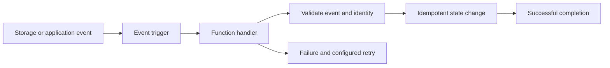

The current product terminology is **Cloud Run functions**. A function packages a focused HTTP or event handler into a managed deployment. It is useful for small integration steps, but the function still needs an explicit contract for authentication, retries, state, and failure handling.[^comparison]

## Understand the generation and API

Current functions can be deployed as [[Cloud Run]] services through the Cloud Run Admin API; the Cloud Functions v2 API remains a compatibility path. First-generation functions have a different runtime and configuration model. Check the deployment's generation and API before applying limits or migration instructions.[^comparison]

The distinction matters operationally: a name such as “function” does not tell you its concurrency, trigger delivery behavior, or networking configuration.

## Event processing lifecycle

1. Define the event schema, event identifier, and version.
2. Configure the trigger and the identities allowed to invoke the function.
3. Validate the input; reject or quarantine malformed events deliberately.
4. Perform a bounded operation with safe retry behavior.
5. Record enough context to diagnose failure without logging secrets or unnecessary personal data.
6. Monitor failures, event age, and retry volume, not only successful invocations.

## Example: process a newly uploaded file

A [[Cloud Storage]] upload triggers validation of a catalog file. Use the object's bucket, name, and generation to identify the particular upload. Record completion against that identity so redelivery does not publish duplicate catalog versions.

If validation succeeds but a later notification fails, a retry must recognize the completed validation. Design the transition and notification together, for example with a durable status record and an outbox processed independently. A check followed by an unprotected write is not a reliable deduplication mechanism under concurrency.

## Choosing functions or a larger service

Functions fit a small handler with a clear trigger. A cohesive API with shared middleware and multiple routes may be easier to maintain as a Cloud Run service. Long-running or partitioned batch work may fit a job or [[Data Flow]] pipeline better.

Keep vendor clients and business rules testable outside the handler. Unit tests should cover validation and state transitions; integration tests should cover trigger identity and duplicate delivery.

## Exercise

The handler commits an update, then crashes before reporting success. Explain what happens on redelivery and how the second attempt avoids repeating the effect.

> [!example]- Crash-after-commit answer
> Redelivery must find a durable record of the completed operation and avoid applying it again. The operation ID and business update need an atomic or otherwise recoverable relationship; storing the ID only in instance memory is insufficient.

## References & Useful Links

[^comparison]: [Cloud Run functions and first-generation comparison](https://docs.cloud.google.com/run/docs/functions/comparison) — Current naming, deployment APIs, triggers, and generation differences; checked September 2026.
