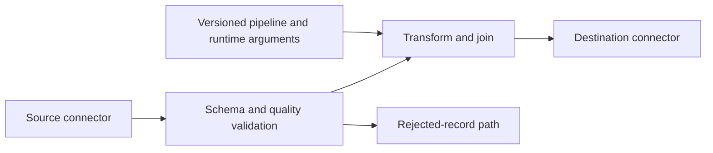

Cloud Data Fusion is a managed data-integration service with a visual pipeline interface, based on the open-source CDAP project. It helps assemble sources, transformations, and sinks; it does not make data contracts or production recovery automatic.[^overview]

## Design-time and execution-time concerns

The design interface, pipeline metadata, and preview environment are distinct from the resources that execute a production pipeline. The current service supports managed Spark execution, including ephemeral clusters in the customer project and configured existing-cluster options.[^overview]

That distinction matters when diagnosing permissions or connectivity: a successful preview does not establish that the execution environment can reach the same private source.

## End-to-end integration flow

1. Define source credentials, extraction boundaries, and expected schema.
2. Choose and configure connectors; verify plugin and runtime compatibility.
3. Make transformations explicit, including null handling, type conversion, and deduplication.
4. Preview representative data, including malformed and boundary cases.
5. Configure compute profile, runtime [[Service Account]], networking, and scheduling.
6. Run against a controlled destination; reconcile source and destination counts.
7. Publish the pipeline definition and parameters through the release process, then monitor production runs.

## Example: catalog ingestion

Assume a vendor publishes a daily catalog file. Record the input object generation and pipeline version for each run. Validate product identifiers, prices, and duplicate records before promoting the output to the serving catalog.

If the source adds a column or changes a type, decide whether to reject the file, apply a compatible conversion, or introduce a schema version. Silently dropping an important field can produce a successful pipeline with incorrect business data.

## Trade-offs and operating cost

Visual composition can make integration logic easier to inspect, but custom transformations, plugin upgrades, and version review still require engineering. Evaluate the persistent integration-service cost separately from processing resources, storage, and network movement.

Use [[DataProc]] when direct Spark development fits the team, [[Data Flow]] for an appropriate Beam pipeline, or [[BigQuery]] when SQL in the warehouse is sufficient. Avoid introducing a full integration platform solely to perform a simple existing SQL transformation.

## Failure modes and exercise

Watch for preview/production differences, credentials expiring, non-idempotent sink writes, partial extraction, and retries that reprocess an entire source.

**Exercise:** A pipeline fails after writing half its rows. Design a rerun protocol that produces one complete catalog without duplicates or a mixed-version result.

## References & Useful Links

[^overview]: [Cloud Data Fusion overview](https://docs.cloud.google.com/data-fusion/docs/concepts/overview) — Visual pipeline model, CDAP, preview, compute profiles, and execution environments.
