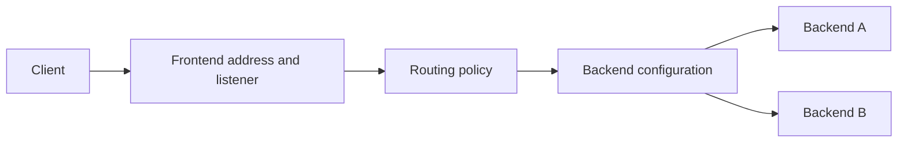

## Overview

Load balancing routes traffic to suitable application backends. Google Cloud offers several families; a single global frontend is one option, not a property of every load balancer. Choose the product from the traffic contract before choosing a topology.[^overview]

## Choose by Protocol and Reachability

| Family | Main question | Typical fit |
|---|---|---|
| Application Load Balancer | Need HTTP(S)-aware routing? | Web/API paths, host routing, supported serverless backends |
| Proxy Network Load Balancer | Need a TCP proxy or supported TLS offload? | TCP services with proxy semantics |
| Passthrough Network Load Balancer | Need packet forwarding/source-address preservation? | Supported TCP/UDP and other IP workloads |

Then choose internal versus external access and an appropriate regional or multi-region/global mode. Feature and protocol support depend on the exact mode; do not copy a legacy “all ports/all protocols” table into a design.[^overview]

## Request Path

For an HTTPS API, identify certificate termination, host/path routing, backend authentication, and connection timeouts. Separate load-balancer latency from backend latency. Health signals help determine usable backends, but health-check behavior differs by backend type; a successful probe does not establish complete application correctness.

## Deploy and Operate

1. Choose protocol, exposure, region scope, and supported backend type.
2. Configure frontend, routing, backend settings, and applicable health/traffic controls.
3. Verify [[VPC]] paths and certificate/DNS behavior.
4. Test a normal request, an unhealthy backend, and loss of a failure domain.
5. Load-test with backend limits in mind and monitor errors, saturation, and tail latency.

A load balancer cannot create capacity inside an overloaded database. For a search API, cap fan-out and downstream concurrency even if frontend traffic can scale quickly. See [[Tail Latency]].

## Common Misconceptions

- “Global” does not mean every dependency is replicated or every request stays local.
- Sending traffic only to apparently healthy instances does not guarantee zero failed requests during a transition.
- Anycast addressing, backend selection, and data consistency are separate design topics.
- A managed frontend reduces operational work but does not eliminate configuration, quota, security, or cost decisions.

> [!question]- Does adding a second region make the application highly available?
> Only if routing, backend capacity, data access, and failure behavior also work there. Test an actual dependency failure rather than treating a second service deployment as the whole recovery plan.

## Exercise

Choose a frontend for an HTTPS search API and for a UDP application. Explain why protocol requirements lead to different choices before discussing performance.

## References & Useful Links

[^overview]: [Cloud Load Balancing overview](https://docs.cloud.google.com/load-balancing/docs/load-balancing-overview) — Families, deployment scopes, protocols, and backend choices.
