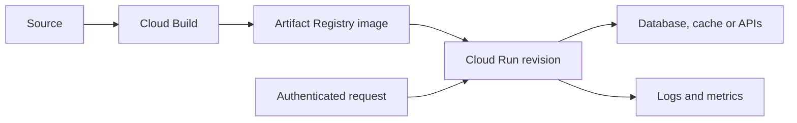

Cloud Run runs applications on managed infrastructure without requiring the application team to operate a Kubernetes cluster. For the common starting choices, a **service** handles incoming requests and a **job** runs tasks to completion. The platform also offers other workload modes; choose a mode from its execution contract rather than assuming every container is a web server.[^overview]

## From source to response

1. Package the application and dependencies into an image, or use a supported source deployment workflow.
2. Configure a runtime [[Service Account]], secrets, ingress, and [[VPC]] access where necessary.
3. Set CPU, memory, concurrency, instance limits, and timeouts from workload measurements.
4. Deploy a revision and verify its identity, dependencies, and response behavior.
5. Shift traffic deliberately; monitor latency and errors and keep a rollback revision available.

Image storage belongs in Artifact Registry in this workflow. [[Cloud Build]] owns the build process; Cloud Run owns execution. Giving the build identity access does not automatically authorize the runtime identity.

## Runtime contract

A service's ingress container listens on `0.0.0.0` using the supplied `PORT`. A job should complete and exit successfully or fail with a nonzero exit code. The container's ordinary writable filesystem is ephemeral and uses memory; durable results belong in external storage.[^contract]

Separate HTTP request completion from background work. If work must survive the request, persist the task and use an appropriate asynchronous execution path. Do not rely on an untracked thread continuing after a response.

## Example: a search API

Assume each instance can safely run eight concurrent requests after load testing. Start with that concurrency, then measure CPU, memory, queueing, and downstream connection use. A higher concurrency setting can improve utilization while worsening [[Tail Latency]] if requests compete for CPU or memory.

A maximum instance setting helps bound resource consumption, but overload still needs a response policy: reject, queue where appropriate, or return a defined fallback. It is not a guarantee that every request will finish within its deadline.

## Operational trade-offs

- **Startup latency:** keep initialization bounded; evaluate minimum instances when latency justifies their cost.
- **Dependency capacity:** bound connection pools and fan-out across all instances.
- **State:** cache entries can disappear with instances; durable state requires a store.
- **Recovery:** retry only safe operations, with deadlines and duplicate handling.

## Exercise

If 100 instances each open a pool of 20 database connections, what capacity could the database be asked to support? Propose a pool and concurrency policy before raising the instance limit.

> [!example]- Connection-budget answer
> The configured pools could request up to 2,000 connections: 100 instances multiplied by 20 connections. Budget across every service and administrative client, then size pools and concurrency against the database capacity.

## References & Useful Links

[^overview]: [What is Cloud Run?](https://docs.cloud.google.com/run/docs/overview/what-is-cloud-run) — Workload modes and managed application execution.
[^contract]: [Container runtime contract](https://docs.cloud.google.com/run/docs/container-contract) — Listening address, job completion, filesystem, and request behavior.
