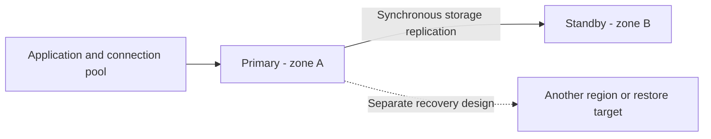

Cloud SQL and Spanner both support transactional applications, but they expose different scaling and operational models. Choose from compatibility, workload, geography, and recovery requirements—not a rule that one is for “small data” and the other is automatically faster.

## Start with the access pattern

| Requirement | Cloud SQL starting point | Spanner starting point |
|---|---|---|
| Existing relational application | Managed MySQL, PostgreSQL, or SQL Server compatibility | Assess dialect and feature compatibility explicitly |
| Write scaling | Plan instance capacity and application architecture | Distributed data placement and compute capacity |
| Availability | Configure HA and a separate regional recovery plan | Select an appropriate instance configuration |
| Schema performance | Indexes, query plans, contention | Those concerns plus key distribution |

[[BigQuery]] is primarily an analytical system; it is not interchangeable with an application's transactional database. [[Horizontal & Vertical Scaling]] explains why adding read capacity and distributing writes are different decisions.

## Cloud SQL: HA is not multi-region writing

For Cloud SQL for PostgreSQL, regional high availability (HA) uses a primary and standby across two zones in one region, with synchronous storage replication. A failover changes the primary; applications still need to handle disrupted connections and in-flight operations.[^sql-ha]

The dotted recovery path is a design requirement, not an automatically configured component. A read replica, HA standby, and backup have different purposes. Document the actual replication and promotion mechanism before promising recovery times or data-loss bounds.

## Spanner: transactions and distribution

With its default serializable isolation, Spanner provides external consistency: transaction ordering respects the real-time ordering described by its consistency contract. Other supported isolation choices have different guarantees; “ACID++” is not a useful substitute for stating the actual contract.[^consistency]

Data distribution depends on keys and access patterns. A leading monotonically increasing timestamp can concentrate writes into a narrow key range. Distributed identifiers or a deliberate shard prefix can spread writes, but may make range queries more complex. Secondary indexes also need workload-aware design.[^schema]

## End-to-end design example

Assume a destination service stores users' favorite places and updates them transactionally:

1. Define the user lookup and update queries, including ownership checks.
2. Choose keys and indexes matching those queries; inspect plans using realistic data.
3. Bound connection pools and transaction duration.
4. Retry only retryable failures, with an idempotency strategy for ambiguous outcomes.
5. Choose backup retention and restoration procedures.
6. Test zonal failure, regional recovery, and application reconnection independently.

Start with the simplest platform meeting measured requirements. A migration to distributed SQL needs evidence that its scale, availability, or geographic model warrants changes in schema and operations.

## Recovery vocabulary and pitfalls

**Recovery point objective (RPO)** is the acceptable amount of data loss expressed in time. **Recovery time objective (RTO)** is the acceptable time to restore service. They are targets to validate, not benefits automatically supplied by the word “managed.”

Watch for single-writer bottlenecks, index write amplification, long transactions, hot keys, and retries that duplicate business effects. Backups must be restored in a drill to establish that the recovery path works.

## Exercise

A team requires writes in two regions during a network partition. Clarify its consistency and availability expectations before choosing a database. Explain why a regional standby alone does not meet the requirement.

## References & Useful Links

[^sql-ha]: [Cloud SQL for PostgreSQL high availability](https://docs.cloud.google.com/sql/docs/postgres/high-availability) — Regional primary/standby topology and failover.
[^consistency]: [Spanner TrueTime and external consistency](https://docs.cloud.google.com/spanner/docs/true-time-external-consistency) — Transaction guarantees and isolation distinctions.
[^schema]: [Spanner schema design](https://docs.cloud.google.com/spanner/docs/schema-design) — Key distribution and hotspot avoidance.
