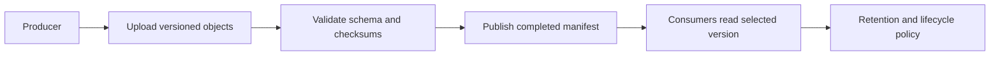

Cloud Storage stores objects in buckets. It fits raw datasets, images, model artifacts, exports, and backups. An object store is a different interface from a relational database or a local filesystem; choose it for whole-object access and durable data exchange.

## Location and storage class are separate

**Location** determines placement. **Storage class** determines an object's storage and access pricing model. Regional, dual-region, and multi-region placement are not the older “regional versus multi-regional” storage-class taxonomy.[^classes]

| Class | Typical consideration | Minimum storage duration |
|---|---|---|
| Standard | Frequent access or short-lived data | None |
| Nearline | Infrequent reads | 30 days |
| Coldline | Rarer reads | 90 days |
| Archive | Long-lived, seldom-read data | 365 days |

These durations affect billing, not when an object becomes readable. Archive data remains online. Retrieval, operations, early deletion, and network costs matter alongside the storage price. Current documentation also lists **Rapid** for specialized zonal Rapid Buckets; evaluate its separate constraints before using it.[^classes]

## Ingest, publish, consume, retire

For a proposed catalog pipeline:

1. Write a new dataset under a unique version prefix.
2. Validate file counts, schemas, and required fields before announcing it.
3. Publish a manifest identifying the complete object generations.
4. Let consumers select the manifest rather than treating every visible file as a finished dataset.
5. Retain older versions long enough for rollback, then apply the chosen cleanup policy.

This publication protocol is an application design. A collection of object writes is not a multi-object transaction.

## Consistency and concurrency

Object reads, writes, deletes, and listings have strong consistency. Access-policy propagation and public caching have different behavior. Individual object operations can be atomic while a batch of operations is not.[^consistency]

Use generation preconditions when concurrent writers might overwrite the same object. If a consumer reads a large object in ranges, bind reads to the intended generation rather than combining bytes from different versions.

## Security, recovery, and trade-offs

Keep access tied to [[IAM]] and the application's [[Service Account]]. Decide whether users need direct object access or an application-mediated download. Logs and manifests should identify objects without exposing credentials.

Replication protects against infrastructure failures; versioning, retention, and tested recovery address other risks. A replicated accidental deletion is still a deletion. Choose a protection policy deliberately and verify its interaction with cleanup and cost.

[[HDFS]] exposes distributed filesystem semantics for processing clusters. Cloud Storage can integrate with data tools, but filesystem compatibility should be verified rather than assumed from similar path syntax.

## Exercise

Two import jobs race to publish different catalog versions. Design a manifest update that detects the conflict and leaves consumers on one complete version.

## References & Useful Links

[^classes]: [Storage classes](https://docs.cloud.google.com/storage/docs/storage-classes) — Classes, billing durations, online retrieval, and Rapid storage; checked September 2026.
[^consistency]: [Cloud Storage consistency](https://docs.cloud.google.com/storage/docs/consistency) — Strong consistency, atomicity boundaries, caching, and generation preconditions.
