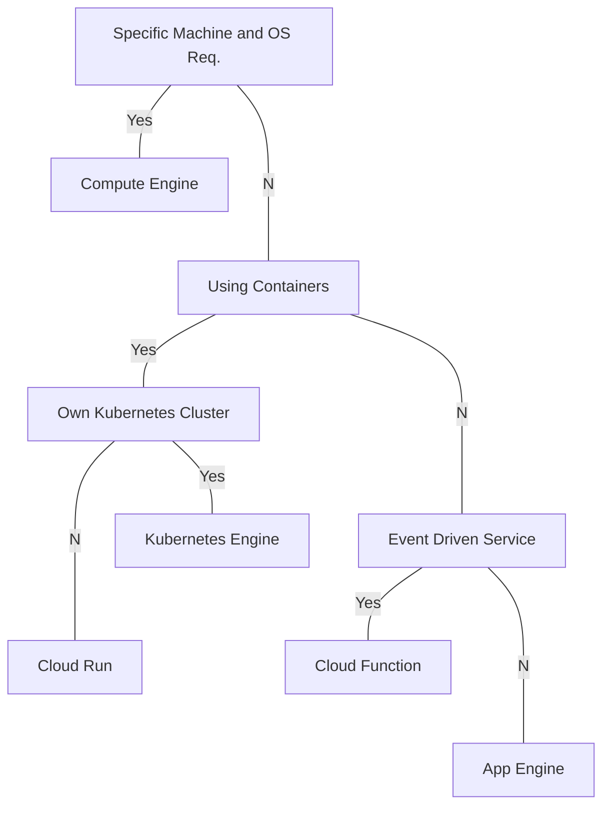

There are 4 major Compute Platform in GCP
- [[G Compute Engine (GCE)]]
- [[G Container Engine]]
- [[G App Engine]]
- [[Cloud Functions]]

```mermaid
flowchart TD;

A[Specific Machine and OS Req.] --Yes--- B[Compute Engine]
A --No--- C[Using Containers]
C --No--- D[Event Driven Service]
C --Yes --- C1[Own Kubernetes Cluster]
C1 --Yes--- C2[Kubernetes Engine]
C1 --No--- C3[Cloud Run]
D --Yes--- D1[Cloud Function]
D --No--- D2[App Engine]
```