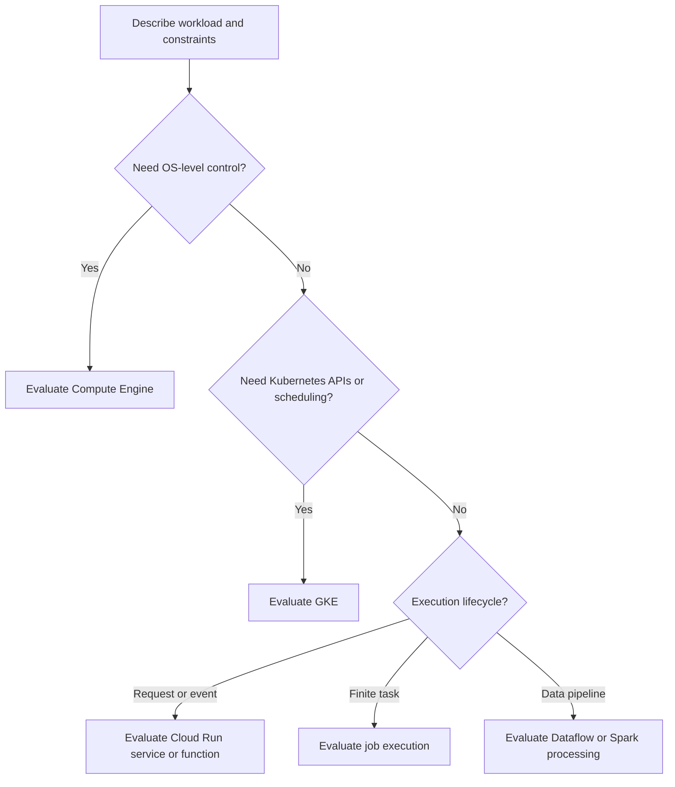

A compute paradigm describes the responsibility boundary between the application team and the platform. **Infrastructure as a service (IaaS)** exposes infrastructure such as VMs; **platform as a service (PaaS)** provides a more constrained application environment. “Serverless” describes an operating model with managed infrastructure, not the absence of servers or operational work.

## Decision path

Use this as an interview discussion aid. An existing platform, team expertise, regulatory constraints, or specialized runtime can change the result. [[Compute Types]] gives the concrete service comparison.[^compute][^run]

## Work backward from requirements

1. State the unit of work: request, event, scheduled task, or dataset partition.
2. Define latency, throughput, and recovery targets. Distinguish normal traffic from bursts.
3. Identify persistent state and external dependencies.
4. Specify required runtime, networking, and hardware capabilities.
5. Compare operational effort and total cost across feasible platforms.
6. Prototype the riskiest assumption, then test failure and recovery.

## Example: online and offline search

An online search request has a short deadline and must bound calls to retrieval and ranking dependencies. A nightly catalog rebuild can take much longer but needs checkpointing and atomic publication of its completed output.

Using the same deployment shape for both can be awkward. Separate their execution contracts even when they share libraries and a repository. The online system should continue serving a known catalog version while the next version is prepared.

## Trade-offs that survive product changes

- **Control versus operating effort:** infrastructure flexibility creates maintenance obligations.
- **Elasticity versus startup behavior:** capacity growth may involve initialization and dependency pressure.
- **Utilization versus isolation:** sharing resources reduces idle capacity but introduces contention.
- **Portability versus integration:** platform-specific capabilities can simplify operations while increasing migration work.

None of these imply a fixed winner. Measure [[Latency vs Throughput]] and cost against the workload's actual acceptance criteria.

## Exercise

For a proposed platform migration, write one measurable success criterion for latency, one for recovery, and one for operating effort. Explain how each will be verified before moving production traffic.

## References & Useful Links

[^compute]: [Compute Engine overview](https://docs.cloud.google.com/compute/docs/overview) — Infrastructure-oriented compute capabilities.
[^run]: [Cloud Run overview](https://docs.cloud.google.com/run/docs/overview/what-is-cloud-run) — Managed application execution model.
