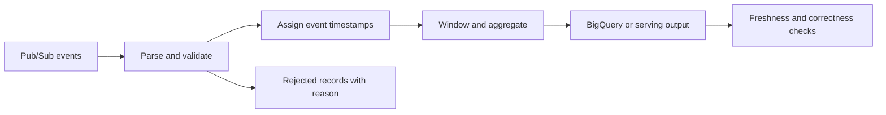

Dataflow runs batch and streaming data pipelines using Apache Beam. Beam describes the transformations; a **runner** executes them on a platform. Dataflow manages worker resources, but the pipeline owner still defines correctness, schemas, late-data handling, and external effects.[^overview]

## Pipeline model

A `PCollection` represents distributed data, and transforms read, validate, map, group, join, or write that data. The logical pipeline forms a directed acyclic graph (DAG); the runner can optimize its physical execution.

## Time, windows, and triggers

- **Event time:** when the event occurred according to its timestamp.
- **Processing time:** when the pipeline processes it.
- **Window:** the logical time grouping for an aggregation.
- **Watermark:** a progress estimate for event-time completeness, not proof that no older event will arrive.
- **Trigger:** when to emit a result; **allowed lateness** helps define how long late events remain relevant to a window.[^beam]

| Window | Useful question |
|---|---|
| Fixed | How many searches occurred in each five-minute interval? |
| Sliding | What is the count over the last hour, updated every five minutes? |
| Session | Which events belong to a period of activity separated by inactivity gaps? |

Choose accumulation and sink-update behavior alongside triggers. Multiple emissions for the same window are not automatically independent counts to sum.

## Worked example: a delayed click

Assume a five-minute window covers 10:00–10:05. A click occurred at 10:04 but arrives at 10:08.

1. Its event time assigns it to the 10:00–10:05 window.
2. Its acceptance depends on the watermark, allowed lateness, and state still retained.
3. If accepted after an earlier result, the pipeline may emit a correction according to its trigger configuration.
4. The sink must update the right window result or interpret an incremental pane correctly.

These are design choices. Reporting a final count before deciding the late-data policy leaves the metric undefined.

## Correctness and operations

Exactly-once processing does not mean user code executes once. Dataflow can retry transforms; external side effects need a compatible sink or an idempotent design. A remote call inside a transform can repeat.[^exactly-once]

Deploy with pinned dependencies, appropriate runtime identity, and a known source/sink schema. Test malformed records and late events locally where supported, then validate runner-specific behavior in a controlled environment. Monitor backlog age, watermarks, hot keys, throughput, and sink errors.

Autoscaling cannot make a single heavily skewed aggregation key fully parallel without changing the aggregation design. “No operations” is therefore misleading: infrastructure is managed while data and operational contracts remain yours.

## Exercise

A dashboard sums every emitted pane and reports too many clicks. Explain the difference between accumulating and discarding panes, then choose a sink representation that avoids double-counting.

> [!example]- Pane-counting hint
> An accumulating pane includes earlier contributions, so adding it to earlier panes counts those contributions again. Store a replacement result per key and window, or use a correctly defined incremental output contract.

## References & Useful Links

[^overview]: [Dataflow overview](https://docs.cloud.google.com/dataflow/docs/overview) — Beam runners, managed execution, and pipeline lifecycle.
[^beam]: [Apache Beam programming guide](https://beam.apache.org/documentation/programming-guide/) — Windowing, watermarks, triggers, and accumulation modes.
[^exactly-once]: [Exactly-once in Dataflow](https://docs.cloud.google.com/dataflow/docs/concepts/exactly-once) — Processing guarantees and external side-effect limitations.
