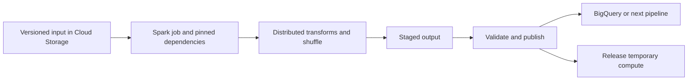

Dataproc is the familiar name for Google's managed Spark and Hadoop processing offering. As checked in September 2026, the documentation now presents the service as **Managed Service for Apache Spark**. This note keeps its existing filename so vault links remain stable.[^clusters]

## Cluster-based and serverless execution

| Choice | Starting use case | Main decisions |
|---|---|---|
| Managed clusters | Existing Spark/Hadoop ecosystem and cluster configuration needs | Image, nodes, libraries, lifecycle |
| Serverless Spark | Supported batch workloads and interactive sessions | Runtime, dependencies, resources, networking |

Cluster images define available versions of tools such as [[Spark]], [[Hadoop]], [[Hive]], and [[Pig]]. Serverless execution removes the need to provision a cluster directly; it does not remove Spark code, dependency, data, or performance concerns.[^clusters][^serverless]

## End-to-end batch flow

1. Define the input snapshot and output contract.
2. Select a supported runtime and package dependencies reproducibly.
3. Configure identity, private connectivity, and source/sink access.
4. Submit the job and monitor task skew, shuffle, memory, and failures.
5. Validate output completeness before publishing it.
6. Keep required logs and durable output, then clean up temporary resources.

## Storage and recovery

Keep the authoritative dataset in [[Cloud Storage]] or another durable external store when compute should be disposable. Cluster-local HDFS can exist and can be useful; it should not be the only copy of data that must survive cluster deletion.

A job retry can repeat output writes. Use a unique run location and publish a completed manifest, or use a sink with a suitable transactional/commit protocol. A partial directory should not be interpreted as a complete dataset.

Interruptible workers can reduce compute cost when the workload tolerates lost work. Evaluate recovery and shuffle behavior; do not assume a fixed discount or that every node role can be interrupted safely.

## Choosing among processing tools

- Existing Spark logic and libraries favor evaluating managed Spark.
- SQL transformations already in the warehouse may fit [[BigQuery]].
- Event-time streaming requirements may fit [[Data Flow]].
- Visually configured integration pipelines may fit [[Cloud Fusion]].

Choose from workload semantics and team ownership, then benchmark the feasible options. Marketing startup times and service labels do not predict a particular job's completion time.

## Exercise

A join has one customer key containing half the dataset. Explain why adding workers might not solve the straggler, and propose a way to measure and address the skew.

## References & Useful Links

[^clusters]: [Managed Spark clusters overview](https://docs.cloud.google.com/managed-spark/docs/concepts/clusters-overview) — Current Dataproc documentation, supported ecosystem, and integrations.
[^serverless]: [Managed Spark serverless overview](https://docs.cloud.google.com/managed-spark/docs/serverless-overview) — Batch workloads, sessions, and managed execution.
