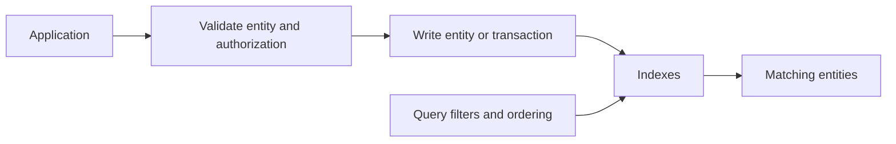

The current service is **Firestore in Datastore mode**. It stores entities with properties and serves indexed queries for operational applications. “Document database” describes the data model; it does not mean a database specifically for HTML or XML files.[^overview]

## Data model and access path

| Term | Meaning |
|---|---|
| Kind | Category of entities, such as `FavoriteDestination` |
| Entity | One stored record |
| Key | Stable entity identity |
| Property | Named value on an entity |
| Index | Structure supporting a query's filters and ordering |

Different entities can have different properties, but the application should still define and validate a schema. Schemaless storage moves responsibility; it does not remove it.

## Query-first design

1. List the application's key lookups and filtered queries.
2. Choose keys and property types that remain stable across versions.
3. Define required indexes and test them against realistic distributions.
4. Denormalize only when it simplifies required reads, then define how copied values are updated.
5. Paginate results and measure read volume, index growth, and write cost.

Datastore mode does not offer relational joins. Current dedicated documentation supports range and inequality filters on multiple properties; the older “only one inequality property” rule is not a safe general statement. The overview still contains an inconsistent older sentence, so use the feature-specific documentation for this capability.[^ranges]

## Consistency and transactions

Current Datastore mode supports strongly consistent queries and atomic transactions. Do not copy legacy Cloud Datastore eventual-consistency constraints into a current design without checking the database mode.[^overview]

A commit error can have an ambiguous outcome: the change might already have committed. Make repeated application operations safe, keep transaction bodies bounded, and handle contention with a retry policy.[^transactions]

## Example: saved destinations

Store each favorite under a stable identity based on the user and destination. Require the authenticated user to own that record. Repeatedly saving the same destination should update the intended entity rather than create duplicates.

If a separate entity tracks the favorite count, update the record and count in an appropriate transaction or derive the count through another explicit consistency policy. A namespace or key prefix alone is not an authorization boundary.

## When to choose something else

Use [[Cloud SQL, Cloud Spanner]] when relational queries and transactions fit better. Use [[BigQuery]] for analytical scans, [[Cloud Storage]] for large objects, and evaluate [[BigTable]] for suitable high-throughput key-based access patterns. These are workload distinctions, not rigid dataset-size thresholds.

## Exercise

Two requests save the same favorite simultaneously. Define the entity key and expected result, then explain how a retry after a lost response behaves.

## References & Useful Links

[^overview]: [Datastore overview](https://docs.cloud.google.com/datastore/docs/concepts/overview) — Entity model, strong consistency, and application uses.
[^ranges]: [Multiple range and inequality filters](https://docs.cloud.google.com/datastore/docs/multiple-range-fields) — Current query capability and index considerations; checked September 2026.
[^transactions]: [Datastore transactions](https://docs.cloud.google.com/datastore/docs/concepts/transactions) — Atomic operations, failures, and ambiguous commit outcomes.
