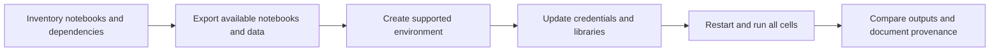

Datalab was a notebook-oriented environment for exploring data on Google Cloud. It is now deprecated; Google's own repository directs new projects and migrations toward Workbench. Keep this note as historical context and a migration guide, not as a recommendation to create new Datalab infrastructure.[^datalab]

## What carries forward

The useful workflow remains: authenticate, access data, explore it in notebooks, make the analysis reproducible, and move repeated work into a controlled execution process. Notebook convenience does not replace versioned data, dependency management, or access controls.

The current Workbench documentation describes JupyterLab environments with Google Cloud integrations and configurable compute. It is now presented under Gemini Enterprise Agent Platform Workbench. Confirm the current instance type and supported environment when following an older Vertex AI tutorial.[^workbench]

## Migration workflow

1. Locate notebooks, local files, package versions, scheduled runs, and external data references that are still accessible.
2. Export source notebooks and required data before changing any remaining environment.
3. Select a supported notebook environment based on compute, connectivity, and collaboration requirements.
4. Replace obsolete packages and environment-specific authentication with the supported identity flow.
5. Run from a clean kernel in order; compare a representative analysis with its recorded inputs and expected outputs.
6. Rebuild schedules and monitoring explicitly. Remove obsolete resources only after validation and retention decisions.

This is a proposed procedure; it does not imply that an old deleted instance or its files can be recovered.

## Example: a BigQuery analysis notebook

Keep the SQL, input table version or observation period, parameters, and output interpretation together. Use [[BigQuery]] to aggregate large datasets before collecting results into notebook memory. A small local dataframe can be useful; downloading an entire warehouse table often changes both cost and memory requirements.

Move reusable transformations into tested modules or [[ML Pipelines]] once they become operational dependencies. A notebook that works only because cells were run in an undocumented order is not a reproducible pipeline.

## Operational pitfalls

- Credentials embedded in notebooks or cell output.
- Dependencies installed interactively but absent after recreation.
- Local-only files mistaken for durable shared artifacts.
- Idle compute accumulating cost.
- A migration that copies notebooks but omits scheduled runs and their access identities.

## Exercise

Restart a representative notebook's kernel and specify the evidence needed to show that its result can be reproduced from recorded inputs. This exercise has not been run as part of the note update.

## References & Useful Links

[^datalab]: [Official Datalab repository](https://github.com/googledatalab/datalab) — Deprecation notice and migration direction.
[^workbench]: [Current Workbench introduction](https://docs.cloud.google.com/gemini-enterprise-agent-platform/notebooks/workbench/introduction) — Supported notebook workflow, integrations, and environment controls; checked September 2026.
