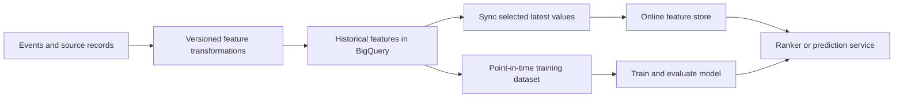

A feature store manages the values used by machine-learning models and the contracts around them: entity identity, feature definitions, timestamps, freshness, and retrieval. It connects [[Feature Engineering]] to training and serving; it does not automatically prevent leakage or make inconsistent transformations equivalent.

## Offline and online paths

The offline path needs reproducible historical values. The online path needs bounded lookup latency and a freshness policy. A feature can be present in BigQuery while an online copy is still stale.

## Current Google Cloud product distinctions

The current overview reached from the Vertex AI Feature Store documentation is titled **Feature Store on Gemini Enterprise Agent Platform**. It uses BigQuery tables/views for offline feature data, with feature groups, features, online stores, and feature views organizing online access.[^overview]

Bigtable online serving supports scheduled and continuous synchronization. This is a materialization/serving path; do not design each search request as an unrestricted BigQuery scan. Its feature-serving capability is distinct from embeddings management.[^serving]

As verified on **26 September 2026**, Google's deprecation page lists both **Vertex AI Feature Store (Legacy)** and **Optimized online serving** as deprecated on 17 February 2026, with shutdown scheduled for **17 February 2027**. Its stated migration directions distinguish V2 feature management from the Bigtable online-serving option. Do not apply a legacy API example to every feature-store generation.[^deprecations]

## End-to-end feature contract

1. Define the entity key and feature version, such as a user's visit count during the preceding 30 days.
2. Record event time and when the value became available to the system.
3. Build historical values without using data from after the prediction being reconstructed.
4. Publish validated values and track synchronization status.
5. Fetch a bounded feature set under the serving deadline.
6. Define defaults for missing or stale values, and record when those defaults were used.
7. Monitor freshness, missing rates, distribution changes, latency, and model outcomes separately.

## Example: Monday-morning destinations

A user favors “Office,” and weekday-morning visits are frequent. Candidate features could include favorite status, weekday-morning visit count, and time since the last trip. The ranking policy decides the favorite boost; the feature store supplies the data.

For a historical recommendation at 08:00, a trip occurring at 07:50 but ingested at 08:10 was not available to the online system. A realistic training reconstruction must account for availability time, not merely event time. See [[Data Leakage]].

## Failure modes and migration

Watch for entity-key mismatches, out-of-order updates replacing newer values, nulls confused with zero, stale features, and inconsistent preprocessing. During migration, compare sampled feature values and timestamps, shadow reads, missing-value behavior, and latency before switching the production read path. Preserve historical data and a rollback route until reconciliation succeeds.

## Exercise

A favorite is removed at 09:00, but the online store refreshes later. Define the acceptable stale interval and whether this field should be read directly from its transactional source.

> [!tip]- Reasoning hint
> Fields that express an explicit user action may need a tighter freshness contract than behavioral aggregates; one synchronization schedule need not fit every feature.

## References & Useful Links

[^overview]: [Current Feature Store overview](https://docs.cloud.google.com/gemini-enterprise-agent-platform/machine-learning/featurestore/latest/overview) — BigQuery offline data and feature-management resources.
[^serving]: [Online serving types](https://docs.cloud.google.com/gemini-enterprise-agent-platform/machine-learning/featurestore/latest/online-serving-types) — Bigtable synchronization and serving distinctions.
[^deprecations]: [Vertex AI deprecations](https://docs.cloud.google.com/vertex-ai/docs/deprecations) — Legacy and Optimized online-serving lifecycle dates; checked 26 September 2026.
