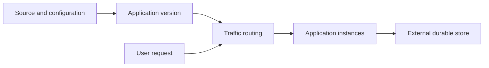

App Engine is a managed application platform. The platform handles much of the deployment and scaling machinery while the application follows the selected environment's runtime and operational constraints. Current documentation recommends considering [[Cloud Run]] for new applications; existing App Engine applications still need a deliberate migration decision.[^environments]

## Standard and flexible environments

| Decision | Standard | Flexible |
|---|---|---|
| Runtime model | Supported runtimes in a constrained environment | Containers on managed Compute Engine VMs |
| Infrastructure control | Less direct control | More runtime flexibility |
| Scaling floor | Can scale to zero in supported configurations | Keeps at least one instance |
| Suitable starting point | Application fits the supported runtime model | Application needs the flexible environment's capabilities |

Exact limits vary with runtime and configuration. Verify them before using a remembered exam comparison to make a deployment decision.[^environments]

## Request and release lifecycle

1. Choose the project, location, and environment with networking and data placement in mind.
2. Define the application configuration and runtime identity.
3. Deploy a version, then verify readiness and dependency access.
4. Route traffic to the version and monitor errors, latency, and instance behavior.
5. Retain a tested rollback path, including compatibility with changes to persistent data.

Treat the application as replaceable compute. A file written inside one instance is not a shared database. Use [[Cloud SQL, Cloud Spanner]], [[DataStore]], or [[Cloud Storage]] according to the data model.

## Example and trade-offs

For an existing Python web application on Standard, a supported runtime upgrade may be a smaller change than moving platforms. For a new containerized API, compare Cloud Run's runtime model, deployment workflow, and networking against the same requirements.

Evaluate total operating cost: developer effort, minimum running capacity, dependency traffic, observability, and migration risk. Automatic scaling is not evidence that an application can handle unlimited traffic; quotas, startup time, database connections, and application bottlenecks remain.

## Failure modes and exercise

Watch for assumptions about local persistence, unsupported libraries, incompatible runtime upgrades, and deployments that change both code and data contracts at once.

**Exercise:** A legacy application relies on local uploaded files. Describe how to move those files to durable object storage before changing the compute platform.

## References & Useful Links

[^environments]: [Choose an App Engine environment](https://docs.cloud.google.com/appengine/docs/the-appengine-environments) — Current environment differences and guidance for new applications.
