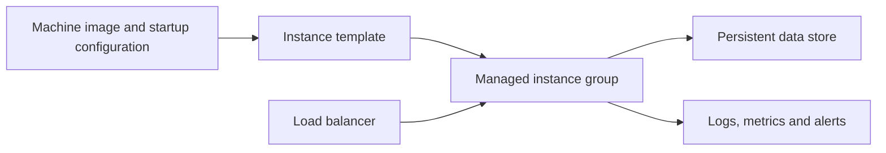

Compute Engine provides virtual machines (VMs) when an application needs control over its operating system, installed software, or machine configuration. Google operates the underlying infrastructure; the workload owner still plans patching, application availability, and recovery.[^overview]

## From image to running application

1. Choose a region, zones, machine shape, and OS image from workload requirements.
2. Configure [[VPC]] connectivity, firewall rules, and a least-privilege [[Service Account]].
3. Install the application reproducibly; avoid manual changes that cannot be recreated.
4. For a replicated service, use an instance template and managed instance group. Make health checks reflect whether an instance can serve useful traffic.
5. Put durable state in suitable storage, then test instance replacement and backup restoration.
6. Monitor capacity, errors, disk growth, and cost. Scale or resize based on measurements.

VMs can run containers or ordinary processes. Container use does not automatically require [[G Container Engine|GKE]].

## Availability and storage decisions

A single VM is a failure domain. Replicas across zones can protect an application from some zonal failures, but dependencies must also tolerate those failures. A load balancer cannot repair a database that every replica depends on.

Choose disks by durability, throughput, latency, and lifecycle requirements. Local scratch storage and durable attached storage have different failure behavior. An attached disk also needs a backup policy; persistence is not protection against accidental deletion or application corruption.

## Spot VMs and interruption

Spot VMs suit work that can be interrupted and retried, such as partitioned batch processing. Capacity is not guaranteed and Compute Engine can reclaim it. Current Spot VMs do not inherit the fixed 24-hour limit associated with legacy preemptible VMs; a separately configured runtime limit is another matter.[^spot]

For a batch embedding job, write completed shard outputs to [[Cloud Storage]], checkpoint progress, and make repeated output writes safe. Measure the cost of recomputation as well as the discounted compute price.

## Trade-offs and failure modes

- **Choose VMs:** OS customization, existing VM-based software, or explicit infrastructure control matters.
- **Evaluate [[Cloud Run]]:** a containerized API needs less infrastructure management.
- **Evaluate GKE:** Kubernetes scheduling and workload orchestration are requirements.
- **Watch for:** mutable server setup, unpatched images, unbounded disks, single-zone dependencies, and autoscaling that overwhelms a database.

## Exercise

A batch job loses its VM after completing 90% of its work. Design an output manifest that lets a replacement resume without publishing incomplete results.

## References & Useful Links

[^overview]: [Compute Engine overview](https://docs.cloud.google.com/compute/docs/overview) — VM capabilities and the infrastructure responsibility boundary.
[^spot]: [Spot VMs](https://docs.cloud.google.com/compute/docs/instances/spot) — Interruption, availability, and runtime behavior.
