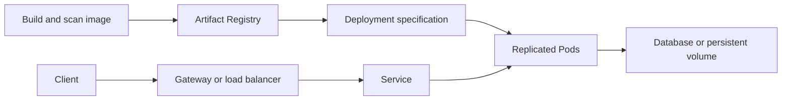

Google Kubernetes Engine (GKE), formerly called Container Engine, runs [[Kubernetes]] workloads with a managed control plane. It is useful when Kubernetes capabilities are part of the requirement, rather than simply because an application has a container image.[^overview]

## Core objects

| Object | Purpose |
|---|---|
| Cluster | Control plane and workload execution environment |
| Node | Compute resource that runs Pods |
| Pod | Scheduled unit containing one or more closely coupled containers |
| Deployment | Desired replica count and rollout policy for replaceable Pods |
| Service | Stable discovery and access to a changing set of Pods |
| Persistent volume | Storage with a lifecycle separate from an individual container |

A Pod can disappear or move. Keep session state and durable records outside its writable container layer; use persistent volumes or an external database when the workload requires them.

## Deployment flow

1. Select a cluster location and networking design; establish workload identity and deployment permissions.
2. Define CPU and memory requests, health probes, replicas, and configuration separately from the image.
3. Deploy an immutable image version and observe rollout health.
4. Verify routing, dependency permissions, and capacity under representative traffic.
5. Exercise Pod replacement, node disruption, and rollback before relying on automatic recovery.

## Autopilot versus Standard

Autopilot delegates more node provisioning and configuration to Google. Standard exposes more node-level control. Both leave application correctness, resource requirements, access policies, and workload recovery design with the application team.[^overview]

Choose based on required capabilities and operating model, then verify supported configurations and pricing for the actual workload. More control also creates more decisions to maintain.

## Example: retrieval and ranking services

A proposed search deployment can scale retrieval and ranking independently because their CPU, memory, and latency profiles differ. Put limits on concurrent downstream calls so adding ranking Pods does not overload a shared feature store. Separate resource pools only when measurements justify the extra operational complexity.

This is a design example, not a claim about the deployment of [[Search2.0 architecture]].

## Common failure modes

- Requests exceed available capacity, so Pods stay pending even though autoscaling is enabled.
- Memory limits cause repeated termination; adding replicas does not fix a per-request memory leak.
- A shallow health check reports success while the application cannot reach a critical dependency.
- Every replica mounts or writes storage as though it were the only writer.
- Rollouts change application and database contracts incompatibly.

## Exercise

Design a rollout that keeps the previous application version usable while a database schema changes. State which changes must be backward compatible.

## References & Useful Links

[^overview]: [GKE overview](https://docs.cloud.google.com/kubernetes-engine/docs/concepts/kubernetes-engine-overview) — Kubernetes resources and the Autopilot/Standard operating models.
