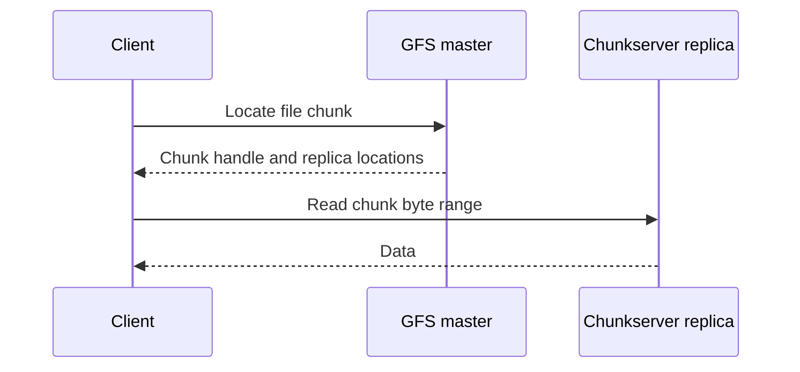

The Google File System (GFS) is a distributed filesystem described by Sanjay Ghemawat, Howard Gobioff, and Shun-Tak Leung in their 2003 paper. Read it as a historical systems design: its workload assumptions explain its architecture, but it is not the current public API contract of [[Cloud Storage]] or [[BigQuery]].[^paper]

## Read path and responsibility split

The master manages metadata. Clients obtain chunk locations and then transfer file data directly with chunkservers; the master is not in the bulk-data path. Clients can cache location information to reduce repeated metadata requests. Replication and background repair address machine failures.[^paper]

This separation is useful intuition for other systems: the component deciding **where** data lives need not carry every byte of that data. It also creates a separate metadata availability and scaling problem.

## Failure reasoning exercise

Suppose a client has a cached location and that server becomes unavailable. A robust design needs another replica or refreshed metadata, a bounded retry policy, and a way to avoid accepting obsolete data. Distinguish temporary inability to read from permanent data loss.

Do not conclude that copying data three times makes all failure modes equivalent. Placement, correlated failures, repair speed, and correctness of metadata each matter. This is a design exercise rather than a reproduction of every GFS recovery mechanism.

## From GFS to Colossus

Google identifies **Colossus** as GFS's successor. Its published architecture separates distributed metadata services, data-serving machines, and background maintenance. The motivation includes scaling metadata beyond the original GFS design.[^colossus]

Modern managed storage services add their own interfaces, consistency guarantees, security, and availability commitments. A historical implementation paper cannot establish today's customer-facing behavior; consult the individual service documentation.

## Connections for revision

Compare the metadata/data split with [[HDFS]], and connect the storage substrate to large-scale processing in [[MapReduce]]. Keep the filesystem, processing framework, database, and analytics service as distinct layers.

## References & Useful Links

[^paper]: [The Google File System paper](https://storage.googleapis.com/gweb-research2023-media/pubtools/4446.pdf) — Original 2003 design; especially architecture and the read path in Section 2.
[^colossus]: [Colossus architecture](https://cloud.google.com/blog/products/storage-data-transfer/a-peek-behind-colossus-googles-file-system) — Google's 2021 explanation of the successor system and distributed metadata.
