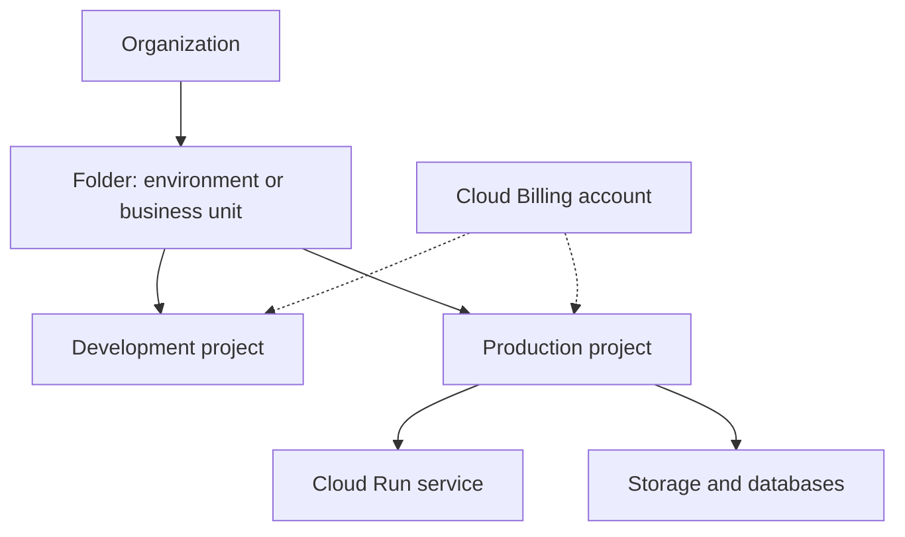

## Purpose and Resource Hierarchy

A project is a boundary for organizing Google Cloud resources, enabling APIs, assigning access, and attributing usage. It is not the top of every organization's hierarchy: organizations can contain folders, which contain projects. A project has a stable project ID, a numeric project number, and a changeable display name.[^hierarchy]

The billing association is separate from the resource-parent hierarchy. A billing account can pay for multiple projects; access to a project and access to its billing account are different permissions.[^billing]

## Establish a Project End to End

1. Identify the owner, environment, data classification, and intended workloads.
2. Select the organization/folder and project ID. Use separate development and production projects when the isolation benefit justifies it.
3. Link the appropriate billing account and configure cost visibility.
4. Enable only the required service APIs and inspect relevant quotas.
5. Grant human access through groups and workload access through dedicated [[Service Account|service accounts]].
6. Design [[VPC|network connectivity]], resource locations, logs, and recovery before deployment.
7. Deploy through reviewed infrastructure/configuration and record ownership for ongoing operations.

This is a planning checklist, not a sequence executed against an account.

## Example: Search Platform Environments

A proposed `search-dev` project hosts synthetic test data and experimental revisions. A separate `search-prod` project hosts live traffic and protected data. The deployment identity may update the service, while the runtime identity can read only the specific datasets it needs. Evaluate inherited [[IAM]] grants too: separation by project name alone does not prevent broad organization-level access.

## Lifecycle and Cost Pitfalls

- A project is not a region. Its resources can have different location scopes and residency implications.
- A billing budget is an alerting/control input, not a reliable automatic hard spending cap.
- Deleting an entire project is a destructive lifecycle operation, not a routine way to stop one unused VM. Inventory resources, dependencies, retention, and recovery requirements before teardown.
- Changing billing or disabling an API can affect running workloads. Treat either as an operational change.

## Exercise

Draw development and production projects, their billing account, deployment identity, runtime identity, and data resources. Mark every permission that crosses a project boundary and explain why it is needed.

## References & Useful Links

[^hierarchy]: [Google Cloud resource hierarchy](https://docs.cloud.google.com/resource-manager/docs/cloud-platform-resource-hierarchy) — Organizations, folders, projects, identifiers, and policy inheritance.
[^billing]: [Manage a Cloud Billing account](https://docs.cloud.google.com/billing/docs/how-to/manage-billing-account) — Billing administration and linked projects.
