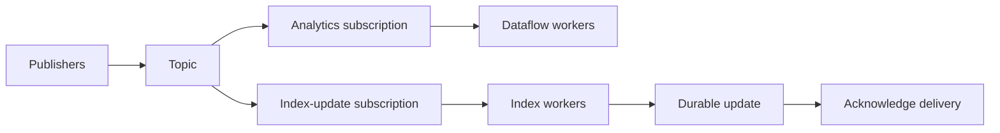

Pub/Sub decouples event producers from consumers. A publisher sends a message to a **topic**; each **subscription** tracks delivery independently. Multiple workers on one subscription share its work, while separate subscriptions allow different applications to consume the same event stream.[^subscriptions]

## End-to-end delivery

Choose **pull** when workers should control consumption, **push** when Pub/Sub should deliver to an HTTP endpoint, or a supported **export subscription** for direct delivery to another Google Cloud destination. A transformation pipeline is only needed when the transformation or processing requirements justify it.[^subscriptions]

## Design the message contract

Include an application event ID, schema version, entity ID, event time, and relevant payload. Separate the business event ID from Pub/Sub's message ID: a producer can publish the same business event twice as distinct messages.

1. Validate and publish the event; record publish failures explicitly.
2. Consume with bounded concurrency and memory.
3. Validate the schema and apply a safe, durable effect.
4. Acknowledge after the intended processing boundary has succeeded.
5. Retry transient failures and route poison messages to a configured recovery path.

A database update followed by publication is a two-system operation. Use an outbox or another explicit reconciliation mechanism when losing the event after the database commit is unacceptable.

## Redelivery, exactly-once, and ordering

Design for redelivery under ordinary delivery settings. If a worker commits an update and crashes before acknowledgment, the next attempt must recognize the completed operation.

Pub/Sub's exactly-once feature applies to **pull subscriptions** within its documented regional scope. Acknowledgment success matters; expiration or a negative acknowledgment can still cause valid redelivery. It does not make an arbitrary external API effect transactional with acknowledgment.[^exactly-once]

Ordering is opt-in, scoped to an ordering key, and requires related messages to be published in the same region. It is not global ordering across all keys. A hot key can serialize too much work, and redelivery can affect subsequent messages on that key.[^ordering]

## Example: update a search index

Suppose product version 12 arrives after version 13. Store a version with each indexed document and apply updates conditionally so an older event cannot overwrite newer state. Handle deletions with an equally explicit version policy. Ordering helps where configured, but version checks also protect replay and multi-source ingestion.

## Monitor and test

Track backlog size, oldest unacknowledged event age, processing failures, and destination freshness. A low error rate with an ever-growing backlog is still an unhealthy pipeline.

Test duplicate publication, delivery retries, malformed payloads, slow consumers, and recovery after retention limits. See [[Data Flow]] for windowed aggregation and [[Index Updates]] for serving consistency.

## Exercise

A worker writes a document and then loses its network connection. Explain which state distinguishes “safe to acknowledge” from “must retry,” and how that state survives worker replacement.

## References & Useful Links

[^subscriptions]: [Choose a subscription type](https://docs.cloud.google.com/pubsub/docs/subscriber) — Pull, push, export, and work distribution.
[^exactly-once]: [Exactly-once delivery](https://docs.cloud.google.com/pubsub/docs/exactly-once-delivery) — Scope, acknowledgments, and redelivery semantics.
[^ordering]: [Order messages](https://docs.cloud.google.com/pubsub/docs/ordering) — Ordering keys, regional publication, and operational trade-offs.
