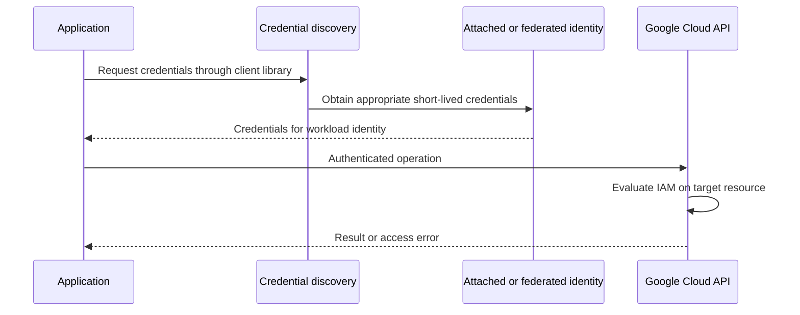

## Overview

A service account is an identity for a workload. An application authenticates **as that identity** when accessing an API; the identity's permissions determine what it may do. The user of the application need not be the principal used for its database or storage calls.[^accounts]

A service account also has its own access policy: permission to use or impersonate an account is different from permissions granted to that account on other resources. Google-managed service agents have service-specific purposes; do not casually replace or broaden their roles.

## Credential Flow

Application Default Credentials (ADC) is a discovery mechanism, not a separate identity. Its search order includes explicit environment configuration, local ADC credentials, and an attached service account from the metadata service when available. The credentials used by `gcloud` and a local application's ADC can differ.[^adc]

## Use It End to End

1. Create or select a purpose-specific runtime account.
2. Grant only the required resource roles through [[IAM]].
3. Attach it to the workload or configure a supported federation/impersonation flow.
4. Let a supported client library obtain and refresh credentials.
5. Exercise a real operation and inspect the effective principal in diagnostics.
6. Review unused permissions and credentials as the application changes.

Prefer attached identity or short-lived federation over distributing long-lived JSON keys. If keys are unavoidable, their storage, rotation, revocation, and exposure response become explicit responsibilities.[^accounts]

## Example: Build Identity versus Runtime Identity

The [[Cloud Build]] identity publishes an image and deploys a revision. The [[Cloud Run]] runtime identity reads the model bucket and queries the serving database. Neither needs all the other's privileges. A developer can test the runtime's access through an authorized impersonation flow without changing the production service to use personal credentials.

## Pitfalls and Exercise

An account existing does not grant API access. A valid token does not prove permission on the target resource. A broadly privileged default account can mask missing deployment configuration.

Draw the identities used by local development, CI, and production for one application. Explain how a permission error could affect only one environment even when the code is identical.

## References & Useful Links

[^accounts]: [Service accounts overview](https://docs.cloud.google.com/iam/docs/service-account-overview) — Workload identity, impersonation, service agents, and key alternatives.
[^adc]: [How Application Default Credentials works](https://docs.cloud.google.com/docs/authentication/application-default-credentials) — Credential discovery and local-versus-attached credentials.
