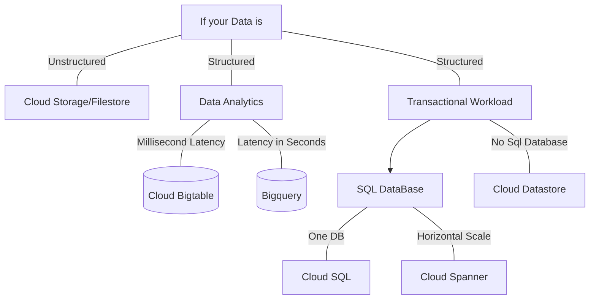

Usecae vs Storage Option
1. Block storage for compute VMs - Persistent Disk or SSD
2. Immutabe blobs like video/image - Cloud Storage
3. OLTP - Cloud SQL or Cloud Spanner
4. NoSQL Documents like HTML/XML - Datastore
5. NoSQL Key-values - BigTable (~[[HBase]])
6. Getting data into Cloud Storage - Transfer Service

## Mapping Opensource with GCP Offering
1. [[Hive]] -> BigQuery
2. HBase -> Big Table
3. MongoDB ->DataStore

## Storage Specific

Type of Need | Open Source | GCP Option
---|---|---
Storage for Compute, Block Storage | Persistent (Hard Disk), SSD | Persistent (hard disks),SSD
Storing media, Blob Storage | File System or [[HDFS]] | [[Cloud Storage]]
SQL Interface atop file data | [[Hive]](SQL-like but [[MapReduce]] on HDFS) | [[BigQuery]] 
Document database, NoSQL | CouchDB, MongoDB (key-value/indexed database) | [[DataStore]]
Fast scanning, NoSQL | [[HBase]] (columnar database) | [[BigTable]]
Transaction Processing (OLTP) | RDBMS | [[Cloud SQL, Cloud Spanner]]
Analytics/Data Warehouse (OLAP) | [[Hive]] (SQL-like, but MapReduce on HDFC) | [[BigQuery]]

## Points

`Block Storage` 
- Data is not **structured**
- Lowest level of storage - no abstraction at all
- **Meant for use from VMs**
- Location tied to VM location

Types of GCP Options onto which **block storage** can be stored
- Persistent Disk
- Standard
- SSD
- Local SSD

## Transfering data to GCP
![[Transfer Service]]

## Mobile Specific Use Case

Type of Need | GCP Option
---|---
Storage for Compute, Block Storage along with mobile SDKs | Cloud Storage for Firebase
Fast random access with mobile SDKs | Firebase Realtime DB

## Choosing the right DB

 Type | Cloud Storage | Cloud SQL | Datastore | Bigtable | BigQuery
 -|-|-|-|-|-|
 Capacity | Petabytes + | Gigabytes | Terabytes | Petabytes | Petabytes
 Access metaphor |Like files in a file system | Relational DB | Persistent Hashmap | Key-value,HBase API |Data warehouse
 Read | Have to copy to local disk | Select Rows | filter objects on property | scan rows | Select rows
 Write | One file | Insert row | put object | put row | Batch/stream
 Update granularity | An object (a file) | Field | Attribute | Row | Field
 Usage | Store blobs | No-ops SQL DB on Cloud | Structred data from App Engine apps | No-ops, high throughput, scalable, flattened data | Interactive SQL* querying fully managed warehouse
 
 ## Selection Flow Chart
 

