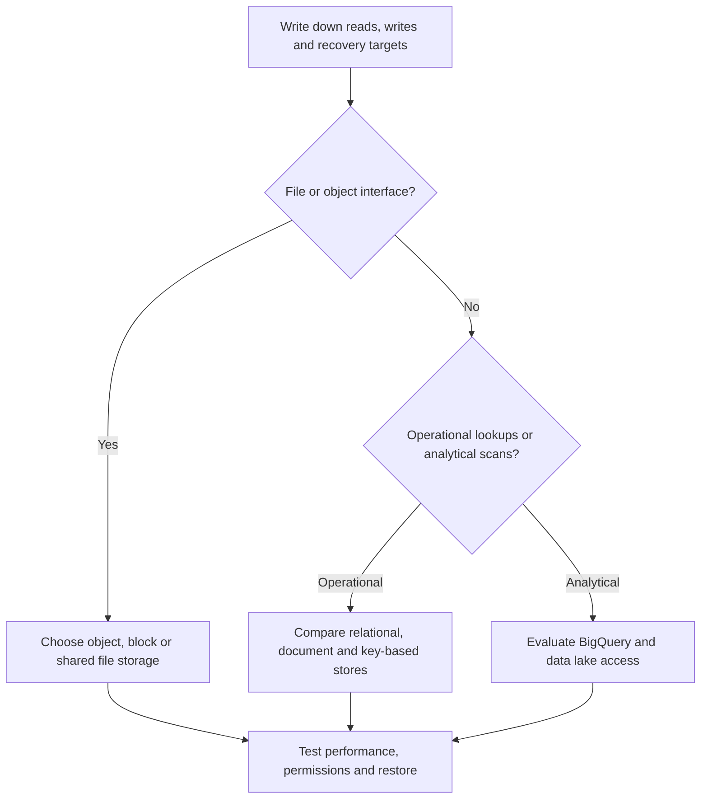

Choose storage by its access contract: what is read or written together, how quickly it must respond, and what consistency and recovery the application requires. “Structured versus unstructured” is useful vocabulary, but it is too coarse to select a service on its own.

## Storage and database families

| Need | Starting option | Key question |
|---|---|---|
| Objects and dataset files | [[Cloud Storage]] | Whole-object access and retention? |
| VM block devices | Hyperdisk or Persistent Disk | Disk performance and recovery? |
| Shared filesystem | Filestore | Shared file semantics required? |
| Relational application data | [[Cloud SQL, Cloud Spanner]] | Compatibility, transactions, scale? |
| Entity-oriented application data | [[DataStore]] | Indexed query patterns fit? |
| Large key/range workloads | [[BigTable]] | Row key and access distribution? |
| Analytical queries | [[BigQuery]] | Scan, aggregation, freshness? |

Object, block, and file storage expose different interfaces. Cloud Storage for Firebase is not a block-storage product; do not confuse **Firebase** with **Filestore**.[^storage]

Bigtable stores data organized by row keys and column families. It is useful when its access pattern fits; calling it an “unstructured blob store” hides the most important schema decision.[^bigtable]

## End-to-end selection process

```mermaid
flowchart TD
    R["Write down reads, writes and recovery targets"] --> F{"File or object interface?"}
    F -->|Yes| S["Choose object, block or shared file storage"]
    F -->|No| Q{"Operational lookups or analytical scans?"}
    Q -->|Operational| D["Compare relational, document and key-based stores"]
    Q -->|Analytical| B["Evaluate BigQuery and data lake access"]
    S --> T["Test performance, permissions and restore"]
    D --> T
    B --> T
```

1. Estimate record size, data growth, read/write rates, and skew.
2. Specify consistency, transaction boundaries, and query shapes.
3. Identify location, access-control, retention, and deletion requirements.
4. Measure the busiest realistic workload and a recovery scenario.
5. Include replicas, indexes, backups, operations, and network transfer in cost estimates.

## Example: a search system uses several stores

A proposed architecture can keep raw catalog exports in Cloud Storage, transactional product metadata in a relational store, and behavioral aggregates in BigQuery. A separate online cache can hold derived values with a freshness contract.

Each store has an owner and source-of-truth role. A cache miss must not silently turn into an unbounded analytical query on the request path. A delayed pipeline should be visible through data-age metrics, even if the serving API remains available.

## Hadoop ecosystem connections

[[HDFS]] provides a distributed filesystem; [[HBase]] provides a different data-serving abstraction; [[Hive]] is a SQL-oriented processing layer. They are not interchangeable storage classes. A [[MapReduce]] or Spark pipeline can read from external object storage through supported connectors without requiring every dataset to be permanently copied onto cluster-local disks.

The existing transfer note remains embedded for ingestion planning:

![[Transfer Service]]

## Exercise

Separate the storage needs of user uploads, order updates, daily reports, and temporary processing files. For each, name one recovery test and one cost driver.

## References & Useful Links

[^storage]: [Google Cloud storage products](https://cloud.google.com/products/storage) — Object, block, and file storage families.
[^bigtable]: [Bigtable overview](https://docs.cloud.google.com/bigtable/docs/overview) — Row-oriented access model and suitable workloads.
