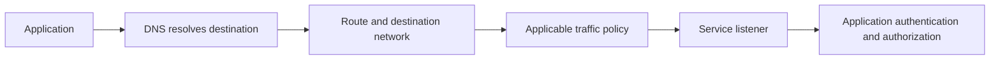

## Overview

A Virtual Private Cloud (VPC) provides network connectivity and traffic controls for cloud resources. In Google Cloud a VPC network is global, while its subnets are regional. Instances in different zones can use the same regional subnet. Network access and [[IAM]] authorization answer different questions.[^vpc]

## Follow a Connection End to End

A connection needs a destination address, a route, permitted traffic, a listening service, and—where required—application authentication. A route alone does not authorize traffic, and an allowed firewall path does not grant database permissions.

Use this as a troubleshooting sequence, not a claim that every managed product exposes each stage identically.

## Design the Network

1. Allocate non-overlapping address ranges with room for growth and managed-service allocations.
2. Select subnets near the workload's data and intended failure boundaries.
3. Document ingress and egress separately, including DNS and private service connectivity.
4. Permit only the intended sources, targets, protocols, and ports.
5. Choose cross-project connectivity deliberately: Shared VPC centralizes a network; peering connects distinct networks under its routing constraints.
6. Validate the actual workload-to-service path and observe errors and latency.

A private API connection may require a product-specific endpoint configuration. Do not assume that placing a workload in a subnet automatically gives it private connectivity to every managed service.

## Worked Scenario: Search API to Database

A service can reach a public vendor but times out connecting to a private database. Confirm the resolved database address, the application's egress path, subnet/range compatibility, traffic rules, and the database listener. Only after establishing connectivity should you interpret database-authentication errors. For [[Cloud Run]], explicitly configure the supported VPC egress path; it is not a VM you can place in a subnet by analogy.

## Trade-offs and Pitfalls

- Global network scope does not remove cross-region latency or data-transfer costs.
- A large shared network simplifies some connectivity but increases coordination and address-planning needs.
- An IP allowlist based on an unstable outbound address can fail after scaling or redeployment.
- Legacy load-balancer names in older notes are not a network design. Select by protocol, reachability, and scope in [[Cloud Load Balancing]].

## Exercise

Diagram a public HTTPS API, a private database, and an external vendor. Label which connections enter the system, which leave it, and which need user identity versus workload identity.

## References & Useful Links

[^vpc]: [VPC networks](https://docs.cloud.google.com/vpc/docs/vpc) — Global networks, regional subnets, routing, firewall rules, and connectivity options.
- [Cloud Run container runtime contract](https://docs.cloud.google.com/run/docs/container-contract) — Product-specific networking and execution behavior.
