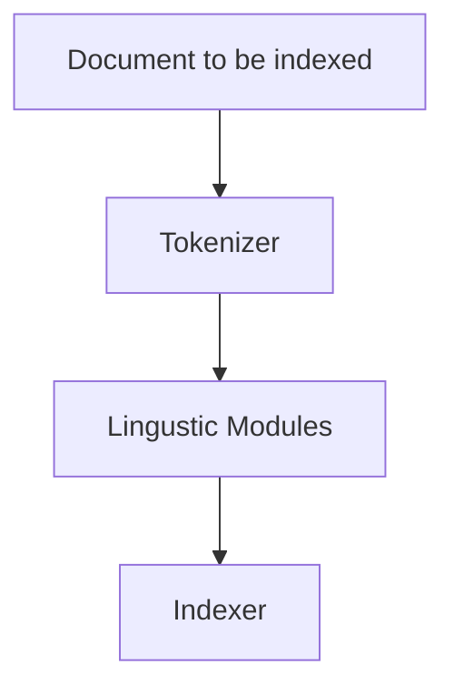

Inverted Index Construction

## Steps in Text Processing

1. Tokenization - Cutting the character sequence to word tokens
2. Normalization - Map text and query term to the same form
	1. U.S.A = US 
3. Stemming
4. Stop words

## Indexing Steps
1. Sort by terms, that is once the text processing takes place, thereafter, sort the elements in the doc, in a alphabetic order
2. Next, sort the term's across all the documents
3. Since there will be repetations,
	1. Multiple term entries in a single document are merged
4. `Document frequency` - Tells the frequency of element across all the documents
	1. This is added after the prior step
5. Postings list is created, which tells which document the token appers, additionally, this is also sorted in the ascending order