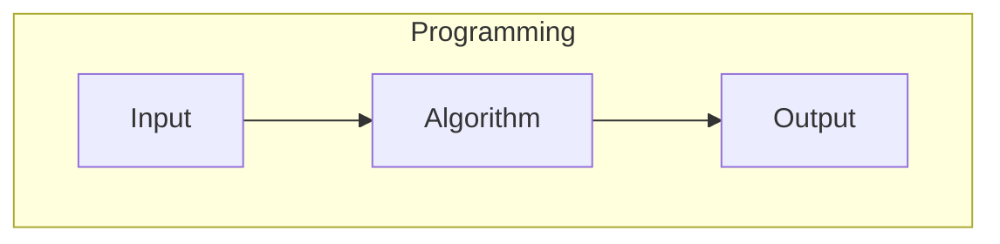
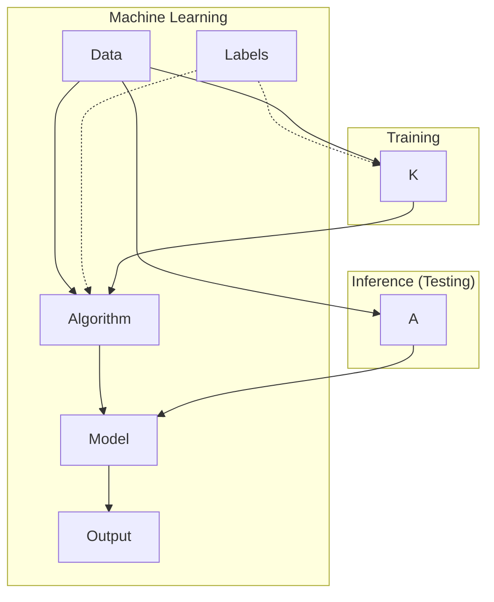

- Study of machine learning explainability involves understanding the predictions made by the machine learning model
- When a model makes prediction, such predictions cannot be acted upon on blind faith, since the consequences may be catastrophic

