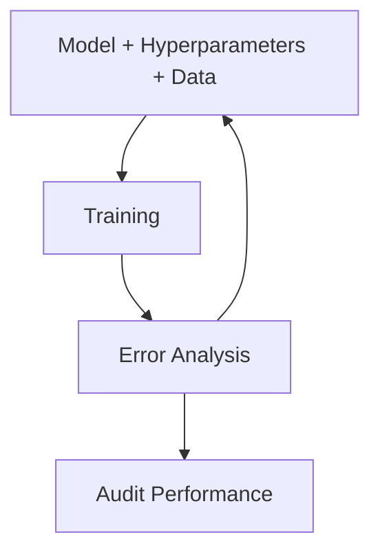

 ### Machine Learning LifeCycle
 
 ```mermaid
 flowchart LR 
 A[Scoping] -->B[Data] --> C[Modeling] --> D[Deployment]
 ```
 
 1. Scoping 
	 1. Identification of the problem statement
 2. [[Data - MLOPs| Data]]
	 1. Define data and establish baseline
		 1. Ways to establish `baseline`
			 1. Comparing with [[Human Level Performance]] 
			 2. Literature serach for SOA/Open Source
			 3. Quick and dirty implementation
			 4. Performance of older system
	 2. Label and organize data
 3. Modeling
	 1. Select and train model
	 2. Perform error analysis
 4. [[Deployment - MLOPs]]
	 1. Deploy in Production
	 2. Monitor and maintain system

### Major Considerations 

`Scoping`
- Decide the key metrics
	- Accuracy, latency and throughput

`Data`
- Estimate resources and timeline
- Data consistency check
	- Identify if the data is consistent
- Data modification and normalization

`Modeling`
- There are 3 major pieces
	- Algorithm
	- Hyperparameters
	- Data
- The focus should be more on Hyperparameters and Data over Algorithm

`Deployment`
- Concept Drift & Data Drift
- [[Experiment Tracking]]

### Flow Chart



It is quite important to ensure that at the start of model development, Hyperparameters and Data are given much of the importance.

`Data Centric Approach` - Herein, focus needs to be on the data of the model. Ensuring that data is improved

`Model Centric Approach` - Herein, the focus is on the model. 

### Error Analysis & Audit Performance
- [[Skewed DataSets]] issues should be addressed
- Prioritization on scopes of improvements
	- Herein, there is a need to identify whereall the system performance can be improved and identify the one which will ensure the best gains
- Developing a Baseline - help put a more complex model into context in terms of accuracy  

### Audit Framework
1. Identify ways a system may go wrong
	1. This could be on different genders, ethnicities
2. Establish metrics to assess performance against these issues on apporopriate slices of data
	1. Ensure that the model is fair and consistent

### Model Degradation

![[Model Degradation]]
