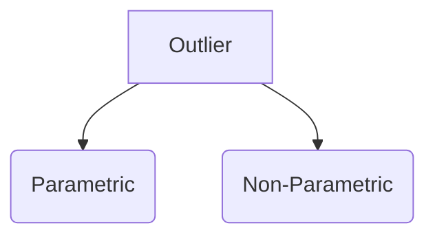
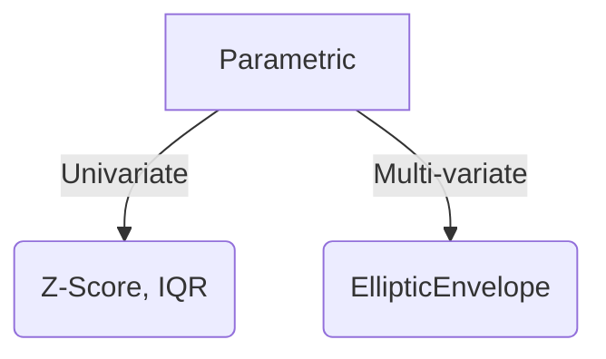
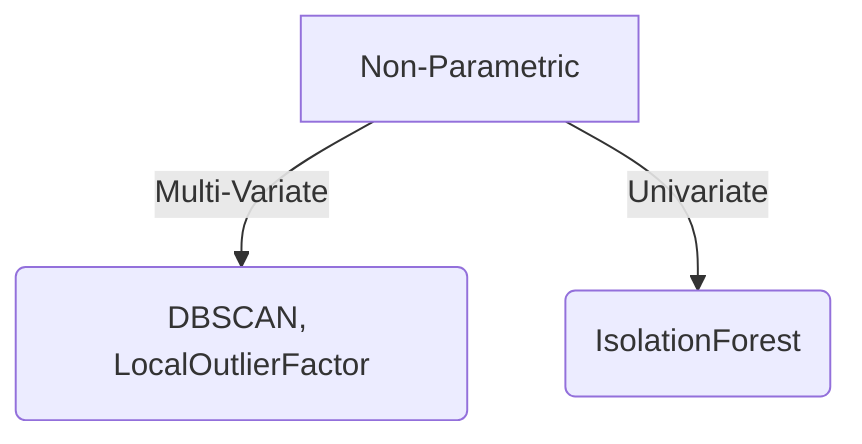

`Outlier` is a data point that is distant from all other observations. Outliers can occur due to two reasons
1. Variability in the data
2. Experimental measurement error

> Algorithms not affected much by outliers - Tree based algorithms. Most classification algorithms are somewhat robust to outliers. Algorithms that create linear boundaries are somewhat robust but will be biased if data is not linearly seperable







### Z-Score

Formula for Z-Score is as follows $z = \frac{Observation - Mean}{Standard Deviation}$, if the value is < -3 or > 3, then it is a outlier

As per Normal Distribution, we have 
1. 68% for 1 SD
2. 95% for 2 SD
3. 99.7% for 3 SD

### IQR 

Using Interquartile range
1. We find the Q1 & Q3 values, 1st and 3rd Quartile or 25th and 75th Percentile
2. IQR Value = Q3-Q1
3. Find the Bound Value
	1. Lower Bound = Q1 - (1.5* IQR Value)
	2. Upper Bound = Q3 + (1.5* IQR Value)	
4. Values below Lower bound and Above upper bound should be rejected

> IQR method filters more data than Z-Score, since Q1/3 +/- 1.5 * IQR < 3 $\sigma$

```py
import numpy as np

Q1,Q3 = np.percentile(dataset,[25,75])
IQR = Q3-Q1

Lower_Bound = Q1 - (1.5*IQR)
Upper_Bound = Q3 + (1.5* IQR)
```

### IsolationForest
Isoloation Forest works on 2 important principles of anomalous data
1. Few - they are the minority consisting of fewer instances
2. Different - They have attribute values that are very different from those of normal instances

Isolation forest builds an ensemble of Isolation Trees. Anomalies are the point that have shorter average path lengths on the iTrees.
