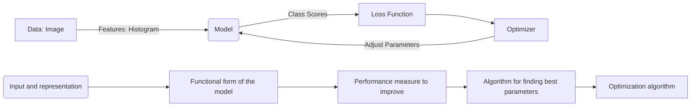

## Parametric Models in Machine Learning

Parametric models in machine learning are defined by the function $f$ that maps input features $X$ to outputs $Y$ using a set of parameters $W$. The goal is to find the best parameters $W$ that minimize a loss function, which measures the difference between the predicted output $\hat{y}$ and the actual output $y$. 

### Components of a Parametric Model:
- **Input (and representation):** The raw data is transformed into a feature representation.
- **Functional form of the model:** This includes the parameters of the model, typically denoted as $W$ (weights) and $b$ (bias).
- **Performance measure to improve:** It is usually a loss or objective function that the model aims to minimize.
- **Algorithm for finding best parameters:** This is commonly an optimization algorithm that iteratively adjusts the parameters to minimize the loss function.

### Linear Classifier as a Parametric Model

A linear classifier can be represented by the function $f(x, W) = Wx + b$, where:

- $x$ is the input feature vector.
- $W$ is the weight matrix, with each row corresponding to a class.
- $b$ is the bias vector.

The classifier calculates the score per class for an example and returns the label of the class with the maximum score, also known as the argmax.

### The Training Process:

1. **Compute Class Scores:** For a given input, the model computes a score for each class.
2. **Evaluate with Loss Function:** The loss function evaluates how well the model's predictions match the actual labels.
3. **Optimization:** An optimizer adjusts the parameters $W$ and $b$ to minimize the loss function, thereby improving the model's predictions.

### Supervised Learning

In supervised learning, the model learns the mapping function $f$ from labeled training data, where the input features $X$ are associated with outputs $Y$. The learned function can then be used to predict outputs for new, unseen inputs.

