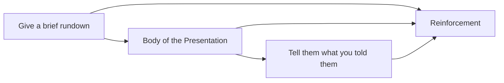

## Basic Checklist

1. Know your Audience
	1. You need to know what is the expectation of the audience, and their preference in terms of what they expect from you
2. Use Structure to build on ideas
	1. This is quite important for making things easy for the audience to understand
3. Use Visuals
	1. Use Image, Chart or Graph can have an impact on the audience
4. Repetition is your friend
	1. More than structure, use repetition to ensure that people remember the key points

- Brief rundown : Just a highlight
- Body of the Presentation : This is where you explain well
- Tell them what you told them : Final Points

5. Have a story to tell
	1. This way you get your point across
	2. You get people's attention and pull them along
	3. Be Authentic
6. Be relatable
	1. Help your audience engage mentally
	2. Be Relaxed
	3. Be ENTHUSIATIC
7. Build your Confidence with Practice
	1. Adds in authority to your talk
	2. This makes you natural and authentic

## Starting Guide

1. Start with confidence
2. Give your credentials
	1. Give them a reason why they should listen to you
3. Deliver the hook
	1. Make the audience the feel
	2. "I am going to show you"
4. Introduce your agenda
	1. The takeaway for your presentation
5. Give a credible statement

## How to hook any audience