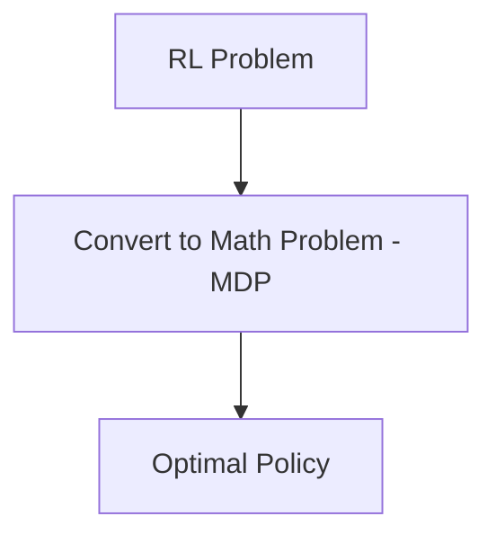

[https://arxiv.org/pdf/2007.03313.pdf](https://arxiv.org/pdf/2007.03313.pdf "https://arxiv.org/pdf/2007.03313.pdf")
https://www.andrew.cmu.edu/course/10-703/textbook/BartoSutton.pdf

MDP - State , Action, Reward, Policy , $\gamma$
You can have multiple optimal policy

$V_{\pi}(s)$ -> Expected return, starting from state S
$q_{\pi}(s,a)$

Bellman expected equations

RL is based on maximising cumulative reward not next stage reward
Optimal policy $\pi{*}$ is the objective of RL

Three Elements of RL
- Action 
- Reward 
- Observation

Iterate using Bellman equation till it converges

## Partial vs Full Observable Environment
- In fully observable enviroment, the agent has access to all the information
- In Partial observable environment,  

## RL Mathematical Formulation

- MDP is used to model the environment in RL learning. Model predicts outcomes from environment

Markov Property 
`Future is independent of the past given the present`

Markov Process
`A sequence of random states with Markov Property is known as Markov Process(Markov Chains)`

- It is represented by 
	- State
	- Transition Probabilities

Markov Reward Processes
- Markov process with reward is known as Markov Reward Processes

Markov Decision Processes
- Markov Decision Process is a Markov Reward process which have a decision associated at every state

`Return`

Reward is scalar feedback and indicates how agent is doing at point at time

## Discounting

- Determines how much importance is to be given to the immediate reward and future rewards
- Helps to avoid infinity as a reward in continuous tasks
- Value between 0 and 1. A value of 0 means that more importance is given to the immediate reward and a value of 1 means more importance is given to the future reward

## Policy

Policy define agent's

To find Optimal Policy we need two things
- $V_{\pi}(s)$ - Expected value of being a state follow $\pi$
- $q_{A}(s,a)$ - Expected value of taking an action from a state then following $\pi$

## State Value Function

What is the values of being in a state given a policy

Expected returns, 

![[Pasted image 20211123100532.png]]