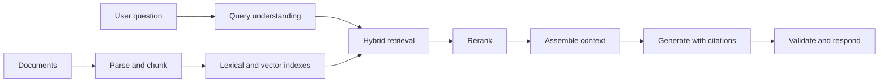

---
aliases:
  - RAG
note_type: concept
search_stage: retrieval
tags:
  - search-eng
---

Retrieval-augmented generation (RAG) answers a question by first **retrieving** relevant passages from a document collection, then asking a language model to **generate** an answer from those passages. It combines a search system with a [[Decoder-Only Model (Transformers)|generative model]], so answers can draw on current, private, or specialised documents and cite their sources.

For a search engineer, RAG is mostly a retrieval problem with a new consumer: the ranked list is read by a model instead of a person. Everything in [[Search Engineering]] about coverage, ranking, and evaluation still applies.

## Why Retrieve Before Generating?

A pretrained model stores knowledge in its parameters (**parametric memory**). The original RAG paper notes that such models are limited in accessing and precisely manipulating that knowledge, and that providing provenance and updating their knowledge remain open problems. It pairs a pretrained sequence-to-sequence model with a dense vector index of Wikipedia (**non-parametric memory**), accessed by a pretrained neural retriever.[^rag]

Two formulations were compared: one conditions on the same retrieved passages for the whole output, and the other can use different passages for each generated token. On knowledge-intensive tasks, the authors report state-of-the-art results on three open-domain question-answering tasks and more specific, diverse, and factual generation than a parametric-only baseline.[^rag] These results are for their models and benchmarks.

Practical benefits:

- **Freshness:** update the index instead of retraining the model.
- **Provenance:** answers can point to the passages they used.
- **Access control:** retrieval can filter documents the user is not allowed to see before the model reads anything.

## The Pipeline

This is a conceptual diagram; real systems add caching, access filters, and fallbacks where they need them.

### 1. Ingest and chunk

Split documents into passages small enough to retrieve precisely and large enough to be understandable alone. Keep metadata with each chunk: source ID, title, section, date, permissions, and position.

- **Too small:** a chunk loses the context that makes it meaningful ("It is 30 days" — what is?).
- **Too large:** relevant sentences are diluted, fewer chunks fit into the prompt, and the ranker scores a mix of topics.
- **Overlap:** repeating some tokens between neighbouring chunks keeps sentences that cross a boundary intact, at the cost of duplicate text.

Record the chunking rule and version. Changing it requires reindexing, like any analysis change in [[Index Updates]].

### 2. Retrieve candidates

Use [[Hybrid Retrieval]]: [[BM25]] recovers exact identifiers and rare terms, while [[Dense Retrieval]] recovers paraphrases. Apply eligibility filters, such as permissions, language, and product line, during retrieval rather than afterwards. See [[Candidate Generation]] and [[Filtered Vector Search]].

### 3. Rerank

A [[Cross-Encoder]] reranks a few dozen candidates so that the handful passed to the model are the best available. Reranking depth and the number of chunks placed in the prompt are separate settings.

### 4. Assemble the context

Place the selected chunks in the prompt with their source IDs, clearly separated from the instructions. Order matters: in the "Lost in the Middle" experiments, performance was often highest when relevant information appeared at the beginning or end of a long input, and it degraded when the model had to use information in the middle, even for models designed for long contexts.[^lost] More context is not automatically better.

### 5. Generate, cite, and validate

Instruct the model to answer only from the provided passages, cite a source ID for each claim, and say when the evidence is insufficient. Then check the output in code: are the cited IDs among the retrieved ones, and is the response in the expected format? The model's instructions are not a security boundary; see [[Prompt Injection]].

## Worked Example: Chunking and the Context Budget

Inputs:

- A policy document of 1,800 tokens.
- Chunk size 400 tokens with 50 tokens of overlap, so each chunk starts 350 tokens after the previous one.
- Prompt budget: 500 tokens of instructions, a 50-token question, and 8 retrieved chunks.

**Step 1 — number of chunks**

$$
\left\lceil \frac{1{,}800 - 400}{350} \right\rceil + 1 = 4 + 1 = 5
$$

The chunks start at tokens 0, 350, 700, 1,050, and 1,400; the last one ends at token 1,800.

**Step 2 — duplicated tokens from overlap**

$$
5 \times 400 - 1{,}800 = 200
$$

Overlap adds about 11% more text to index for this document.

**Step 3 — input tokens per request**

$$
500 + 50 + 8 \times 400 = 3{,}750
$$

**Interpretation.** Retrieved text dominates the prompt, so the number and size of chunks drive input-token cost and prefill latency. Halving the chunk size while keeping 8 chunks would halve that part of the prompt, but each chunk would carry less context. Tune these settings against the evaluation set, not by intuition.

## Evaluate Retrieval and Generation Separately

An answer can fail because the right passage was never retrieved, or because the model misused a passage it was given. Measure the two stages separately:

| Stage | Question | Example measure |
|---|---|---|
| Retrieval | Did the relevant passage reach the prompt? | Recall@$k$ against labelled passages; [[NDCG]] for ordering |
| Generation | Is the answer supported by the given passages? | Faithfulness, citation correctness |
| End to end | Did the user get a correct, useful answer? | Answer correctness, appropriate abstention |

Ragas proposes reference-free metrics along these lines: whether the retrieved context is relevant and focused, whether the model uses it faithfully, and the quality of the answer itself.[^ragas] See [[LLM Evaluation]] for definitions, a worked example, and the limits of model-graded scores. Retrieval judgments follow the conventions in [[Search Evaluation]] and [[Judgement List]].

## Common Failure Modes

| Symptom | Likely stage | First check |
|---|---|---|
| Answer is wrong, and no retrieved chunk contains the fact | Retrieval coverage | Query analysis, hybrid recall, filters |
| The right chunk was retrieved but the answer ignores it | Context assembly or generation | Chunk position, prompt instructions, context length |
| Answer cites a chunk that does not support it | Generation | Citation validation; faithfulness checks |
| Answer mixes versions of a policy | Ingestion | Dates and version metadata; stale index entries |
| Answer follows instructions hidden in a document | Security | [[Prompt Injection]] defences |
| Confident answer to an unanswerable question | Generation | Abstention instructions and tests |

## Limitations

- Retrieval errors propagate: the model cannot cite a passage that was never retrieved.
- Grounding reduces but does not eliminate unsupported claims; the model can still misread or over-generalise a passage.
- Retrieved text becomes model input, which creates a new attack surface.[^greshake]
- Latency and cost add up: retrieval, reranking, a long prefill, and sequential generation.

## Exercise

A support assistant answers "What is the refund window for opened electronics?" with "30 days", citing chunk `policy-2024#3`. The current policy says 14 days, in chunk `policy-2026#2`.

1. List three different causes that could produce this failure.
2. For each cause, name the check or metric that would detect it.

> [!example]- Exercise solution
> 1. **Stale index:** the 2024 policy was never removed or marked superseded. Detect it by auditing index entries against the source of truth and filtering on effective dates.
>
> 2. **Retrieval ranking:** both chunks were candidates, but the 2024 chunk ranked higher and only the top few reached the prompt. Detect it with Recall@$k$ and rank position of the labelled current chunk.
>
> 3. **Generation:** the 2026 chunk was in the prompt but the model preferred the 2024 chunk, perhaps because of its position in a long context. Detect it with faithfulness checks and by testing different chunk orders on the same question.
>
> Put this question in the regression set so the failure stays fixed.

## Related Notes

- [[Transformers]] and [[Decoder-Only Model (Transformers)]] — How the generator works and why long prompts cost time.
- [[Hybrid Retrieval]], [[Cross-Encoder]], and [[Search Ranking]] — The retrieval and ranking stages.
- [[LLM Evaluation]] — Measuring answer quality.
- [[Prompt Injection]] and [[Tool Calling]] — Safety and tool workflows.
- [[Action-Plan]] — The portfolio project that builds this pipeline.

## References & Useful Links

[^rag]: [Lewis et al. (2020), Retrieval-Augmented Generation for Knowledge-Intensive NLP Tasks](https://arxiv.org/abs/2005.11401) — Parametric and non-parametric memory, the two RAG formulations, and reported results.
[^lost]: [Liu et al. (2023), Lost in the Middle: How Language Models Use Long Contexts](https://arxiv.org/abs/2307.03172) — Effect of the position of relevant information in long contexts.
[^ragas]: [Es et al. (2023), Ragas: Automated Evaluation of Retrieval Augmented Generation](https://arxiv.org/abs/2309.15217) — Reference-free evaluation dimensions for RAG pipelines.
[^greshake]: [Greshake et al. (2023), Compromising Real-World LLM-Integrated Applications with Indirect Prompt Injection](https://arxiv.org/abs/2302.12173) — Attacks delivered through retrieved content.
