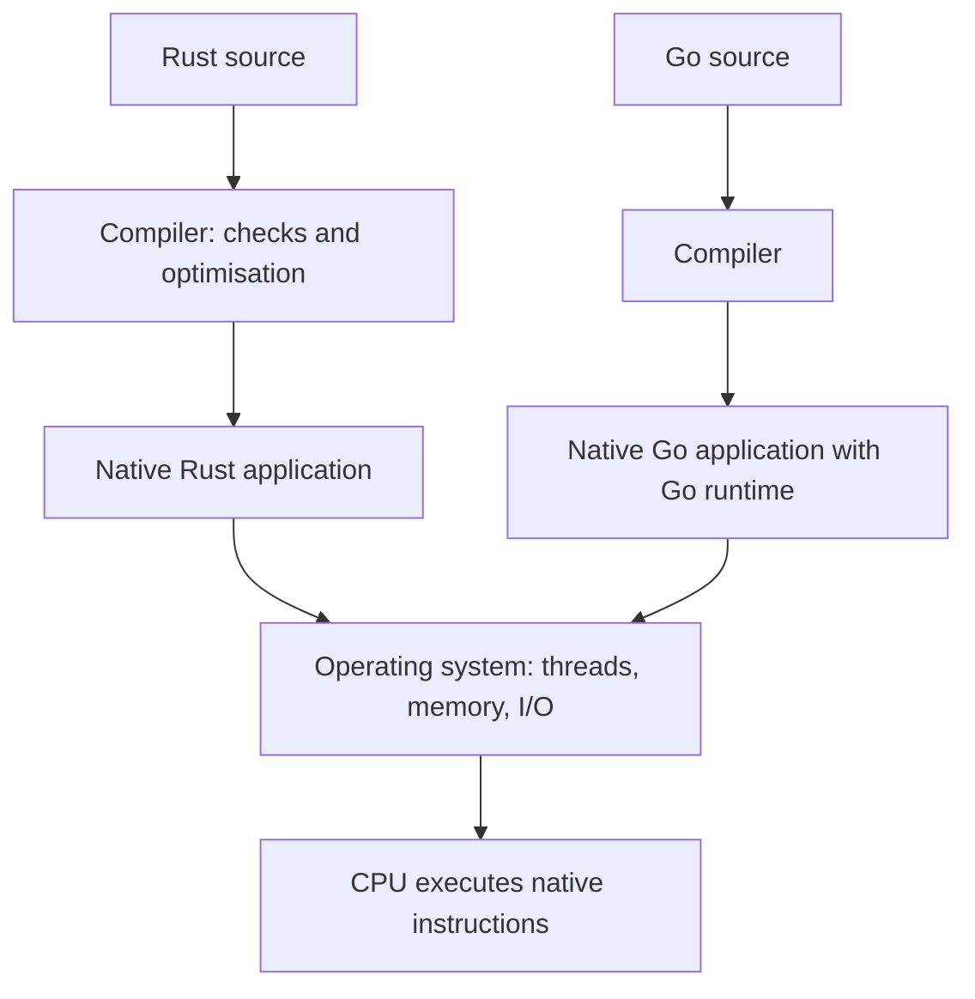

# Rust and Go

#search-eng

## Overview

Rust and Go both compile to native machine code for ordinary desktop and server targets. The CPU executes their compiled instructions. Their main difference is how they manage memory and concurrency: Rust relies heavily on compile-time ownership checks; Go provides a runtime with garbage collection and goroutine scheduling. [^1][^2][^3]

Rust **can** be faster or use less memory for a particular workload, but the language alone does not determine the outcome. The mechanisms below explain possible advantages, not a measured speedup.

## Execution Layers: What Does “Virtualisation” Mean Here?

| Layer | What it does | Relationship to Rust and Go |
|---|---|---|
| Native machine code | CPU instructions produced before execution | The ordinary execution model for both languages |
| Language runtime | Supports language features while the program runs | Go includes GC and scheduling; Rust applications still use runtime support such as allocation and may add an async executor |
| Language virtual machine | Executes an intermediate language, sometimes with just-in-time compilation | Go does not require a JVM-style VM |
| Container | Isolates processes while sharing a kernel | Either language can run inside a container |
| Hardware virtual machine | Provides virtual hardware for a guest operating system | Either language can run inside the guest OS |

Go's runtime is compiled code within the program, not an interpreter through which every instruction must pass. Containers and hardware VMs are separate deployment choices. [^2][^4][^12]



This diagram shows a native host deployment. A container adds process isolation; a hardware VM adds a guest OS and hypervisor layer. It does not turn Go's runtime into a language VM. [^4]

## How Rust Works

### From source to executable

Cargo manages builds and dependencies and invokes `rustc`. A simplified compiler path is:

1. Parse source and expand macros.
2. Resolve names and check types.
3. Build intermediate representations and check borrowing.
4. Generate concrete implementations of generic code where needed.
5. Optimise and generate machine code, normally using LLVM, then link the executable.

These are conceptual stages; the compiler internally uses a query system rather than one simple linear sequence. The borrow checker runs during compilation, not as a background service in the executable. [^1]

### Intermediate representations: the compiler's working drafts

An **intermediate representation (IR)** is a version of your program designed for the compiler to work with. Rust source is convenient for humans; other representations make it easier to check types, follow branches, detect invalid borrows, or optimise instructions.

Think of the compiler preparing several working drafts of the same program. Each draft makes certain details more explicit so a particular kind of analysis becomes easier. Converting to a more explicit or lower-level representation is called **lowering**. These are compilation steps, not layers your finished application passes through every time it runs. [^1]

| Representation | Plain-language meaning | What it helps the compiler do |
|---|---|---|
| **Token stream** | Break the text into meaningful pieces: names, numbers, keywords, and symbols. | Recognise the ingredients of the code. |
| **AST — Abstract Syntax Tree** | Arrange those pieces into a tree showing the structure of expressions, functions, and statements. | Understand how the written code fits together and check its syntax. |
| **HIR — High-level Intermediate Representation** | Rewrite convenient Rust syntax into a more uniform form, while staying close to the source. | Resolve and check the meaning and types of the code. |
| **THIR — Typed HIR** | A version with types established and more implicit operations made explicit. | Prepare typed expressions for conversion into simpler execution steps. |
| **MIR — Middle-level Intermediate Representation** | Organise simple operations into blocks, with connections showing which block can execute next. | Check borrowing and value initialisation, evaluate constants, and perform optimisations. |
| **LLVM IR** | Express operations in a lower-level form understood by LLVM, the usual code-generation backend. | Perform further optimisations and generate machine code for the target platform. |

“Desugaring” means expanding convenient syntax into more explicit operations. For example, a method call can be represented with its receiver passed explicitly. This does not change what the program means; it makes the work easier for the compiler to inspect. LLVM IR is still an intermediate form, not the final CPU instructions. [^1]

#### A small example

Consider this Rust function:

```rust
fn adjusted(x: i32) -> i32 {
    if x > 0 { x + 1 } else { 0 }
}
```

The following is a **conceptual explanation, not an actual compiler dump**:

- **Tokens:** Recognise pieces such as `fn`, `adjusted`, `x`, `i32`, `if`, `>`, and `1`.
- **AST:** Represent a function containing an `if` expression with a condition and two alternatives. The addition belongs inside the positive branch.
- **HIR:** Put that structure into the compiler's standard high-level form. This simple example has little convenient syntax to expand.
- **THIR:** Record that `x` is an `i32`, `x > 0` produces a Boolean, and both alternatives produce an `i32`.
- **MIR:** Make the possible execution paths explicit, roughly as below.
- **LLVM IR:** Lower the checked operations for further optimisation and machine-code generation.

```text
Illustrative control flow, not literal MIR:

START: Is x greater than 0?
    yes -> POSITIVE: Calculate x + 1 -> RETURN the result
    no  -> OTHER:    RETURN 0
```

Actual MIR contains additional detail, including overflow checks where applicable. A **control-flow graph (CFG)** is this idea of blocks connected by possible execution paths. It lets the compiler ask questions such as “Could this value be used before it has been initialised?” across different branches. [^1]

#### Interning and arenas: saving work inside the compiler

Suppose the compiler needs to refer to the same type in thousands of places. **Interning** means keeping one canonical representation of that type and reusing references to it, instead of storing an independent copy at every occurrence. For values interned this way, comparing their references can cheaply establish that they represent the same thing. [^1]

An **arena** is storage used to allocate many compiler objects together. The two ideas have different jobs:

- **Arena allocation:** Provides storage for the objects.
- **Interning:** Ensures equivalent values reuse a canonical object. An arena alone does not remove duplicates.

These techniques reduce the compiler's own memory use and repeated work. They do not imply that your Rust application automatically interns its strings or needs an arena at runtime. [^1]

### Ownership: responsibility for a value

An owner controls a value's lifetime. Moving an owned value transfers that responsibility. For an ordinary owned `String`, leaving its scope drops the value and releases its buffer, unless ownership has moved elsewhere. Moving a `String` does not duplicate its text; `.clone()` explicitly creates another owned copy. Types implementing `Copy`, such as integers, behave differently: assignment copies their value. [^3]

This avoids a mandatory tracing garbage collector. It does **not** mean memory is allocated or freed at compile time: allocation and destruction still execute at runtime. [^3]

### Borrowing: access without taking ownership

`&T` provides shared access; `&mut T` provides exclusive access. For ordinary references to the same data, shared borrows and an exclusive borrow cannot overlap in use. The compiler also rejects dangling references. [^5]

```rust
fn byte_count(text: &str) -> usize {
    text.len()
}

fn main() {
    let mut topic = String::from("Rust");
    let size = byte_count(&topic); // Borrow; do not copy the text.
    topic.push_str(" and Go");    // Earlier borrow is no longer used.
    let moved = topic;            // Transfer ownership.
    println!("{size}: {moved}");
    // println!("{topic}");       // Would fail: topic was moved.
}
```

Expected output: `4: Rust and Go`. The function counts UTF-8 bytes, not characters. The example illustrates ownership; it is not a benchmark.

### Lifetimes describe validity

A lifetime expresses how long a reference may remain usable. The compiler often infers it. Explicit lifetime parameters describe relationships between references; they do not extend an allocation's life or install a runtime timer. Returning a reference to a local value that is being destroyed is invalid. [^6]

### Stack, heap, and shared ownership

Ownership is a rule about responsibility, not a rule that everything lives on the stack. A `String` owns a heap buffer; its descriptor may be a local variable or a field inside another allocation. [^3]

Rust offers different ownership tools: [^7]

- `Box<T>` owns a heap-allocated value.
- `Rc<T>` shares ownership using reference counting within one thread.
- `Arc<T>` supports shared ownership across threads using atomic reference counting.
- Interior-mutability types permit controlled mutation through shared access; some enforce borrowing rules at runtime.

Reference counts, allocations, and locking have costs. `Arc<T>` does not automatically make all operations on `T` safe to perform concurrently.

### Types, errors, and concurrency

Traits describe supported behaviour; generic functions can be compiled into concrete versions for the types used. This is called **monomorphisation**, and it gives the optimiser concrete types to work with. It may also increase compilation time and generated code size. [^8]

Recoverable failures commonly use `Result<T, E>`; `panic!` represents an unrecoverable failure in the current operation. Explicit error handling makes failure paths visible, but does not eliminate failures. [^9]

`Send` and `Sync` express whether values can be transferred or shared safely across threads. Safe abstractions enforce these constraints, assuming their underlying unsafe implementations uphold their contracts. This protection does not prevent deadlocks or application-level logic errors. [^10]

For asynchronous work, Rust uses futures and executors. Tokio is one such runtime, providing task scheduling, asynchronous I/O, and timers. Consequently, a Rust server using Tokio also pays scheduling and task-management costs; a fair comparison includes them. [^11][^12]

## How Go's Runtime Works

### Goroutines abstract OS threads

A goroutine is a concurrently executing function started with `go f()`. Many goroutines can share a smaller set of OS threads. Each has a stack that can grow, allowing code to use ordinary function calls while the runtime manages execution. Concurrency means tasks can make progress over overlapping periods; parallelism means they execute simultaneously. [^13]

The scheduler's internal vocabulary is: [^14]

| Term | Meaning |
|---|---|
| G | A goroutine and its execution state |
| M | An OS thread |
| P | Runtime resources needed to execute user Go code, including scheduler state |

An M needs a P to execute user Go code. `GOMAXPROCS` controls the number of Ps; it is neither the goroutine count nor a hard limit on all OS threads. A P is not a physical CPU core. The OS ultimately schedules threads on CPUs. [^14]

### Following a waiting request

Imagine a service with many requests waiting on network responses:

1. A goroutine attempts an operation on a supported nonblocking network connection.
2. If the connection is not ready, the runtime can park the goroutine and track readiness.
3. The thread can execute another runnable goroutine.
4. When readiness is reported, the waiting goroutine becomes eligible to run again.

Scheduler queues, work stealing, and preemption distribute execution. An actually blocking syscall can occupy an OS thread; the runtime can make its P available to another thread. These mechanisms explain how Go handles substantial concurrency without assigning a dedicated thread to every request. [^15]

This is useful execution abstraction, sometimes informally described as virtualising threads. It does not emulate a CPU or interpret Go bytecode.

### Escape analysis and garbage collection

The compiler can keep eligible allocations on a goroutine's stack. Data that must outlive that storage may be placed on the heap; taking an address does not automatically require a heap allocation. [^2]

For heap data, Go's collector traces reachable objects and reclaims unreachable memory. Most collection work runs concurrently with application code, with brief stop-the-world phases. Collection still consumes CPU, and allocation-heavy goroutines can assist the collector. Pointer-write barriers also add work during marking. [^16]

The tradeoff involves allocation rate, the live heap, and available memory. Allowing more heap growth can reduce collection frequency while increasing memory use. Removing unnecessary allocations may help both throughput and latency. GC does not replace explicit handling of resources such as open files. [^16]

## Why Rust Could Be Faster Than Go

The following are **performance hypotheses inferred from the mechanisms above**, not benchmark results.

| Mechanism | Potential Rust advantage | Qualification |
|---|---|---|
| Heap reclamation | Avoids tracing-GC CPU work and associated interruptions | Rust still pays for allocation, destruction, and any reference counting |
| Borrowing | Processes existing buffers without cloning them | Go can also reuse buffers and operate on slices |
| Concrete generic code | Can enable inlining and specialised optimisation | Go also optimises code; compiler output and workload matter |
| Data organisation | Explicit ownership can support designs with fewer indirections | Both languages can use compact data; pointer-heavy Rust can still perform poorly |
| Scheduling choices | A program can use synchronous code, threads, or an executor suited to its workload | Async Rust has overhead too; Go's scheduler can efficiently handle I/O concurrency |

Data layout connects to [[Locality of Reference]]: a design that avoids scattered accesses may improve cache behaviour. This is a property to measure in the implementation, not an automatic reward for choosing Rust.

### Three useful scenarios

- **Parsing many short-lived records:** Rust may benefit if borrowing avoids copies and reduces heap churn. Compare equally careful Go buffer reuse before attributing a difference to the language.
- **Waiting on a remote database:** Network and database latency may dominate. Faster application code might change total request latency very little.
- **Serving near CPU or memory capacity:** Lower per-request resource use may reduce queueing and improve tail latency. Confirm that the bottleneck is actually in the application.

For a hypothetical sequential request, suppose 90 ms is external waiting and 10 ms is application work. Making application work twice as fast gives:

$$T_{new} = 90 + \frac{10}{2} = 95\text{ ms}$$

Overall speedup is $100/95 \approx 1.053$, about 5.3%. This illustrative calculation assumes unchanged waiting time and no queueing effects; it is not a Rust-versus-Go measurement.

### Common misconceptions

- **“Go is slower because it runs in a VM.”** Ordinary Go applications use native code. [^2]
- **“Rust has no runtime costs.”** Allocation, destruction, reference counting, and optional executors still do work. [^3][^7][^12]
- **“GC freezes the application for the entire collection.”** Go performs most GC work concurrently. [^16]
- **“More goroutines mean more CPU parallelism.”** Thread scheduling and execution capacity still constrain simultaneous work. [^13][^14]
- **“No GC guarantees low latency.”** Locks, I/O, allocation, destruction, and scheduling can still delay a request.

## How to Compare Fairly

Treat this as an experiment design, not evidence that one language wins:

1. Match inputs, outputs, algorithms, concurrency limits, and dependency behaviour.
2. Use Rust's release profile (`cargo build --release`); default development builds have different optimisation settings. Use a normal optimised Go build. Record versions and flags. [^17]
3. Fix hardware, CPU and memory limits, and load. Record Go GC settings and `GOMAXPROCS`, plus the Rust executor and worker configuration.
4. Measure throughput, p50/p95/p99 latency, CPU use, memory, and allocations. Check correctness before interpreting speed.
5. Profile the bottleneck. Go's diagnostics include CPU and heap profiling plus execution traces that help investigate scheduling and GC. [^18]
6. Repeat measurements and report variation. Keep startup measurements separate from steady-state service behaviour.

No cross-language benchmark has been run for this note.

## Suggested Learning Exercises

1. Run the Rust example, then uncomment the final line and explain the compile error.
2. Replace the move with `topic.clone()` and identify the additional work.
3. Write a small Go program that launches goroutines and waits for them to finish. Explain why launching work is different from waiting for it.
4. Implement the same parsing task in both languages. First check identical results; then inspect allocation and CPU profiles.
5. Revisit the comparison table and identify which hypotheses your measurements support.

## Related Notes

- [[Locality of Reference]] — Memory access patterns and cache behaviour.
- [[DevOps/Docker|Docker]] — Container deployment, separate from a language runtime.
- [[System Design]] — Evaluating latency, throughput, and resource constraints in a complete service.

## Search Connections

- [[Search Engineering]] — Learning map and review status.
- [[Latency vs Throughput|Latency and throughput]]
- [[Information Retrieval|Retrieval pipeline]]

## References & Useful Links

[^1]: [Rust compiler overview](https://rustc-dev-guide.rust-lang.org/overview.html) — Compilation stages, intermediate representations, and code generation.
[^2]: [Go FAQ](https://go.dev/doc/faq) — Native compilation, runtime services, and stack-versus-heap decisions.
[^3]: [Rust ownership](https://doc.rust-lang.org/book/ch04-01-what-is-ownership.html) — Moves, copies, allocation, and destruction.
[^4]: [Docker: What is a container?](https://docs.docker.com/get-started/docker-concepts/the-basics/what-is-a-container/) — Containers compared with virtual machines.
[^5]: [Rust references and borrowing](https://doc.rust-lang.org/book/ch04-02-references-and-borrowing.html) — Shared and mutable access.
[^6]: [Rust lifetimes](https://doc.rust-lang.org/book/ch10-03-lifetime-syntax.html) — Compile-time reference validity.
[^7]: [Rust smart pointers](https://doc.rust-lang.org/book/ch15-00-smart-pointers.html) — Ownership wrappers and interior mutability; links to detailed chapters.
[^8]: [Rust generic data types](https://doc.rust-lang.org/book/ch10-01-syntax.html) — Monomorphisation and generic code.
[^9]: [Rust error handling](https://doc.rust-lang.org/book/ch09-00-error-handling.html) — Recoverable errors and panics.
[^10]: [Rust Send and Sync](https://doc.rust-lang.org/book/ch16-04-extensible-concurrency-sync-and-send.html) — Thread-safety contracts.
[^11]: [Rust async foundations](https://doc.rust-lang.org/book/ch17-00-async-await.html) — Futures and asynchronous programming.
[^12]: [Tokio tutorial](https://tokio.rs/tokio/tutorial) — Async runtime responsibilities.
[^13]: [Effective Go: Goroutines](https://go.dev/doc/effective_go#goroutines) — Lightweight concurrency and growing stacks.
[^14]: [Go runtime implementation guide](https://go.dev/src/runtime/HACKING) — G, M, P, stacks, and runtime internals.
[^15]: [Go scheduler source](https://go.dev/src/runtime/proc.go) — Scheduler implementation and design comments; details vary by version.
[^16]: [Go garbage collector guide](https://go.dev/doc/gc-guide) — Allocation, collection, latency, and CPU/memory tradeoffs.
[^17]: [Cargo profiles](https://doc.rust-lang.org/cargo/reference/profiles.html) — Development and release optimisation settings.
[^18]: [Go diagnostics](https://go.dev/doc/diagnostics) — Profiling and tracing tools.
