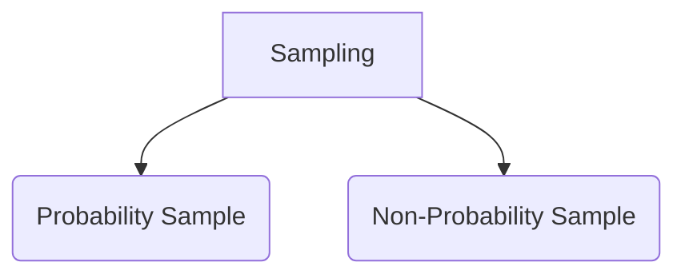
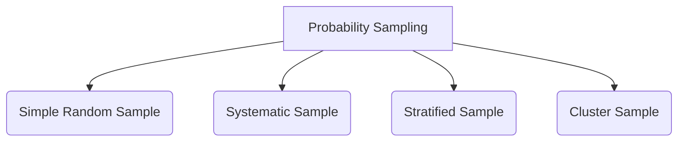
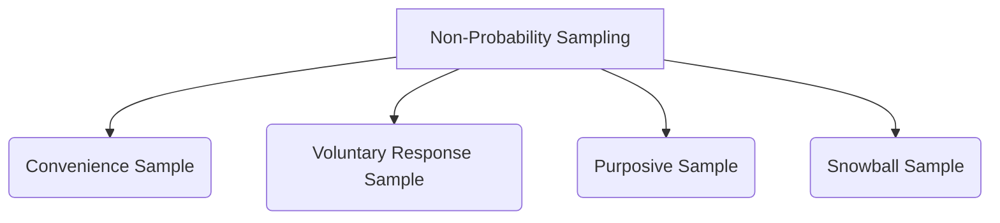

# Sampling 
> When conducting research about a population, it is rarely possible to collect data from each datapoint. Instead sampling is done for which valid conclusion is made

`Population` is the entire group that you want to draw conclusion about
`Sample` is the specific group of individual that you will collect data from






---
## Probability Sampling

### Simple Random Sample
Here, every member of the population of being selected

### Systematic Sampling
Is similar to Simple Random Sampling, however there is pattern to the selection techniques Ex: In a ordered list, the selected samples have ID that is a multiple of 5

### Stratifed Sampling
This form of sampling ensures that selected sample has equal representation of all the groups present, this is quite useful when the population has mixed characteristics

```py
from sklearn.model_selection import StratifiedShuffleSplit

split = StratifiedShuffleSplit(n_splits=1, test_size=0.2,random_state=42)

for train_index, test_index in split.split(Test_DF,Test_DF['Target']):
	Stratified_train = Test_DF.loc[train_index]
	Stratified_test = Test_DF.loc[test_index]
```

### Stratified K-Fold
This should be used of K-Fold when the dataset is quite large

### Cluster Sampling
Cluster sampling clusters the population into subgroups
- The subgroup has characteristics of the population
- Then at sampling stage, each subgroup is selected

![[Pasted image 2.png]]

---
## Non-Probability Sampling

### Convenience Sampling
The samples are easiest to come across and this technique may not be representative of population

### Voluntary Response Sampling
Again similar to convenience sampling, the responses are biased

### Purposive Sampling
Using judgement to sample 

### Snowball Sampling
Sample that refer other samples


![[Pasted image 3.png]]