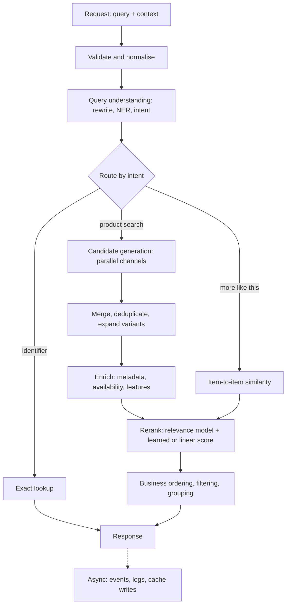

# Search Architecture

#search-eng

## Overview

A search system turns a request into a short, ordered, eligible result list. Most production systems do this in stages: cheap and broad **candidate generation** over the whole catalogue, then progressively more expensive scoring over fewer items.[^1][^2] Each stage answers a different question, fails in a different way, and needs its own measurement.

This note is the hub for the architecture track in [[Search Engineering]]. It describes the stages generically, then records transferable lessons from a production hybrid product-search pipeline that was being migrated from Python to Rust.

## Reference Pipeline

This is a conceptual diagram. Real systems move eligibility checks, deduplication, and caching to wherever their data and latency constraints require.

| Stage | Question it answers | Typical failure signature | Notes |
|---|---|---|---|
| Query understanding | What does the user want, and which constraints are hard? | Wrong filter or route; relevant items never searched | [[Query Understanding]], [[Named Entity Recognition]], [[Query Intent Classification]] |
| Candidate generation | Are the useful items in the pool at all? | Low union recall; zero-result queries | [[Candidate Generation]], [[Dense Retrieval]], [[SPLADE]], [[BM25]], [[Filtered Vector Search]] |
| Merge | Which copy of an item survives, and with what provenance? | Non-deterministic order; duplicate variants | [[Hybrid Retrieval]] |
| Reranking | Are the useful candidates near the top? | Good pool, poor order | [[Cross-Encoder]], [[Learning to Rank]], [[Score Normalization]] |
| Business ordering | Does the order respect product policy? | Unavailable or unsellable items on top | [[Score Normalization#Business Ordering\|Business ordering]] |
| Presentation | Is the page useful as a set? | Ten variants of one product | [[Search Result Diversification]] |
| Serving | Is it fast and reliable enough? | p99 spikes, timeouts, restart loops | [[Tail Latency]], [[Latency vs Throughput]] |

Diagnose in pipeline order. A ranking change cannot rescue an item removed by a wrong filter upstream. [[Search Ranking]] develops this separation.

## Case Study: A Hybrid Product-Search Pipeline

The production system is documented in a private repository. This section records the design patterns, not its configuration, weights, or identifiers.

### Query understanding and routing

- A separate query-parser service performs NER over the query: brand, product type, attributes, price, and location entities. Its output is cached per search session, so pagination and follow-up requests do not repeat the model call.
- Intent routing uses precedence: an explicit "more like this" flag first, then an identifier pattern (a long run of digits) for direct lookup, then product search. Broad queries with several detected product types fan out into per-type groups.
- Extracted entities are whitelisted to known types, and product types are gated by a catalogue of currently active types before they become filters or count towards intent confidence.

### Candidate generation

- Recall is hybrid: a dense query embedding and a learned sparse (SPLADE-style) embedding query the same managed vector index.
- Channels are defined on independent axes: **representation** (dense or sparse), **filter scope** (full NER-derived filters or base eligibility only), and **specialisation** (featured items, availability at nearby stores, normally excluded conditions such as refurbished). Each channel has its own top-K.
- "Unfiltered" does not mean unrestricted. Broad channels drop NER-derived narrowing, convert a predicted product-type allow list into a deny list, and keep base eligibility filters. This hedges against NER mistakes by deliberately searching outside the predicted types.
- Channels run concurrently. Results are concatenated in a fixed plan order and deduplicated by first occurrence, so an item's recorded channel is its highest-priority source regardless of which call returned first.
- Parent datapoints are expanded to sellable variants from a metadata store, re-applying the request filters with the store's native column types.

### Reranking and ordering

- Product metadata comes from a cache with database fallback. A managed cross-encoder supplies query–product relevance; scores are cached.
- Relevance classes follow [[ESCI]]. Exact and Substitute become "best match"; Complement and Irrelevant become "probable match". Product types whose relevance falls below a threshold are removed.
- A per-request A/B flag selects either a hand-tuned multiplicative blend or a gradient-boosted engagement model. Only the model branch looks up query-level engagement features, keyed by a hash of the normalised query and restricted to recalled items. The lookup runs concurrently with relevance scoring and degrades to neutral feature values on failure.
- Final ordering is lexicographic: order status, condition, availability priority, score, then marketplace rank, with stable identifiers as the last tie-breaker.

### Serving

- Internal HTTP hops between search stages were replaced by in-process calls behind narrow interfaces, while external model services stayed remote.
- Independent work is concurrent: recall channels, per-type groups, and feature lookup overlapping relevance scoring.
- Structured per-stage logs carry query and search identifiers, intent, filters, candidate counts, fallback decisions, and latency. These make pipeline parity measurable.

## Design Principles

1. **Measure each stage separately.** Report candidate recall, ranking quality, and serving latency as distinct quantities; see [[Search Evaluation]].
2. **Hedge uncertain interpretation.** When a model decides filters, keep a broader channel that does not depend on that decision.
3. **Apply eligibility everywhere.** Base exclusions belong in every channel and again after variant expansion.
4. **Make merges deterministic.** Order by plan, not by completion time; break ties by stable identity.
5. **Classify dependencies.** Required dependencies fail with typed errors; optional signals degrade to neutral values and log the fallback.
6. **Keep request-dependent decisions in policy code.** An A/B branch chosen per request should not require a redeploy.
7. **Cache deterministic work.** Embeddings per normalised query and parsed entities per session are good candidates. Caching reduces average cost but does not by itself fix tail latency.[^3]

## Migration and Parity Checks

Reimplementing a pipeline in another language can change results without any intended behaviour change. Common causes include tie-breaking order, per-channel K, filter value types, timeouts that trigger fallbacks, normalisation over a different candidate set, and floating-point differences.

- Compare candidate IDs **per stage**, not only the final list.
- Use overlap@k for set agreement and [[Kendall's Tau]] for order agreement on shared items.
- Confirm that both deployments run the intended version before treating a difference as a code defect.
- Use [[Shadow Deployment|shadow traffic]] to compare behaviour on live queries without serving the new result.

## Exercise

Use the tiny collection in [[Search Engineering]]. Suppose NER extracts `colour=black` from `red hiking boots`.

1. Which documents survive a full-filter channel?
2. Which survive a base-eligibility channel?
3. Where would you detect the error: NER evaluation, candidate recall, or final [[NDCG]]?

## References & Useful Links

[^1]: [Sentence Transformers: Retrieve & Re-Rank](https://www.sbert.net/examples/sentence_transformer/applications/retrieve_rerank/README.html) — Two-stage retrieval with a bi-encoder or lexical retriever, then cross-encoder reranking.
[^2]: [Google Cloud: About hybrid search](https://docs.cloud.google.com/gemini-enterprise-agent-platform/build/vector-search/about-hybrid-search) — Dense and sparse retrieval in one index, RRF merging, and multi-stage reranking. Accessed 23 September 2026.
[^3]: [Dean and Barroso, "The Tail at Scale", CACM 2013](https://cacm.acm.org/research/the-tail-at-scale/) — Latency variability in fan-out services; caching does not directly address tail latency.

- [Huang et al., "Embedding-based Retrieval in Facebook Search", KDD 2020](https://arxiv.org/abs/2006.11632) — Integrating embedding retrieval into an inverted-index search system, including ANN tuning and full-stack optimisation. Abstract read; body not reviewed.
