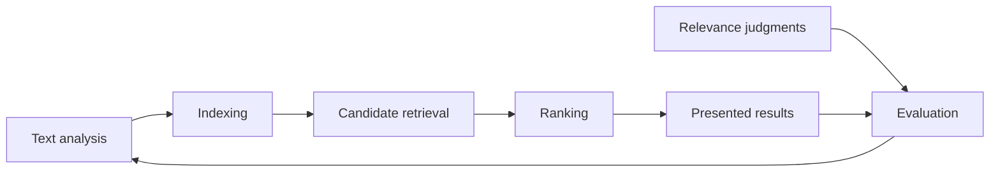

# Search Engineering

#search-eng

## Purpose

Use this map to build search fundamentals from the existing vault. Follow the main path first, then use supporting notes when you need more depth. The `#search-eng` tag means a note is relevant to this learning path; it does not certify factual review.

## Main Learning Path

0. **See the whole system:** [[Search Architecture]]. Name each stage, the question it answers, and how it fails, before studying the stages individually.
1. **Define the problem:** [[Information Retrieval]] and [[NLP Basic Terminology]]. Explain the information need and the difference between a query, a document, and a relevance judgment.
2. **Understand text analysis:** [[Query Understanding]], [[Tokenization]], [[N-Grams]], [[Stemming and Lemmatization]], [[Stopwords]], and [[Levenshtein Distance]]. Predict which terms are indexed and which query terms can match them. Then study [[Named Entity Recognition]] and [[Query Intent Classification]]: how entities become filters and how a query is routed.
3. **Build lexical retrieval:** [[Inverted Index]], [[Bag of Words]], [[TF-IDF]], and [[BM25]]. Build a small postings index and explain why two documents receive different scores.
4. **Understand vector representations:** [[Embedding and Encoding]], [[Word2Vec]], [[Embeddings]], [[Cosine Similarity]], [[Dense Retrieval]], [[SPLADE]], [[Approximate Nearest Neighbours]], and [[Filtered Vector Search]]. Distinguish learned similarity from exact constraints and measured relevance.
5. **Separate retrieval from ranking:** [[Candidate Generation]], [[Hybrid Retrieval]], [[Search Ranking|Ranking]], [[Cross-Encoder]], [[Learning to Rank]], [[Score Normalization]], and [[Search Result Diversification]]. Trace candidate coverage before judging the final ordering.
6. **Measure search quality:** [[Judgement List|Relevance judgments]], [[ESCI]], [[Search Evaluation]], [[NDCG]], and [[Click Bias]]. Define the corpus, unit, cutoff, label rubric, and aggregation. Use [[Kendall's Tau]] or [[Spearman Correlation]] for rank agreement, not as replacements for relevance metrics.
7. **Evaluate learning and experiments:** [[Model Evaluation]], [[Cross Validation]], [[Data Leakage]], [[Feature Scaling]], [[AB Testing|A/B testing]], and [[P-Value]]. Match splits and randomisation to the question being answered.
8. **Connect quality to serving:** [[Index Updates]], [[Monitoring - MLOPS|Monitoring]], [[Latency vs Throughput]], [[Tail Latency]], [[Go Language|Go]], and [[Rust and Go]]. Explain the resource cost of increasing candidate counts or using a more expensive ranker.

This is a conceptual learning diagram; real systems place eligibility checks, deduplication, and other operations according to their requirements.

## A Small End-to-End Exercise

Use the same tiny collection through several notes:

- D1: `red waterproof hiking boots`
- D2: `black waterproof hiking boots`
- D3: `red running shoes`
- D4: `waterproof boot cleaner`

For query `red hiking boots`:

1. Write an explicit relevance rubric, including whether colour is a hard constraint.
2. Tokenize and build postings. Compare AND and OR matching.
3. Calculate a lexical score with stated parameters.
4. Record which relevant documents enter the candidate set.
5. Order the candidates, then calculate precision@3 and NDCG@3 using your rubric.
6. Change one analysis rule and explain both recovered matches and false matches.
7. Keep the labels fixed when comparing configurations; change the rubric only as a separate, recorded decision.

The goal is to explain each result and calculation before moving to a larger dataset or model.

## Supporting Notes

These connections identify useful prerequisites and follow-on topics. Unless listed in the substantive-review section below, their existing technical content still needs verification.

### Representations and Neural Models

[[GloVe]], [[BERT]], [[RoBERTa]], [[Transformers]], [[Encoder-Only Model (Transformers)|Encoder models]], [[Decoder-Only Model (Transformers)|Decoder models]], [[Encoder-Decoder Model (Transformers)|Encoder–decoder models]], [[Language Model]], [[Encoding]], [[Softmax Function]], [[Dimensionality Reduction]], [[PCA]], [[Singular Value Decomposition]], and [[KNN]].

### Learning to Rank

[[Feature Engineering]], [[Feature Cross]], [[Feature Importance]], [[Feature Selection]], [[Gradient Boosting Machines (GBM)|Gradient boosting]], [[Light GBM]], [[XGBoost]], [[Logistic Regression]], [[Loss Function & Cost Function|Loss functions]], [[Cross Entropy Loss]], [[L1 and L2 Regularization|Regularisation]], and [[Hyperparameter Tuning]].

### Labels, Statistics, and Feedback

[[Hypothesis Testing]], [[Confidence Interval]], [[K Fold Cross Validation|K-fold]], [[Stratified K Fold Cross Validation|Stratified K-fold]], [[Evaluation Metrics]], [[Confusion Matrix & Metrics]], [[Sampling]], [[Data Labeling]], [[Active Learning]], [[Weak Supervision]], [[Semi-Supervised Labeling]], [[Imbalanced Classification]], [[Product Metrics]], and [[Multi-Armed Bandits]].

### Systems and Operations

[[Big O]], [[Locality of Reference]], [[System Design]], [[Primitives - System Design|System components]], [[Database Sharding]], [[Horizontal & Vertical Scaling|Scaling]], [[Performance vs Scalability]], [[API]], [[REST]], [[Microservices]], [[Monitoring - MLOPS|Monitoring]], [[MLOPs]], [[Data Drift]], [[Concept Drift]], [[Model Degradation]], [[Experiment Tracking]], [[ML Pipelines]], [[Data - MLOPs|Data lifecycle]], [[Deployment - MLOPs|Model deployment]], [[Canary Deployment]], [[Shadow Deployment]], and [[Deployment Patterns]].

## Review Status

Initial pass: 20 September 2026.

- **Inventory:** 480 existing visible Markdown notes, excluding `AGENTS.md`; four are Excalidraw documents. This was a structure/content inventory, not a complete factual review of 480 notes.
- **Substantive work:** 25 existing notes rewritten or expanded, plus the new [[BM25]], [[Search Ranking]], and [[Search Evaluation]] notes. The exact list appears below.
- **Navigation only:** 64 supporting notes tagged and connected. Go's title and the Rust/Go comparison filename were also simplified; their previously written technical content was retained.
- **Preserved:** Other subject areas, existing attachments, and drawing payloads. Unrelated finance and interview notes were not tagged merely because they might be broadly useful.

Substantively revised concepts: [[Information Retrieval]], [[Inverted Index]], [[Tokenization]], [[Stemming and Lemmatization]], [[Stopwords]], [[N-Grams]], [[TF-IDF]], [[Cosine Similarity]], [[Levenshtein Distance]], [[Embeddings]], [[Judgement List]], [[NDCG]], [[Data Leakage]], [[Feature Scaling]], [[P-Value]], [[AB Testing]], [[Kendall's Tau]], [[Spearman Correlation]], [[Latency vs Throughput]], [[Word2Vec]], [[Bag of Words]], [[Embedding and Encoding]], [[NLP Basic Terminology]], [[Model Evaluation]], and [[Cross Validation]].

## Completed Follow-Up Review

Completed on 20 September 2026. All nine items below have been addressed; this is not a factual review of every tagged note.

- [x] Review [[Hypothesis Testing]]: correct test selection, code/import errors, and the distinction between statistical evidence and proof. Preserve and recalculate the existing examples.
- [x] Update [[K Fold Cross Validation]] and [[Stratified K Fold Cross Validation]]: remove guarantees of better generalisation and replace obsolete or malformed code. Expand [[Confidence Interval]].
- [x] Review [[Evaluation Metrics]] and [[Confusion Matrix & Metrics]]: distinguish optimisation losses from metrics, correct formulas and code, and qualify threshold tradeoffs.
- [x] Review [[Encoding]]: correct estimator names and categorical-feature guidance. Review [[Sampling]]: stratification does not necessarily mean equal group sizes.
- [x] Review [[Encoder-Only Model (Transformers)]] and [[Decoder-Only Model (Transformers)]]: correct overly broad capability claims; then check the larger [[Transformers]] and [[GloVe]] notes.
- [x] Review [[Light GBM]] and [[XGBoost]]: remove universal performance comparisons, check parameters against current documentation, and add ranking objectives and query groups.
- [x] Review [[Data Drift]] and [[Concept Drift]]: distinguish changes in input distribution from changes in the input–target relationship. Expand [[Monitoring - MLOPS|Monitoring]] with search-specific diagnosis.
- [x] Review [[Product Metrics]], [[System Design]], [[Big O]], and [[Database Sharding]]: replace unsupported thresholds or blanket rules with conditions and tradeoffs.
- [x] Added [[Approximate Nearest Neighbours]], [[Hybrid Retrieval]] (including rank fusion), [[Learning to Rank]], [[Click Bias]], [[Query Understanding]], and [[Index Updates]] after checking for existing equivalents.

## Review Boundary

The 20 September follow-up substantively revised 21 existing supporting notes and added six concept notes. Together with the initial pass, 55 concept notes have received substantive work. At the end of that pass, 43 of the 64 notes initially tagged for navigation had not received a detailed factual review. The 21 September pass below reduces that backlog to 24. Their tags indicate relevance, not completion. Go and Rust notes retain their earlier review status.

The hypothesis examples use illustrative reconstructed counts where original integer counts were unavailable; the BMI calculation uses supplied summaries, not a survey-weighted reanalysis. Previously saved reading links are preserved and labelled where they were not used for verification.

## Validation of This Follow-Up

- Checked internal note targets, preserved embeds and existing reference URLs, code-fence balance, Python syntax, and final reference-section placement across the 33 edited/new review and navigation files.
- Executed all four hypothesis-test snippets; independently checked confidence-interval and rank-fusion arithmetic.
- Scikit-learn examples were checked against documentation and parsed for Python syntax, but not executed: installation into a temporary environment failed TLS certificate verification. No package or application settings were changed to bypass this.
- Obsidian visual preview was not checked.

## Review on 21 September 2026

Reviewed and improved 19 existing concept notes, plus this learning map: **20 files changed**, below the requested 100-file limit. The visible Markdown inventory contains 491 files including instructions and drawings; this was not a factual review of all 491.

- **Representations:** [[BERT]], [[RoBERTa]], [[Encoder-Decoder Model (Transformers)]], [[Language Model]], [[Softmax Function]], [[Dimensionality Reduction]], [[PCA]], [[Singular Value Decomposition]], [[KNN]].
- **Features and training:** [[Feature Engineering]], [[Feature Cross]], [[Feature Importance]], [[Feature Selection]], [[Gradient Boosting Machines (GBM)]], [[Logistic Regression]], [[Loss Function & Cost Function]], [[Cross Entropy Loss]], [[L1 and L2 Regularization]], [[Hyperparameter Tuning]].

Corrected the gradient-descent sign and penalty derivatives, coefficient interpretation, PCA centring/scaling guidance, feature-importance causality claims, and general versus squared-error boosting. Expanded model stubs, distinguished masked from causal language modelling, repaired tuning examples, and added search exercises and primary references. Existing tags, local embeds, and saved resource URLs were preserved.

Validation: four standalone NumPy snippets executed successfully; five additional numerical checks passed. All six Python snippets parsed successfully. The estimator-inspection fragment is explicitly illustrative; the scikit-learn tuning example was checked against documentation but not run because scikit-learn is unavailable in the current interpreter. Internal targets and incoming wikilink heading targets were checked. Obsidian visual preview was not checked.

This brings substantive concept coverage from the recorded 55 to 74 notes. The remaining 24 originally navigation-only notes are not certified by their tags. Prioritise label collection and imbalance next, followed by deployment and operational fundamentals. Existing unresolved Git conflicts in `.obsidian/workspace.json` are outside this content review and were left unchanged.

## Architecture Track: 23 September 2026

Added 12 concept notes drawn from the architecture of a production hybrid product-search pipeline. The source repository is private; the notes record transferable patterns and omit internal identifiers, weights, and environment details.

Suggested order: [[Search Architecture]] → [[Query Intent Classification]] → [[Named Entity Recognition]] → [[Candidate Generation]] → [[Dense Retrieval]] → [[SPLADE]] → [[Filtered Vector Search]] → [[Cross-Encoder]] → [[ESCI]] → [[Score Normalization]] → [[Search Result Diversification]] → [[Tail Latency]].

- **Sources opened:** DPR, SPLADE and SPLADE v2, Nogueira and Cho (2019), the Shopping Queries Dataset paper and repository, Google Cloud Vector Search filtering/query/format/hybrid pages, the OpenSearch normalization processor, Sentence Transformers retrieve-and-rerank, Hugging Face token classification, and "The Tail at Scale". Only abstracts were read for Facebook EBR and MMR.
- **Checked:** worked-example arithmetic (DPR loss, ESCI NDCG, MMR, min–max blends, fan-out probabilities) and the two Python snippets were executed.
- **Links added** from [[Query Understanding]], [[Hybrid Retrieval]], [[Search Ranking]], [[Approximate Nearest Neighbours]], [[Learning to Rank]], and [[Latency vs Throughput]].
- **Open:** Broder's query taxonomy and intent-aware diversity metrics are recorded as `#TODO` items in their notes. Obsidian preview was not checked.

Next candidates from the same architecture: search caching and session state, query rewriting, engagement features and feedback loops in LTR, and interleaving for online ranking comparison.

## How to Continue

Work through one connected group at a time. For each note, verify the main claims, preserve useful examples and attachments, add an exercise, link prerequisites and follow-on topics, and record unresolved work here. Use stable concept filenames and short display labels such as `[[Go Language|Go]]`.
