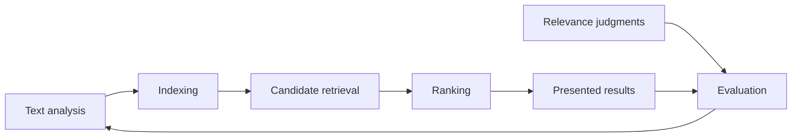

## Purpose

Use this map to build search fundamentals from the existing vault. Follow the main path first, then use supporting notes when you need more depth. The `#search-eng` tag means a note is relevant to this learning path; it does not certify factual review.

## Page Properties and Callouts

Central search pages use two text properties to make the map easier to filter without repeating note content:

- `note_type`: `learning_map` for this page, or `concept` for a focused topic note.
- `search_stage`: one controlled stage describing the page's main place in the learning path: `overview`, `foundations`, `query_understanding`, `indexing`, `retrieval`, `ranking`, `evaluation`, `experiments`, or `serving`.

These are navigation labels, not claims that a page has been fully reviewed. Keep the property types and values consistent; add metadata to directly relevant notes when it helps retrieval rather than applying it to every broad prerequisite. Obsidian properties can be queried alongside ordinary search terms.[^1]

Use callouts for concise caveats, practical tips, or open questions that should be visually distinct from the main explanation. For example:

> [!warning] Evaluation boundary
> Candidate coverage and ranking quality answer different questions; report them separately.

Obsidian uses typed Markdown blockquotes for callouts, supports custom titles and foldable blocks, and renders supported types with distinct styles.[^2]

### Reading and Folding Longer Notes

Keep the overview, assumptions, and main worked example visible on the first read. Use the arrow beside a heading to collapse its section; the command palette also provides **Fold all headings and lists** and **Unfold all headings and lists**. Native heading folds keep tables, code, and multi-paragraph explanations in the ordinary note layout.[^folding]

Optional derivations and exercise answers use a short titled foldable callout: `> [!example]- Exercise solution`. The minus sign starts the callout collapsed; click its title to expand it. Try the exercise before revealing the answer. Folding changes presentation, not the underlying content.[^2]

The current pass uses `note_type` and `search_stage` on every substantively revised concept note. For example, `[note_type:concept] [search_stage:retrieval]` finds reviewed and other classified retrieval concepts; properties alone still do not certify factual review.[^1]

## Main Learning Path

0. **See the whole system:** [[Search Architecture]]. Name each stage, the question it answers, and how it fails, before studying the stages individually. For a source-backed implementation walkthrough, read [[Search2.0 architecture]]: Rust startup, request branches, recall, reranking, caches, deployment, and failure behavior at a recorded revision.
1. **Define the problem:** [[Information Retrieval]] and [[NLP Basic Terminology]]. Explain the information need and the difference between a query, a document, and a relevance judgment.
2. **Understand text analysis:** [[Query Understanding]], [[Tokenization]], [[N-Grams]], [[Stemming and Lemmatization]], [[Stopwords]], and [[Levenshtein Distance]]. Predict which terms are indexed and which query terms can match them. Then study [[Named Entity Recognition]] and [[Query Intent Classification]]: how entities become filters and how a query is routed.
3. **Build lexical retrieval:** [[Inverted Index]], [[Bag of Words]], [[TF-IDF]], and [[BM25]]. Build a small postings index and explain why two documents receive different scores.
4. **Understand vector representations:** [[Embedding and Encoding]], [[Word2Vec]], [[Embeddings]], [[Cosine Similarity]], [[Dense Retrieval]], [[SPLADE]], [[Approximate Nearest Neighbours]], and [[Filtered Vector Search]]. Distinguish learned similarity from exact constraints and measured relevance.
5. **Separate retrieval from ranking:** [[Candidate Generation]], [[Hybrid Retrieval]], [[Search Ranking|Ranking]], [[Cross-Encoder]], [[Learning to Rank]], [[Score Normalization]], and [[Search Result Diversification]]. Trace candidate coverage before judging the final ordering.
6. **Measure search quality:** [[Judgement List|Relevance judgments]], [[ESCI]], [[Search Evaluation]], [[NDCG]], and [[Click Bias]]. Define the corpus, unit, cutoff, label rubric, and aggregation. Use [[Kendall's Tau]] or [[Spearman Correlation]] for rank agreement, not as replacements for relevance metrics. Study [[Relevance Pooling]] and [[Annotation Agreement]] to understand how the judgments were collected; use [[Probability Calibration]] when scores must represent probabilities.
7. **Evaluate learning and experiments:** [[Model Evaluation]], [[Cross Validation]], [[Data Leakage]], [[Feature Scaling]], [[AB Testing|A/B testing]], [[Interleaving]], and [[P-Value]]. Match splits and randomisation to the question being answered.
8. **Connect quality to serving:** [[Index Updates]], [[Search Caching]], [[Shadow Deployment]], [[Monitoring - MLOPS|Monitoring]], [[Latency vs Throughput]], [[Tail Latency]], [[Go Language|Go]], and [[Rust and Go]]. Explain the resource cost of increasing candidate counts or using a more expensive ranker.

```mermaid
flowchart LR
    T[Text analysis] --> I[Indexing]
    I --> R[Candidate retrieval]
    R --> K[Ranking]
    K --> P[Presented results]
    J[Relevance judgments] --> E[Evaluation]
    P --> E
    E --> T
```

This is a conceptual learning diagram; real systems place eligibility checks, deduplication, and other operations according to their requirements.

## A Small End-to-End Exercise

Use the same tiny collection through several notes:

- D1: `red waterproof hiking boots`
- D2: `black waterproof hiking boots`
- D3: `red running shoes`
- D4: `waterproof boot cleaner`

For query `red hiking boots`:

1. Write an explicit relevance rubric, including whether colour is a hard constraint.
2. Tokenize and build postings. Compare AND and OR matching.
3. Calculate a lexical score with stated parameters.
4. Record which relevant documents enter the candidate set.
5. Order the candidates, then calculate precision@3 and NDCG@3 using your rubric.
6. Change one analysis rule and explain both recovered matches and false matches.
7. Keep the labels fixed when comparing configurations; change the rubric only as a separate, recorded decision.

The goal is to explain each result and calculation before moving to a larger dataset or model.

## Supporting Notes

These connections identify useful prerequisites and follow-on topics. Unless listed in the substantive-review section below, their existing technical content still needs verification.

### Representations and Neural Models

[[GloVe]], [[BERT]], [[RoBERTa]], [[Transformers]], [[Encoder-Only Model (Transformers)|Encoder models]], [[Decoder-Only Model (Transformers)|Decoder models]], [[Encoder-Decoder Model (Transformers)|Encoder–decoder models]], [[Language Model]], [[Layer Normalization]], [[Sequence Models]], [[Machine Translation]], [[Encoding]], [[Softmax Function]], [[Dimensionality Reduction]], [[PCA]], [[Singular Value Decomposition]], and [[KNN]]. [[Transformer Papers]] is the reading list.

### LLM Applications

[[Retrieval-Augmented Generation]], [[LLM Evaluation]], [[Prompt Injection]], and [[Tool Calling]]. These support the portfolio project in [[Action-Plan]].

### Learning to Rank

[[Feature Engineering]], [[Feature Cross]], [[Feature Importance]], [[Feature Selection]], [[Gradient Boosting Machines (GBM)|Gradient boosting]], [[Light GBM]], [[XGBoost]], [[Logistic Regression]], [[Loss Function & Cost Function|Loss functions]], [[Cross Entropy Loss]], [[L1 and L2 Regularization|Regularisation]], and [[Hyperparameter Tuning]].

### Labels, Statistics, and Feedback

[[Hypothesis Testing]], [[Confidence Interval]], [[K Fold Cross Validation|K-fold]], [[Stratified K Fold Cross Validation|Stratified K-fold]], [[Evaluation Metrics]], [[Confusion Matrix & Metrics]], [[Sampling]], [[Data Labeling]], [[Active Learning]], [[Weak Supervision]], [[Semi-Supervised Labeling]], [[Imbalanced Classification]], [[Product Metrics]], and [[Multi-Armed Bandits]].

### Systems and Operations

[[Big O]], [[Locality of Reference]], [[System Design]], [[Primitives - System Design|System components]], [[Database Sharding]], [[Horizontal & Vertical Scaling|Scaling]], [[Performance vs Scalability]], [[API]], [[REST]], [[Microservices]], [[Monitoring - MLOPS|Monitoring]], [[MLOPs]], [[Data Drift]], [[Concept Drift]], [[Model Degradation]], [[Experiment Tracking]], [[ML Pipelines]], [[Data - MLOPs|Data lifecycle]], [[Deployment - MLOPs|Model deployment]], [[Canary Deployment]], [[Shadow Deployment]], and [[Deployment Patterns]].

## Review Status

Initial pass: 20 September 2026.

- **Inventory:** 480 existing visible Markdown notes, excluding `AGENTS.md`; four are Excalidraw documents. This was a structure/content inventory, not a complete factual review of 480 notes.
- **Substantive work:** 25 existing notes rewritten or expanded, plus the new [[BM25]], [[Search Ranking]], and [[Search Evaluation]] notes. The exact list appears below.
- **Navigation only:** 64 supporting notes tagged and connected. Go's title and the Rust/Go comparison filename were also simplified; their previously written technical content was retained.
- **Preserved:** Other subject areas, existing attachments, and drawing payloads. Unrelated finance and interview notes were not tagged merely because they might be broadly useful.

Substantively revised concepts: [[Information Retrieval]], [[Inverted Index]], [[Tokenization]], [[Stemming and Lemmatization]], [[Stopwords]], [[N-Grams]], [[TF-IDF]], [[Cosine Similarity]], [[Levenshtein Distance]], [[Embeddings]], [[Judgement List]], [[NDCG]], [[Data Leakage]], [[Feature Scaling]], [[P-Value]], [[AB Testing]], [[Kendall's Tau]], [[Spearman Correlation]], [[Latency vs Throughput]], [[Word2Vec]], [[Bag of Words]], [[Embedding and Encoding]], [[NLP Basic Terminology]], [[Model Evaluation]], and [[Cross Validation]].

## Completed Follow-Up Review

Completed on 20 September 2026. All nine items below have been addressed; this is not a factual review of every tagged note.

- [x] Review [[Hypothesis Testing]]: correct test selection, code/import errors, and the distinction between statistical evidence and proof. Preserve and recalculate the existing examples.
- [x] Update [[K Fold Cross Validation]] and [[Stratified K Fold Cross Validation]]: remove guarantees of better generalisation and replace obsolete or malformed code. Expand [[Confidence Interval]].
- [x] Review [[Evaluation Metrics]] and [[Confusion Matrix & Metrics]]: distinguish optimisation losses from metrics, correct formulas and code, and qualify threshold tradeoffs.
- [x] Review [[Encoding]]: correct estimator names and categorical-feature guidance. Review [[Sampling]]: stratification does not necessarily mean equal group sizes.
- [x] Review [[Encoder-Only Model (Transformers)]] and [[Decoder-Only Model (Transformers)]]: correct overly broad capability claims; then check the larger [[Transformers]] and [[GloVe]] notes.
- [x] Review [[Light GBM]] and [[XGBoost]]: remove universal performance comparisons, check parameters against current documentation, and add ranking objectives and query groups.
- [x] Review [[Data Drift]] and [[Concept Drift]]: distinguish changes in input distribution from changes in the input–target relationship. Expand [[Monitoring - MLOPS|Monitoring]] with search-specific diagnosis.
- [x] Review [[Product Metrics]], [[System Design]], [[Big O]], and [[Database Sharding]]: replace unsupported thresholds or blanket rules with conditions and tradeoffs.
- [x] Added [[Approximate Nearest Neighbours]], [[Hybrid Retrieval]] (including rank fusion), [[Learning to Rank]], [[Click Bias]], [[Query Understanding]], and [[Index Updates]] after checking for existing equivalents.

## Review Boundary

The 20 September follow-up substantively revised 21 existing supporting notes and added six concept notes. Together with the initial pass, 55 concept notes have received substantive work. At the end of that pass, 43 of the 64 notes initially tagged for navigation had not received a detailed factual review. The 21 September pass below reduces that backlog to 24. Their tags indicate relevance, not completion. Go and Rust notes retain their earlier review status.

The hypothesis examples use illustrative reconstructed counts where original integer counts were unavailable; the BMI calculation uses supplied summaries, not a survey-weighted reanalysis. Previously saved reading links are preserved and labelled where they were not used for verification.

## Validation of This Follow-Up

- Checked internal note targets, preserved embeds and existing reference URLs, code-fence balance, Python syntax, and final reference-section placement across the 33 edited/new review and navigation files.
- Executed all four hypothesis-test snippets; independently checked confidence-interval and rank-fusion arithmetic.
- Scikit-learn examples were checked against documentation and parsed for Python syntax, but not executed: installation into a temporary environment failed TLS certificate verification. No package or application settings were changed to bypass this.
- Obsidian visual preview was not checked.

## Review on 21 September 2026

Reviewed and improved 19 existing concept notes, plus this learning map: **20 files changed**, below the requested 100-file limit. The visible Markdown inventory contains 491 files including instructions and drawings; this was not a factual review of all 491.

- **Representations:** [[BERT]], [[RoBERTa]], [[Encoder-Decoder Model (Transformers)]], [[Language Model]], [[Softmax Function]], [[Dimensionality Reduction]], [[PCA]], [[Singular Value Decomposition]], [[KNN]].
- **Features and training:** [[Feature Engineering]], [[Feature Cross]], [[Feature Importance]], [[Feature Selection]], [[Gradient Boosting Machines (GBM)]], [[Logistic Regression]], [[Loss Function & Cost Function]], [[Cross Entropy Loss]], [[L1 and L2 Regularization]], [[Hyperparameter Tuning]].

Corrected the gradient-descent sign and penalty derivatives, coefficient interpretation, PCA centring/scaling guidance, feature-importance causality claims, and general versus squared-error boosting. Expanded model stubs, distinguished masked from causal language modelling, repaired tuning examples, and added search exercises and primary references. Existing tags, local embeds, and saved resource URLs were preserved.

Validation: four standalone NumPy snippets executed successfully; five additional numerical checks passed. All six Python snippets parsed successfully. The estimator-inspection fragment is explicitly illustrative; the scikit-learn tuning example was checked against documentation but not run because scikit-learn is unavailable in the current interpreter. Internal targets and incoming wikilink heading targets were checked. Obsidian visual preview was not checked.

This brings substantive concept coverage from the recorded 55 to 74 notes. The remaining 24 originally navigation-only notes are not certified by their tags. Prioritise label collection and imbalance next, followed by deployment and operational fundamentals. Existing unresolved Git conflicts in `.obsidian/workspace.json` are outside this content review and were left unchanged.

## Architecture Track: 23 September 2026

Added 12 concept notes drawn from the architecture of a production hybrid product-search pipeline. The source repository is private; the notes record transferable patterns and omit internal identifiers, weights, and environment details.

Suggested order: [[Search Architecture]] → [[Query Intent Classification]] → [[Named Entity Recognition]] → [[Candidate Generation]] → [[Dense Retrieval]] → [[SPLADE]] → [[Filtered Vector Search]] → [[Cross-Encoder]] → [[ESCI]] → [[Score Normalization]] → [[Search Result Diversification]] → [[Tail Latency]].

- **Sources opened:** DPR, SPLADE and SPLADE v2, Nogueira and Cho (2019), the Shopping Queries Dataset paper and repository, Google Cloud Vector Search filtering/query/format/hybrid pages, the OpenSearch normalization processor, Sentence Transformers retrieve-and-rerank, Hugging Face token classification, and "The Tail at Scale". Only abstracts were read for Facebook EBR and MMR.
- **Checked:** worked-example arithmetic (DPR loss, ESCI NDCG, MMR, min–max blends, fan-out probabilities) and the two Python snippets were executed.
- **Links added** from [[Query Understanding]], [[Hybrid Retrieval]], [[Search Ranking]], [[Approximate Nearest Neighbours]], [[Learning to Rank]], and [[Latency vs Throughput]].
- **Open:** Broder's query taxonomy and intent-aware diversity metrics are recorded as `#TODO` items in their notes. Obsidian preview was not checked.

Next candidates from the same architecture: search caching and session state, query rewriting, engagement features and feedback loops in LTR, and interleaving for online ranking comparison.

### Follow-Up Pass: 23 September 2026

All four next candidates above were addressed:

- **New notes:** [[Search Caching]] and [[Interleaving]].
- **Expanded:** [[Query Understanding#Query Rewriting|query rewriting]] in [[Query Understanding]], and [[Learning to Rank#Engagement Features|engagement features]] in [[Learning to Rank]], including XGBoost's missing-versus-zero behaviour.
- **Rewritten:** [[Shadow Deployment]], previously a stub. The original human-in-the-loop definition is preserved as one of two meanings, alongside service traffic mirroring.
- **Links only:** [[Click Bias]], [[AB Testing]], [[Judgement List]], and [[Index Updates]].
- **Sources:** Radlinski et al. (2008) and Chapelle et al. (2012) full texts, Redis `EXPIRE`, Istio mirroring, and the XGBoost FAQ. The Team-Draft example and cache arithmetic were executed and checked. Obsidian preview was not checked.

## Review on 26 September 2026

**Scope: 54 existing concept notes substantively revised, plus this learning map — 55 notes.** The starting inventory contained 515 visible Markdown files including instructions and drawings, with 116 ordinary notes carrying `#search-eng`. This pass is a targeted review of the following concepts, not a factual review of the entire vault.

| Group | Notes | Main improvements |
|---|---:|---|
| Text and lexical foundations | 12 | Analysis contracts, term counts, edit-distance recurrence, postings, TF-IDF and BM25 calculations |
| Representations and retrieval | 9 | Vector compatibility, training objectives, sparse weights, filtered top-k and fusion |
| Architecture and ranking | 9 | Stage contracts, intent and entities, candidate coverage, ranking losses, normalisation and diversity |
| Judgments and label learning | 12 | Evaluation units, gains, pooling, agreement, click bias, calibration and annotation workflows |
| Experiments and validation | 5 | Randomisation units, interleaving ownership, leakage, fold aggregation and nested selection |
| Indexing and serving | 7 | Update ordering, freshness, cache failure load, shadow coverage, deadlines and metric denominators |

### Exact Notes Revised

- **Text and lexical foundations (12):** [[Information Retrieval]], [[NLP Basic Terminology]], [[Tokenization]], [[N-Grams]], [[Stemming and Lemmatization]], [[Stopwords]], [[Levenshtein Distance]], [[Inverted Index]], [[Bag of Words]], [[TF-IDF]], [[BM25]], [[Query Understanding]].
- **Representations and retrieval (9):** [[Embedding and Encoding]], [[Embeddings]], [[Word2Vec]], [[Cosine Similarity]], [[Dense Retrieval]], [[SPLADE]], [[Approximate Nearest Neighbours]], [[Filtered Vector Search]], [[Hybrid Retrieval]].
- **Architecture and ranking (9):** [[Search Architecture]], [[Query Intent Classification]], [[Named Entity Recognition]], [[Candidate Generation]], [[Search Ranking]], [[Cross-Encoder]], [[Learning to Rank]], [[Score Normalization]], [[Search Result Diversification]].
- **Judgments and label learning (12):** [[Search Evaluation]], [[Judgement List]], [[NDCG]], [[ESCI]], [[Click Bias]], [[Annotation Agreement]], [[Probability Calibration]], [[Relevance Pooling]], [[Data Labeling]], [[Active Learning]], [[Weak Supervision]], [[Semi-Supervised Labeling]].
- **Experiments and validation (5):** [[AB Testing]], [[Interleaving]], [[Data Leakage]], [[Cross Validation]], [[Model Evaluation]].
- **Indexing and serving (7):** [[Index Updates]], [[Search Caching]], [[Shadow Deployment]], [[Tail Latency]], [[Latency vs Throughput]], [[Monitoring - MLOPS|Monitoring]], [[Product Metrics]].

### What Changed

Added plain-language explanations, concrete search scenarios, explicitly defined equations, assumptions, failure cases, and exercises. Rebuilt the four short label-learning notes into connected guides. Corrected strict price comparisons, benchmark attribution, universal cross-encoder performance claims, cache-tail claims, and the interleaving ownership example. Added consistent page properties while preserving existing tags and aliases.

Long explanations and comparison tables use ordinary headings that support native folding. Selected optional solutions and derivations use collapsed callouts. The main explanation remains visible. Existing filenames and meaningful heading targets were retained; no note renames were needed.

Sources for substantive additions include official library and service documentation and original papers. Broder's taxonomy and the definition of alpha-DCG are now covered. Worked examples are illustrative calculations, not evidence of a deployed system's measured quality or latency.

### Checks for This Pass

- Checked all 55 notes against the starting snapshot for preserved metadata, tags, attachment embeds, and original source URLs. Checked internal note links, affected incoming heading links, final reference sections, footnote definitions, code fences, math delimiters, and whitespace.
- Independently recalculated worked numerical results for retrieval scores, ranking metrics, calibration, experiments, cache load, and latency. Parsed the four Python snippets for syntax; model, service, and code examples were not executed in this pass.
- Obsidian reading-view verification remains incomplete: the app window became unavailable during the preview attempt. Markdown structure was checked; rendered equations, table layout, and folding interactions were not fully verified.

### Equation Readability Follow-Up

Reviewed the full 55-note set above for equation and worked-example spacing. Reformatted 51 concept notes, including the main BM25 example as well as its optional solution. The review covered formula introductions, notation, calculations, comparisons, and folded answers; this was a presentation pass rather than a new factual review of the wider vault.

- Separated inputs, intermediate calculations, results, and interpretations with actual paragraph breaks.
- Moved calculations into individual display blocks and split wide groups of independent equations. Kept short symbol references and compact per-item comparisons inline where already readable.
- Checked all 162 display-math blocks for delimiter balance and surrounding spacing, plus links, heading targets, references, preserved metadata, embeds, and unchanged code examples. Recalculated the expanded numerical steps.
- Obsidian reading-view inspection was attempted but interrupted by changes to the active app. The Markdown checks passed; rendered layout remains unverified.

The repository-wide writing rule is recorded in `AGENTS.md` under **Equation sections and worked examples**.

### Remaining Work and Review Boundary

- **Outside this pass:** 61 other search-tagged notes were not revised here. Some have earlier recorded reviews; this number is a scope boundary, not a count of wholly unreviewed notes.
- **Still open:** full-text verification of the original MMR paper; an explicit ideal-ranking calculation for alpha-NDCG; application of nested evaluation to an actual ranking dataset; domain-specific intent costs and annotation decisions. These remain visible in the relevant notes.
- **Continue next:** [[Imbalanced Classification]], [[Multi-Armed Bandits]], and the broader deployment and operational prerequisites. Preserve the historical review records above rather than treating a tag or property as a completion flag.

## GCP Folder Review: 26–27 September 2026

Substantively expanded **all 28 existing notes in `GCP/`**, covering project and identity boundaries, networking, compute and delivery, storage and databases, data pipelines, analytics, feature management, and exam preparation. [[GCP]] contains the exact inventory, reading sequence, an illustrative end-to-end search-platform diagram, and the review boundary.

Corrected outdated transaction, consistency, storage-class, and compute assumptions; added current product-lifecycle context for Datalab, managed Spark, functions, and feature serving. Examples connect duplicate handling, late events, historical features, and serving freshness to the search learning path. Tags use YAML properties, and optional details use brief folded callouts.

This was a documentation review with primary sources, not a cloud deployment or lab execution. The SQL, build example, permissions, performance assumptions, and recovery procedures still need validation in a designated environment. Obsidian rendered layout remains unverified. Other linked notes retain their earlier review status.

## Transformer and LLM Track: 27 September 2026

Expanded the transformer notes from short summaries into study notes, and added four notes that close gaps identified in [[Action-Plan]].

- **Substantively rewritten (13):** [[Transformers]], [[Encoder-Only Model (Transformers)]], [[Decoder-Only Model (Transformers)]], [[Encoder-Decoder Model (Transformers)]], [[BERT]], [[RoBERTa]], [[Language Model]], [[Layer Normalization]], [[Sequence Models]], [[Machine Translation]], [[Transformer Papers]], [[Research_Paper/Attention is not all you need]], and the new subword section of [[Tokenization]].
- **Corrected:** [[Layer Normalization]] previously described batch-wise, per-feature statistics, which is batch normalization, and presented internal covariate shift as settled. [[Tokenization - NLP]] now points to [[Tokenization]] and no longer calls tokenization mandatory.
- **New notes (4):** [[Retrieval-Augmented Generation]], [[LLM Evaluation]], [[Prompt Injection]], and [[Tool Calling]], including the Model Context Protocol.
- **Sources opened:** the original Transformer, BERT, and RoBERTa papers in full (arXiv HTML); abstracts of Layer Normalization, Pre-LN, RMSNorm, Santurkar et al., seq2seq, Bahdanau et al., T5, BART, GPT-3, nucleus sampling, GQA, PagedAttention, RAG, Lost in the Middle, Ragas, LLM-as-a-judge, Greshake et al., the rank-collapse paper, and GPT-4 Can't Reason; Hugging Face BERT, RoBERTa, tokenizer, cache, and generation docs; OWASP LLM01:2025; OpenAI function-calling docs; and the MCP specification. Only the BLEU paper's bibliographic record was opened.
- **Checked:** every worked-example number was recalculated in Python; the Layer Normalization and Tool Calling code snippets were executed; the tool-schema JSON was parsed. Obsidian rendered layout was not checked.
- **Open:** a separate note on LLM serving metrics (time to first token, tokens per second, cost accounting) was not written; the serving basics live in [[Decoder-Only Model (Transformers)#Serving and the KV Cache|the decoder note]]. [[Autoencoders]] and [[Customer Transformer - SkLearn]] matched the search for "transformer" but are unrelated to this architecture and were left unchanged.

## Foundations and Ranking Pass: 27 September 2026

- **Search notes revised (3):** [[Learning to Rank]] gained [[Learning to Rank#Training a LambdaMART Ranker with XGBoost|a LambdaMART training section]] (data layout, objectives, ranking parameters, gain conventions, and pitfalls), synced with the ranking section of [[XGBoost]]. [[Bag of Words]] was restructured, with step-by-step scoring and library defaults.
- **Foundation notes rewritten (3, not search-tagged):** [[ARIMA]], [[Autoencoders]], and [[Bagging]].
- **Tags:** the ambiguous `oan` tag was replaced by `ds-foundations` on its four notes; the convention is recorded in `AGENTS.md`.
- **Checked:** the XGBoost ranking example and the autoencoder–PCA check were executed (XGBoost 3.0.5, NumPy); worked-example arithmetic was recalculated. The scikit-learn and statsmodels snippets were not executed because those packages are not installed. Obsidian rendered layout was not checked.

## Deep-Learning Foundations Pass: 27 September 2026

- **Tags:** the `dl` (16 notes) and `DL` (2 notes) tags were merged into `ds-foundations`, whose scope in `AGENTS.md` now covers deep-learning fundamentals, the calculus behind training, and introductory RL. No `dl` or `DL` tags remain.
- **Substantively rewritten (16, not search-tagged):** [[Deep Learning]], [[Gradient Descent]], [[Computational Graph]], [[Jacobians]], [[Optimization Algorithms]], [[Momentum]], [[Nesterov Momentum]], [[Adagrad and RMSProp]], [[Adam Optimizer]], [[Initialization]], [[Sigmoid Function]], [[Tanh Function]], [[Convolutional Networks]], [[Calculus]], [[Non-Parametric Model]], and [[Markov Decision Process]]. [[L1 and L2 Regularization]] and [[Evaluation Metrics]] were already reviewed and only retagged.
- **Corrected:** sign and missing-factor errors in the sigmoid gradient; reversed forward/reverse-mode efficiency claims; a Nesterov update that mixed conventions; Adam's $\epsilon$ placement and missing bias-corrected update; conflated Xavier and He schemes; pooling described as scale- or rotation-invariant; a wrong power rule, exponential rule and quotient-rule sign in [[Calculus]]; a mislabelled Bellman section; and duplicated sections in [[Gradient Descent]] and [[Tanh Function]]. The layout section moved from [[Computational Graph]] to [[Jacobians#Numerator and Denominator Layout]].
- **Sources opened:** PyTorch 2.14 documentation for SGD, Adagrad, RMSprop, Adam, NAdam, `nn.init`, `Conv2d` and `BCEWithLogitsLoss`; CS231n notes on neural networks (parts 1 and 3) and CNNs; the Baydin et al. AD survey in full; the Parr and Howard matrix-calculus article; and the scikit-learn nearest-neighbours guide. Only abstracts or landing pages were read for Adam, AdamW, Adagrad, Adadelta, Glorot and Bengio, He et al., Sutskever et al., Goodfellow et al. chapter 9, and Sutton and Barto. Two saved YouTube links could not be fetched.
- **Checked:** every worked example was recalculated in Python, and internal links, heading anchors, footnotes, fences and math delimiters were checked. Obsidian rendered layout was not checked.
- **Follow-up (same day), resolving the open items:** created [[Backpropagation]] and [[ReLU Function]] (Leaky ReLU, PReLU, GELU and Maxout; linked to [[SPLADE]] and [[BERT]]), each with a Python-checked worked example; the backprop gradients were confirmed by finite differences. [[Gradient Descent]] gained an executed batch-size experiment on scikit-learn's breast-cancer dataset: gradient noise fell as $1/B$ as predicted, and per-update gains saturated beyond $B \approx 8$ (training loss, one seed, learning rate not tuned per batch size). [[Integral]] was corrected (power-rule condition $k \neq -1$, $e^{ax}/a$, interval additivity, and the substitution rule) and given worked examples. In [[Convolutional Networks]], an arXiv search found no paper with the placeholder title; the closest match is listed as unconfirmed, and both saved videos were identified as 3Blue1Brown titles via YouTube oEmbed metadata. Sources opened: CS231n backpropagation notes, the GELU abstract, PyTorch `GELU` and `LeakyReLU` docs, scikit-learn `load_breast_cancer`, and Paul's Online Math Notes on substitution and integration by parts. Obsidian rendered layout was not checked.

## Tree-Ensemble Pass: 27 September 2026

- **Search notes revised (2):** [[Gradient Boosting Machines (GBM)]] and [[Light GBM]] gained step-by-step maths, worked examples, and interview questions, in the style of [[XGBoost]]. The LightGBM note now summarises the paper's LETOR ranking results.
- **Foundation notes revised (12, not search-tagged):** [[Decision Trees]], [[Decision Tree Regressor]], [[Decision Tree - Pruning]], [[Random Forest]], [[Extra Trees]], [[AdaBoost]], [[CatBoost]], [[Boosting]], [[XGBoost Regression]], [[XGBoost Classification]], and, from the source review, [[Bagging]] and [[DBSCAN]].
- **Corrected:** a `Boosting` code bug that never trained the third tree; `early_stopping_rounds`, which XGBoost 3.x accepts only in the constructor; "sum of squared residuals" in the XGBoost similarity score; the `eta` range; several decision-tree claims (leaf purity, ID3 naming, entropy maximum, missing-value support); and the outdated `friedman_mse` default.
- **Sources opened in full:** the LightGBM paper and supplement (proofs not read), CatBoost (main text and Appendices C.2, D and G), Extra Trees (Sections 1–4), and DBSCAN papers; Breiman's *Random Forests* (2001) and *Bagging Predictors* (1994) technical reports; and the scikit-learn tree and ensemble guides. For AdaBoost, the introduction and Section 4 of Freund and Schapire's journal article were read, as was the start of the SAMME preprint by Zhu et al. The Friedman, Hastie and Tibshirani (2000) PDF is a scan without a text layer, so its exponential-loss view is cited through Zhu et al.
- **Checked:** worked examples and library claims were reproduced with scikit-learn 1.9.1, XGBoost 3.2.0, LightGBM 4.7.0, CatBoost 1.2.10, and statsmodels 0.15.0 in a temporary environment. The earlier unexecuted snippets in [[ARIMA]], [[Bag of Words]], [[Bagging]], [[DBSCAN]], [[Gaussian Mixture Models]], and [[Heirarchical Clustering]] now run, and their notes record the outputs. Links, heading anchors, footnotes, fences, and math delimiters were checked. Every equation in these notes typesets without errors in MathJax 3, the engine Obsidian uses. An approximate reading-view render at Obsidian's default 700 px line width showed no overflowing equations, tables, or text after one wide display in [[Light GBM]] was split. Dense exercise solutions were rewritten as displayed steps. Obsidian itself could not be inspected, because screen capture is not permitted from the editor, so its exact rendering (callout styling and folding) remains unverified.

## How to Continue

Work through one connected group at a time. For each note, verify the main claims, preserve useful examples and attachments, add an exercise, link prerequisites and follow-on topics, and record unresolved work here. Use stable concept filenames and short display labels such as `[[Go Language|Go]]`.

## References & Useful Links

[^1]: [Properties — Obsidian Help](https://obsidian.md/help/properties) — Property types, YAML frontmatter, and searching properties.
[^2]: [Callouts — Obsidian Help](https://obsidian.md/help/callouts) — Callout syntax, supported types, titles, and foldable blocks.
[^folding]: [Folding — Obsidian Help](https://obsidian.md/help/Editing%2Band%2Bformatting/Folding) — Heading and list folding, command-palette actions, and folding controls.
