# Search2.0 architecture

#search-eng

## Overview and Reading Guide

Search2.0 turns a query and customer context into grouped, ordered product results. In the inspected Rust implementation, **product search coordinates the request, recall finds candidates, and reranking selects and orders them inside one process**. Query parsing, embedding generation, ESCI relevance inference, and storage remain external dependencies.

This is the implementation companion to [[Search Architecture]], linked from [[Search Engineering]]. Read the main diagrams for the overall flow; expand the foldable callouts for examples and less obvious behavior. The callouts use Obsidian's native collapsed syntax, so their titles remain visible while the details can be opened as needed.[^format]

**Source snapshot:** inspected on **26 September 2026**, repository `/Users/A3126435/Desktop/Projects/aml-ai-search`, branch **`pre-prod`**, commit **`1dfaa528621e7306135ffc62a0972508091cd4f9`**. The source checkout was clean at inspection. Paths below beginning with `crates/`, `knowledge/`, or `deploy/` are relative to its `serving-rs/` directory; the reference section links to that exact source revision.

**Evidence boundary:** this note describes executable source and checked-in configuration. It does not certify a running deployment, current cache contents, model quality, or complete Python/Rust parity. The repository's knowledge bundle is a navigation aid; where older prose or comments disagree with executable code, this note follows the code. Upstream catalogue ingestion, model training, and index publishing are dependencies of serving, not audited pipelines in this review.[^map]

| Read this section | To understand |
|---|---|
| [[#System Boundary and Responsibilities]] | What runs inside Rust and what remains remote |
| [[#Startup and Shared State]] | What must exist before the service accepts requests |
| [[#End-to-End Request Flow]] | The sequence from HTTP input to response |
| [[#Query Understanding and Filters]] | How entities become routing and retrieval constraints |
| [[#Recall and Candidate Expansion]] | Dense/sparse tiers, merging, and parent-to-SKU expansion |
| [[#Reranking and Final Ordering]] | ESCI, engagement features, ONNX, availability, and grouping |
| [[#Alternative Request Paths]] | Lookup, multiple type groups, and more-like-this |
| [[#Failures and Fallbacks]] | Errors, graceful broadening, and degraded success |
| [[#Observability and Diagnosis]] | How to locate the first divergence |
| [[#Deployment and Runtime Lifecycle]] | Image build, deployment handoff, probes, and shutdown |
| [[#Known Gaps and Review Questions]] | What remains incomplete or needs live verification |

## System Boundary and Responsibilities

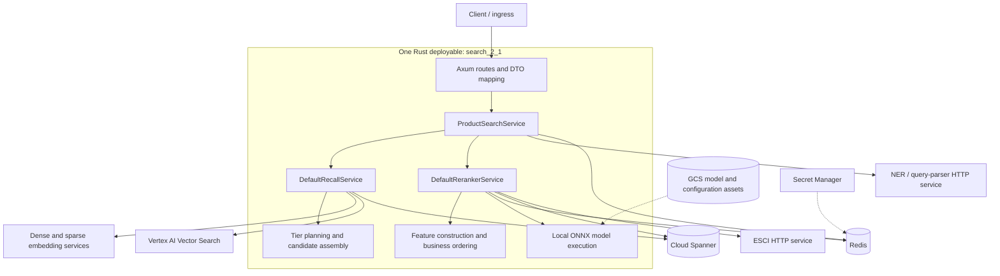

Solid arrows describe request-time calls or internal work. Dashed arrows show supporting initialization dependencies. GCS also supplies startup mappings, described below. This diagram does not imply that every arrow occurs on every request: caches and intent routing can bypass work.[^startup][^recall-wiring]

| Layer | Owns | Concrete entry points |
|---|---|---|
| `api` | HTTP routes, request/response DTOs, error mapping, startup composition | `main.rs`, `lib.rs`, `state.rs`, `handlers/product_search.rs` |
| `domain::product_search` | Session reuse, query understanding policy, filters, route selection, fallback, response meaning | `service.rs`, `intent.rs`, `filters.rs` |
| `domain::recall` | Recall workflow, tier policy, deduplication, expanded candidate assembly | `service.rs`, `policy.rs`, `candidate.rs` |
| `domain::reranker` | Metadata/relevance workflow, feature construction, normalization, final ordering | `pipeline.rs`, `features.rs`, `scoring.rs` |
| `domain::ports` | Interfaces describing the outside capabilities the domain needs | `QueryEmbedder`, `VectorSearch`, `ProductMetadataRepository`, `EsciModel`, and others |
| `infra` | HTTP, Redis, Spanner, GCS, vector-search transport, ONNX adapters | Implementations of domain-owned interfaces |
| `shared` | Configuration, structured logging, tracing | `config/`, `observability.rs` |

The dependency direction and request flow are different views. At startup, API composition code constructs concrete infrastructure adapters. During a request, the domain calls interfaces without needing to know which Redis client, SQL library, or HTTP transport implements them.[^startup]

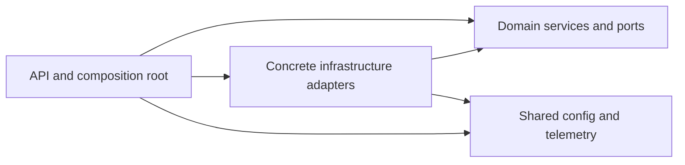

> [!info]- Why keep three services inside one process?
> A product-search call invokes recall and reranker as Rust methods. It avoids serializing and transmitting their large intermediate candidate sets between separate HTTP services. The three responsibilities still have separate domain modules and interfaces. External calls still incur network latency, and local inference still consumes CPU; the architecture alone does not establish a speedup. See [[Microservices]], [[Latency vs Throughput]], and [[Rust and Go]].

### Data that Must Already Exist

The online service consumes several independently maintained data products:

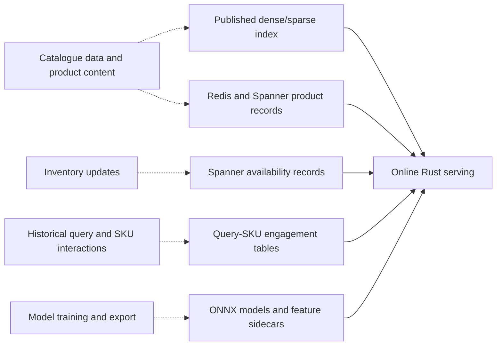

The dashed upstream paths are **conceptual prerequisites**, not verified ingestion job definitions. A consistent serving snapshot needs compatible embedding/index versions, metadata keys, model feature order, and engagement windows. See [[Index Updates]], [[Feature Engineering]], [[Data Leakage]], and [[Learning to Rank]].

## Startup and Shared State

The actual entrypoint is `crates/api/src/main.rs`. It installs a TLS crypto provider, loads configuration, initializes telemetry, builds the app, and binds the listener only after construction succeeds.[^startup]

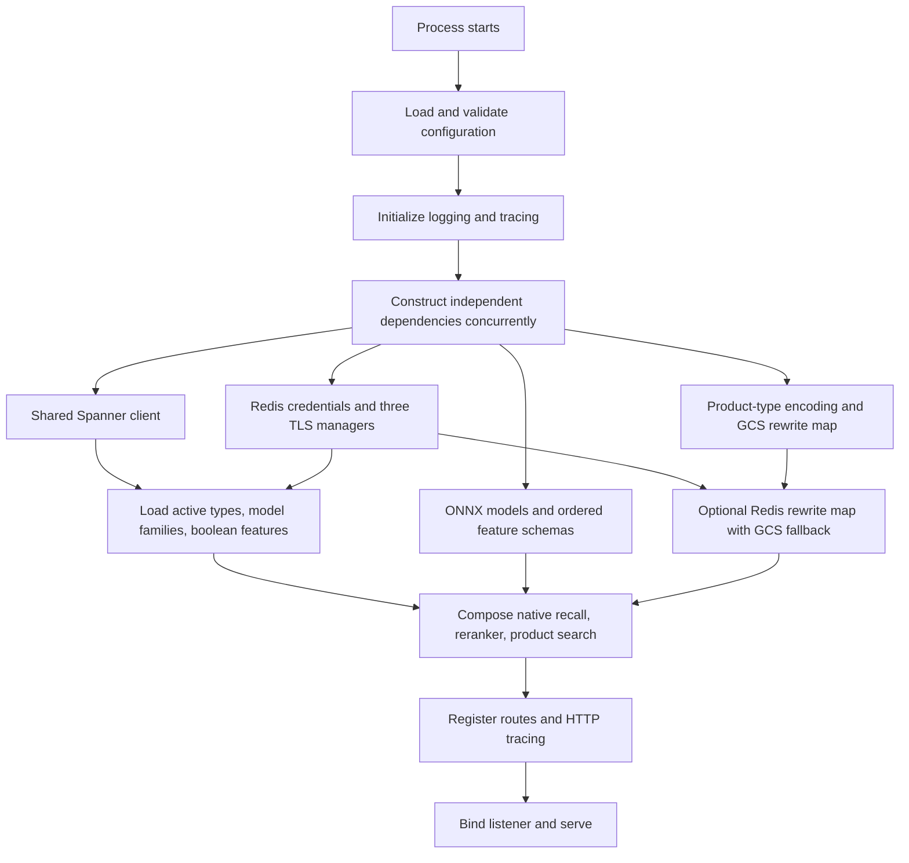

Important construction rules:

- **Required configuration and required dependency construction fail before bind.** A healthy listener therefore means startup completed; it does not guarantee every remote dependency will remain healthy.
- **Both ONNX branches are attempted.** Failure to load the configured default branch aborts startup. Failure of the other branch is logged and tolerated; requests selecting that unavailable branch later fail reranking and can degrade to recall results. The executable loader is more precise than its older introductory comments.[^onnx]
- Product types, active model families, and boolean-feature catalogues are initially loaded and then refreshed by caching adapters. A product-type ranking-map load failure instead yields neutral ranks.
- Query rewriting can load a Redis map, with the already-loaded GCS map as its startup fallback. This is not a new GCS download for each search.
- There are **three independently connected Redis managers**: product search, recall, and reranker. Adapters inside each boundary share its manager; a large command batch in one boundary does not share the same socket with the other two.[^startup]

> [!info]- What `Arc`, traits, and shared state mean here
> `AppState` holds values such as `Arc<dyn RecallService>`. `Arc` is a reference-counted pointer whose reference count can be updated safely across threads. Cloning it shares ownership of the existing service; it does not construct another service. The `dyn` interface permits a concrete production adapter to sit behind the domain contract. `Send + Sync` constraints allow the service to participate in the concurrent server safely. `Arc` alone does not make mutable contents safe: local ONNX sessions use a mutex because execution needs mutable access. This connects ownership to the runtime model described in [[Rust and Go]].[^rust-arc][^onnx]

## End-to-End Request Flow

### Public Contract

The main route is **`POST /api/v1.0/predictions`**. The required fields are `search_id`, `query_id`, and `query`. A minimal illustrative request is:[^api]

```json
{
  "search_id": "example-search-001",
  "query_id": "example-query-001",
  "query": "gaming laptop under 1000",
  "num_results": 100,
  "ab_flag": "test"
}
```

These example IDs and query are explanatory inputs, not a captured production request.

| Input family | Fields and current meaning |
|---|---|
| Identity and query | IDs correlate sessions/logs; query drives understanding and retrieval |
| Size | `num_results` defaults to 100; domain validation accepts 1–1000 |
| Routing | `enable_more_like_this` changes the query into an anchor-SKU request |
| Refinements | `prompt_ids`, `in_stock`, `membership_type`, `enable_marketplace` |
| Geography | `zip_code`, `location_ids`, `location_id_map`, `store_id_map` |
| Fulfillment selections | `same_day_shipping_applied`, `instore_applied`, `store_pickup_applied` |
| Model branch | `ab_flag=test` selects engagement/LTR; other values select baseline; omission uses configuration |
| Exact SKU restriction | `sku_hard_filter_list` becomes a `sku_id` filter and suppresses broad tiers |
| Optional side effect | `persist_interim_results` calls the configured interim-results sink, currently a no-op |

Snake case is canonical; camelCase aliases are accepted. List fields support arrays and legacy comma-delimited strings. Map fields support objects with string-list values and legacy JSON-encoded strings. Integer IDs are accepted by the list-field parser, **not by the map's `Vec<String>` parser**.[^api]

> [!warning]- Requested count, retrieval budget, and response size differ
> `num_results` is validated and passed into recall, but the native tier budgets are fixed by policy. The normal reranker caps output at **100 parents and 5 SKUs per parent**. The response mapper performs no further truncation to `num_results`. Lookup and degraded recall pass-through also follow their own paths. Therefore `num_results=10` is not an enforced promise of ten returned products in this revision. This is a contract question to resolve, not a pagination feature to assume.[^api][^recall-policy][^rank]

### Orchestration Spine

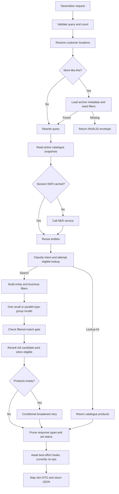

The diagram is the successful/degraded business flow. Propagated dependency errors can terminate earlier; their exact boundaries are in [[#Failures and Fallbacks]].[^product-search]

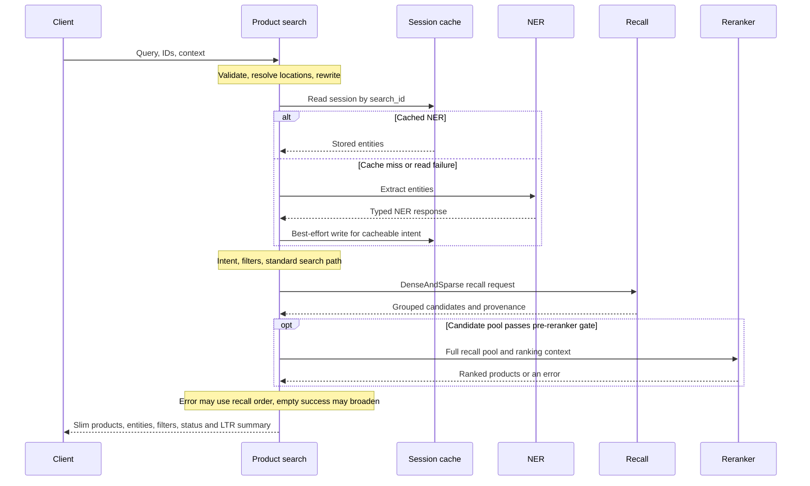

## Query Understanding and Filters

### Session Reuse and Intent

The service captures the original query before MLT or rewriting changes the effective query. It reads active catalogue snapshots, then looks for a cached NER response using **`search_id`**. A hit skips the remote NER call; intent metadata is recomputed. A miss calls the authenticated query parser. Session read/write errors are non-fatal. Fresh product-search and MLT sessions are eligible for best-effort write-back, with a 24-hour TTL in the Redis adapter.[^product-search][^session]

A session is not a cached final result. Recall and ranking still run. Nor is it keyed by every filter, model branch, or query string. Reusing a `search_id` for unrelated text can reuse old entities; correct session identity is part of the caller contract. See [[Search Caching]] and [[Query Understanding]].

The implemented routing distinctions are:

- **MLT:** explicit request flag; anchor preprocessing happens before NER.
- **Product lookup:** on a fresh ordinary search, token extraction and a nonempty Redis catalogue result are required. A digit pattern alone does not establish the route.
- **Product search:** the default route; confidence, NER presence, and multiple-type metadata influence subsequent work.
- **Invalid:** unresolved MLT anchor is a reachable early exit. The text-moderator interface could reject low-confidence input, but its production adapter currently allows all text.
- **More information:** the enum/status exists; the inspected classifier does not implement a clarification-producing branch.[^intent][^product-search]

### From Entities to Constraints

[[Named Entity Recognition]] supplies candidate brands, product types, features, prices, and other entities. These are interpreted by policy rather than forwarded blindly. Active-type filtering, confidence thresholds, type narrowing, and active feature/model-family sets determine what becomes a filter.[^filters]

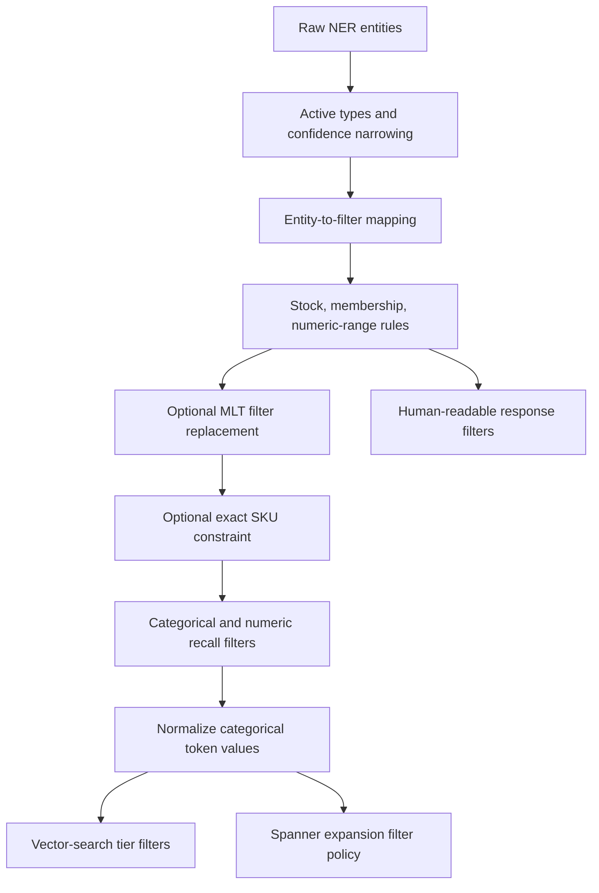

Key rules in this revision:

| Policy | Why it matters |
|---|---|
| Entity-specific thresholds | Type confidence, brand confidence, and model-family confidence have different meanings; there is no universal NER threshold |
| Active model-family gating | A predicted family/variation must pass selection thresholds and the active catalogue check |
| Active boolean features | A feature must be valid for the applicable product type before it constrains retrieval |
| In-stock transformation | Changes order-code filtering; availability additionally depends on location resolution and downstream data |
| Membership mapping | Known memberships rewrite price/deal filters to the associated member columns; arbitrary membership strings are not new supported tiers |
| Numeric-range merging | Adjacent/overlapping bounds are consolidated before recall |
| Categorical normalization | At the recall boundary: trim, lowercase, replace spaces with hyphens, drop empty tokens |
| SKU restriction | Retained even by the broadened fallback; unfiltered tiers must not bypass it |

> [!info]- Why model-family selection is more than one threshold
> In the fresh-session policy, a base model family must first exceed its 0.97 gate before a family or variation survives. The selected value is then checked against the active catalogue. An inactive selected variation does not automatically fall back to the base family. Cached sessions relax the initial gate but still validate the selected value. That means the same raw NER payload can produce different constraints depending on session state and catalogue state. Compare the processed entities and actual filters before attributing a missing product to vector similarity.[^filters]

### Location Resolution Has Precedence Rules

1. If `zip_code` is supplied, resolve it through the location repository. Otherwise start from the caller's `location_id_map`.
2. Preferred stores in `location_ids["user_preferred_store"]`, plus their nearby stores, replace the `instore` group.
3. Applied same-day shipping clears the map when same-day-shipping locations were resolved.
4. Nonempty `instore_applied` or `store_pickup_applied` clears the map independently.

These are the current product-search rules; do not interpret applied store selections as merely adding more locations. Separately, **`store_id_map`** supplies condition-specific retrieval columns for Get It Fast tier expansion. Location availability in recall, availability used for ranking, and prompt rendering are separate paths.[^locations]

## Recall and Candidate Expansion

Recall implements [[Candidate Generation]] using [[Dense Retrieval]] and [[SPLADE|learned sparse retrieval]]. Both modalities feed the native vector-search path. The dense path is configurable: DVS uses an HTTP embedding service; otherwise the adapter uses a Vertex text-embedding model. Sparse embedding remains an HTTP call. Dense and sparse computation run concurrently on a cache miss.[^recall-wiring]

The checked-in T02/P03/P04 values select `text-embedding-005`, not the DVS path. They identify different vector deployments: `productembeddings_v5`, `productembeddings_v16`, and `productembeddings_v15`, respectively. These are configuration observations, not proof of what is currently serving traffic.[^deployment]

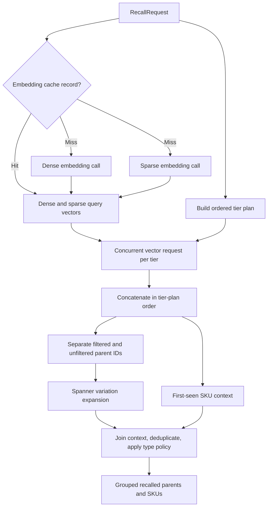

### Tier Planning

A **tier** is a particular modality, filter scope, and business purpose. It has its own vector request and top-K. The following budgets come from `RecallTierStrategy::transport_spec`, not from `num_results`.[^recall-policy]

| Tier label | Modality | Neighbor budget | Main purpose/gate |
|---|---|---:|---|
| `filtered_ranked_dense` | Dense | 100 | Featured rank constraint, when NER is present |
| `filtered_relevant_dense` | Dense | 100 | Featured relevance, when NER is present |
| `filtered_dense` | Dense | 150 | Request's entity-derived filters, when NER is present |
| `filtered_sparse` | Sparse | 100 | Same filtered scope using sparse representation |
| `unfiltered_sparse` | Sparse | 250 | Broader discovery when prompts and SKU hard restrictions do not suppress it |
| `unfiltered_dense` | Dense | 250 | Broader dense discovery; crowding neighbor count 1 |
| `filtered_dense_excluded_conditions` | Dense | 150 | Separate normally excluded conditions when no explicit conditions filter exists |
| `unfiltered_dense_excluded_conditions` | Dense | 250 | Broader excluded-conditions tier, also subject to unfiltered gating |
| `filtered_dense_available_*` | Dense | 100 | Nonempty matching location group |
| `unfiltered_dense_available_*` | Dense | 250 | Availability plus unfiltered eligibility |

The ordinary first four tiers require `ner_present`; excluded-condition tiers have their own gate. Availability groups cover digital, in-store, delivery, and shipping when matching locations exist. Nonempty `store_id_map` entries replace the corresponding base tiers with condition-specific variants. Availability tiers are appended after the fixed tier families.

**Current-source detail:** `build_recall_tiers` builds one query per planned strategy. It does not itself split a multi-valued product-type filter into one physical query per type. The outer multiple-type-group workflow can invoke separate recalls. Do not confuse that outer fan-out with per-tier/per-type expansion described in other revisions.

> [!example]- Calculate a retrieval budget without confusing it with result count
> Suppose NER is present, no prompts or SKU hard filter are applied, no explicit conditions filter exists, and both location maps are empty. The eight base tiers can request `100 + 100 + 150 + 100 + 250 + 250 + 150 + 250 = 1350` raw neighbor rows. Actual results can be fewer. Duplicate SKUs, overlapping parents, variation expansion, relevance filtering, and final caps all change the count afterward. Neither 1,350 raw rows nor 100 requested products means 1,350 or 100 unique relevant products.

### Filter Semantics Differ by Stage

“Unfiltered” means broader than the NER constraints, not unrestricted. Vector-search base guards normally require active products, exclude unclassified types and not-orderable products, and handle refurbished/pre-owned/clearance through dedicated condition tiers. Broad tiers can turn the predicted type allow-list into a deny-list to explore outside the predicted types.[^recall-policy]

Spanner expansion constructs a separate filtered and unfiltered policy. In this checkout:

- Filtered expansion retains request categorical/numeric filters, strips certain availability filters unless the preferred-store condition applies, and inserts an order-code guard when absent.
- Unfiltered expansion keeps a narrower base/conditional availability set and ensures active/order-code guards.
- Filtered expansion does **not** independently add the same missing active guard here. Do not infer identical constraints merely because both paths ultimately query product data.
- SQL conversion handles booleans, string arrays, scalar strings, and numeric restrictions according to supported columns. Unsupported filters can become errors rather than quietly ignored constraints.[^expansion]

See [[Filtered Vector Search]] for why filtering before retrieval and filtering expanded candidates have different effects.

### Deduplication, Parent Expansion, and Provenance

Vector datapoint IDs can encode individual SKUs or combos, such as `sku:*` and `combo:*_sku:*`. They must be parsed into candidate identity before parent expansion. `BSIN`, `VARIATION`, and `COMBO` are different parent kinds; the note uses the repository's BSIN identifier without assuming it is interchangeable with a SKU.[^vector]

Raw tier rows determine which parents enter the two expansion queries. **First-seen SKU deduplication** determines which retrieval context survives when joining the expanded rows. Parent match type comes from the first non-null matching context over ordered variation rows. A parent reached through several tiers therefore cannot safely be assigned provenance from whichever request finished first.[^candidate]

Marketplace variation handling also matters: the policy orders variation rows by marketplace rank, prefers a BSIN represented by vector search in the relevant tie, and keeps one representative per `(parent_id, bsin_id)` before parent assembly. Dense/sparse distances and match type are intermediate ranking evidence, not the final public score.[^recall-policy]

> [!example]- Why concurrency must preserve order
> Tier A returns SKU X after 90 ms. Tier B returns the same SKU X after 20 ms. If A is earlier in the plan, A's context must survive first-seen deduplication. `join_all` runs both requests concurrently but returns their outcomes in input order. A merge in completion order could change X's provenance, parent classification, and later type filtering even though both requests returned the same IDs.[^vector-port]

> [!warning]- Empty expansion is not necessarily an empty recall
> `expand_recalled_products` returns the deduplicated vector neighbors when its variation list is empty. This can preserve candidates without enriched product-type metadata, including after the expansion filtering stage empties the rows. Treat the raw, expanded, post-filter, and final recall counts as distinct evidence. This branch needs specific live validation if eligibility guarantees depend on Spanner expansion.[^recall-policy]

## Reranking and Final Ordering

The product-search orchestrator first checks whether any recall candidates have a `filtered`-prefixed match type. If none do and high-confidence NER types exist, it skips reranking and returns an empty primary result, which can trigger broadening. **When reranking runs, it receives the full recall pool**, not just that filtered subset.[^product-search]

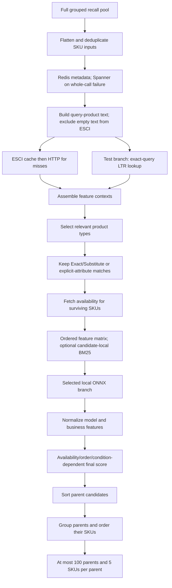

This source sequence is important: metadata first; then ESCI and LTR overlap; then relevance selection; then availability and model execution. Availability is not queried for the entire original pool in parallel with metadata.[^rank]

### Metadata and ESCI

Product metadata comes from Redis. The fallback decorator calls Spanner if the **whole Redis metadata call fails**. A successful Redis read with an empty name or missing fields is accepted as-is; it is not repaired SKU by SKU from Spanner.[^metadata]

ESCI input concatenates cleaned short-name and categorical-feature text. Empty text is excluded from inference. A missing score defaults internally to score zero and Irrelevant; it normally does not survive best-match retention. See [[Cross-Encoder]] and [[ESCI]].

The ESCI cache reads an override hash before the normal configured hash. It sends only remaining misses to the HTTP model and merges results in input order. A cache-read failure sends all inputs to the model. Ordinary inference does not write predictions back to these caches.[^esci]

Type selection considers per-type relevance, high-confidence types actually present in recall, and brand-search policy. Then the live SKU filter retains **Exact or Substitute**, plus `explicit_attribute` matches. The log calls this “clustering,” but the executed filter is class-based; it is not the historical KMeans workflow. Normal product `match_quality` is the selected head SKU's class label; lookup uses its own `BEST_MATCH` label.[^rank][^scoring]

### Exact-Query Engagement Features

In this snapshot, query–SKU LTR features are read from **Spanner** by the metadata decorator. The baseline skips this lookup. The test branch performs the lookup concurrently with ESCI.[^ltr]

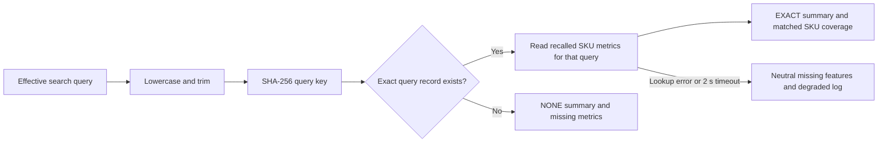

The SQL checks both hash and normalized query text, joins `ltr_queries` with `ltr_query_sku_metrics_v2`, and restricts metrics to the recalled SKU IDs. It reads 16 values: four windows each for clicks, the source's `order_3d_*` fields, add-to-cart, and product-page views. This is exact normalized-query matching; no approximate substitute-query or Gemini rewrite is part of this feature lookup.[^ltr]

An `EXACT` query match does not imply that every recalled SKU has metrics. `ltr_match_summary` distinguishes query match, matched queries, and candidate coverage. Missing values are mapped through the serving feature builder; the inspected metric paths use neutral zero fills. That is an implementation convention to match training, not a general rule that missing means observed zero. See [[Learning to Rank]], [[Click Bias]], and [[Feature Engineering]].

> [!warning]- One empty-result path loses diagnostic context
> If successful ESCI filtering leaves no retained SKUs, this revision returns `RerankerResult::default()`. That loses the computed relevant types and LTR summary on that path. A skip/error handled by product search separately preserves a recall-count-based `NONE` summary. These two empty/degraded outcomes are not equivalent, and later envelope logic cannot reconstruct discarded context.[^rank][^product-search]

### Ordered Features and ONNX Execution

The model artifact and its feature-name sidecar are loaded together. The domain constructs rows **in the sidecar's order**. Inputs include semantic score/class, query length, type encoding, price/deal signals, release-year boost, retrieval distances, featured rank, engagement metrics, and optional [[BM25]] over candidate short names, depending on the selected schema.[^features][^onnx]

Schema validation rejects an empty feature list or unimplemented feature names. Model output must contain one score per retained row. Discount calculation preserves wider price precision until construction of the float32 model matrix, because rounding before the calculation can cross a tree split. Unknown type encodings and feature defaults are logged.

The baseline uses the linear ONNX model; `test` uses the XGBoost engagement ONNX model. Model inference here is a synchronous local call, and each ONNX session is behind a mutex. Parallel external calls do not imply unlimited simultaneous model execution or isolation from runtime-thread CPU pressure.[^onnx][^rank]

### Scores Are Different Quantities

| Quantity | Role |
|---|---|
| Dense/sparse distance | Retrieval-stage evidence from the index |
| ESCI score and class | Query–product relevance and class-based retention |
| ONNX output | Selected baseline/engagement model output for the retained cohort |
| Normalized model score | Min–max scaling over this request's retained model outputs |
| Release-year boost | Business feature, separately normalized |
| Final score | Conditional business combination used within the ordering policy |

For model outputs $x_i$ in a retained cohort $C$, the current min–max rule is:

$$
\hat{x}_i = \frac{x_i-\min_{j\in C}x_j}{\max_{j\in C}x_j-\min_{j\in C}x_j}.
$$

When the range is effectively zero, every value becomes **0.5**. Boost normalization instead divides by the positive maximum and uses zero when no positive maximum exists. These distinctions matter when comparing requests or implementations. See [[Score Normalization]] and [[Probability Calibration]].[^scoring]

Let $m$ be normalized model score, $b$ normalized boost, $c$ normalized cheapness, and $a$ normalized availability. Current `combine_score` uses the following branches; these are source constants for this revision, not general ranking recommendations:

| Condition | Final score |
|---|---|
| Coming soon or sold out | $1+b$ |
| Pre-order | $(1+b\cdot 1/1.1)(1+c\cdot 0.1/1.1)$ |
| Buy/in-store and available | $(1+m\cdot 4/9)(1+a\cdot 5/9)$ |
| Buy/in-store, unavailable, new/open-box | $1+m$ |
| Other current branches | $1+b$ |

Both model branches currently use these same combination factors, but their ONNX scores and feature schemas differ. The historical blueprint's long multiplicative formula is not the executed formula in this checkout.[^scoring]

> [!example]- How a cohort change alters a surviving item's normalized score
> A model gives A=2, B=4, C=6, so B normalizes to 0.5. If C is removed before that normalization and the retained outputs are A=2, B=4, B becomes 1.0 despite unchanged raw prediction. Candidate-local BM25 can also change with the retained text corpus. Compare candidate identities and feature rows before concluding that a changed final score implies a changed model.

### Availability and Two Levels of Ordering

Availability is requested only for SKUs retained after relevance selection. No location map means no availability request. Failed availability reads degrade to an empty map. A returned availability condition must match the SKU's condition before it affects scoring. Product `available` is a fulfillment string or `null`; `null` does not prove the item is out of stock.[^rank][^availability]

Parent order is established by sorting candidate rows using:

1. ESCI class ordinal: Exact, Substitute, Complement, Irrelevant.
2. Order-code ordinal: pre-order; buy/in-store; coming soon; sold out, with source-specific defaults for missing/unknown values.
3. Condition ordinal: new, open-box, clearance, refurbished, pre-owned.
4. Availability priority.
5. Final score descending.
6. Parent ID, then SKU ID, for deterministic ties.

Rows are grouped by parent in that order. **Within each parent**, SKUs are reordered by availability priority, marketplace rank, then SKU ID, and capped at five. The first SKU after this second ordering supplies display metadata, class label, and availability. The selected head can differ from the row that first established the parent's position.[^rank]

This grouping is one form of presentation control; it is not evidence of a separate maximum-marginal-relevance diversification step. See [[Search Result Diversification]].

## Alternative Request Paths

### Direct Product Lookup

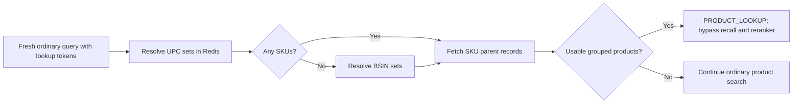

The current catalogue adapter resolves UPC before BSIN, then groups SKU records under their parent identity and applies marketplace ordering. Model lookup is disabled in this adapter. It does not implement the blueprint's general Redis-to-Spanner lookup fallback. A Redis error propagates; an empty successful lookup continues search. The lookup attempt occurs after NER/intent work in the fresh-session path, so bypassing recall/reranking does not mean bypassing all query understanding.[^lookup]

### More-Like-This

For MLT, the incoming query represents an anchor SKU. The metadata provider loads its short name, product type, and price. The service forces in-stock, replaces the effective query with the short name, and seeds a `more_like_this` prompt. The anchor type replaces the NER type constraint; a nonzero anchor price gives a range of **50%–150% of its price**.[^mlt]

Only the MLT whitelist survives the filter rewrite. The whitelist contains `brand`, while ordinary brand mapping uses `co_brands`, so those ordinary brand filters are dropped in the current implementation. The anchor SKU is removed before reranking and again at final assembly; the helper stops after the first parent from which it removes that SKU, an implementation detail worth checking for duplicated combo/variation representations.

> [!example]- Trace an MLT request
> Suppose anchor SKU X has short name “wireless headphones,” type T, and price 200. The effective query becomes the short name, the price range becomes 100–300, and type T becomes the type restriction. A missing/zero price creates no price range. Missing anchor metadata returns HTTP-successful `INVALID` with empty items/entities. Anchor X must not influence its own recommendation ranking. If the primary search is empty, MLT may broaden despite its synthetic prompt, dropping numeric constraints while retaining type, order code, and any SKU hard restriction.

### Multiple Type Groups

High-confidence ordinary searches with multiple types and more than one type token can run one recall per group. Each group gets shared constraints plus its own type and applicable features. Group query IDs append the type token. Calls run concurrently, results merge in group order, and first-seen parent IDs survive cross-group deduplication.[^product-search]

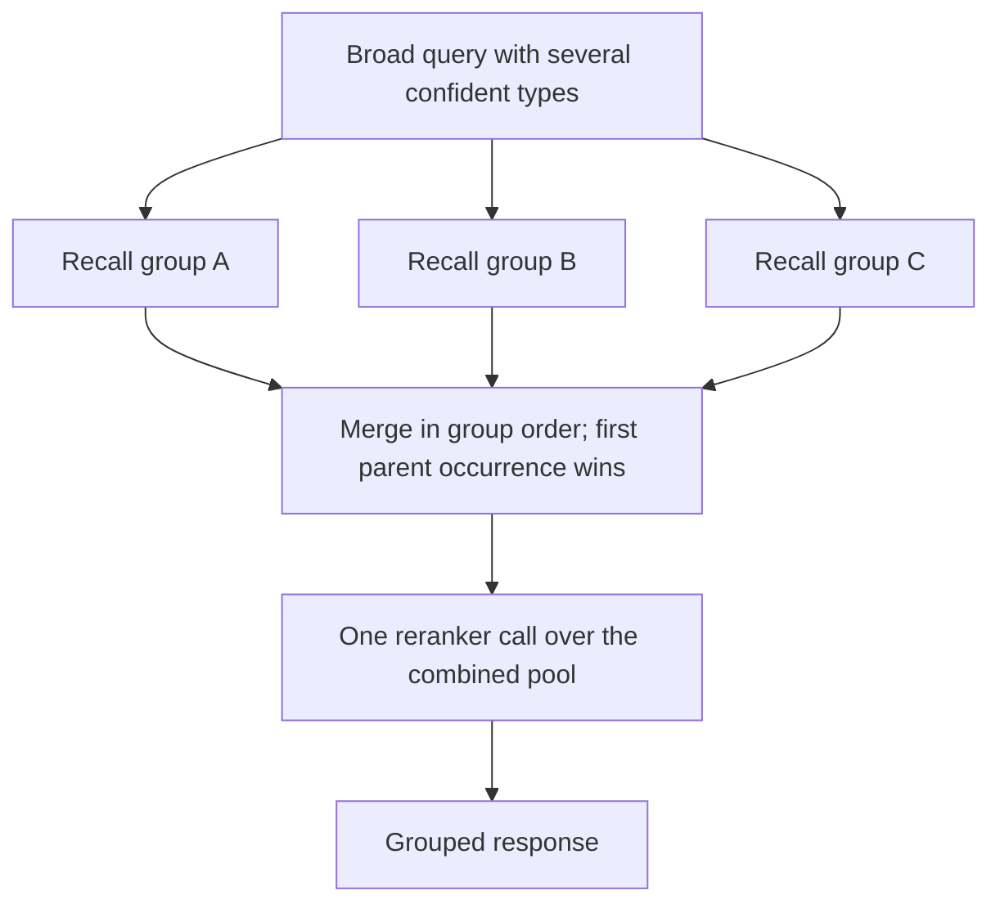

A failed type-group recall contributes no products while other groups can continue. This differs from a failed physical tier inside one recall, which causes that recall to return an error. Also, using multiple recall groups is not identical to returning model status 215: that final status requires a brand query with more than three result types.

## Failures and Fallbacks

There are two different recovery decisions: **reranker error → recall pass-through**, and **empty successful primary result → conditional broadened retry**. Neither guarantees the same relevance or constraints as the main ranked path.[^product-search]

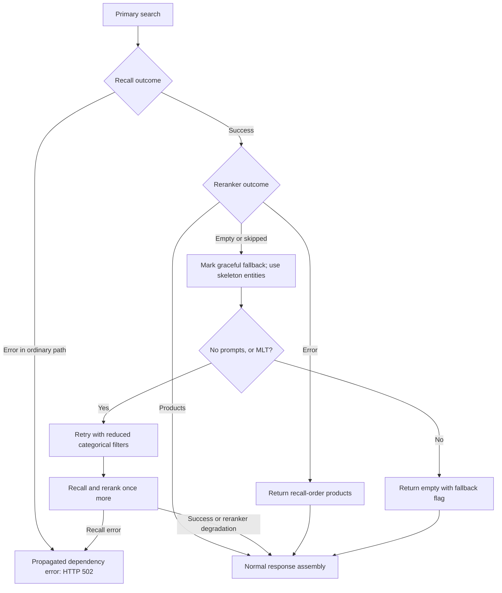

The broadening retains `product_type_id`, `conditions`, and `sku_id` for ordinary search; MLT retains `product_type_id`, `order_code`, and `sku_id`. All numeric filters are removed. With prompts on ordinary search, broadening is skipped. The response keeps the original derived filter list while using fallback entities, so inspect fallback logs for the effective retry constraints. `cache_disabled` is set for fallback without prompts, but the earlier NER-session write may already have happened.[^product-search]

| Situation | Actual boundary behavior | Consequence |
|---|---|---|
| Blank query or count outside 1–1000 | Domain invalid request → 422 | Malformed JSON/extraction errors have separate framework handling |
| Session cache read/write fails | Read becomes miss; write is ignored | NER may run; search can continue |
| NER call fails | Error propagates | Ordinary public request gets generic 502 |
| Embedding cache misses | Compute embeddings | Cache is read-only in this path |
| Embedding cache read/decode fails | Error propagates; no inner-embedder fallback | Cache failure differs from a cache miss |
| One vector tier fails | All joined outcomes are collected, then an error propagates from recall | A `partial_error` log is not partial-success serving |
| One outer type-group recall fails | Omit that group's products | Combined results can still be returned |
| Spanner variation expansion fails | Recall error propagates | No general Python recall fallback |
| Whole Redis metadata call fails | Try Spanner metadata | Missing fields on a successful Redis response do not trigger this |
| ESCI cache read fails | Score all inputs using HTTP model | A slower path can still succeed |
| ESCI HTTP or ONNX scoring fails | Reranker errors; product search uses recall-order products | HTTP 200 can conceal loss of ranking unless logs are inspected |
| LTR lookup fails or times out | Neutral features and `NONE` summary | Test branch can still execute |
| Availability fails or locations are absent | Empty availability map | `available=null` is ambiguous |
| No retained ESCI candidates | Empty successful reranker result | Can trigger broader search; summary-loss caveat applies |
| Unresolved MLT anchor | `INVALID` business envelope | Different from invalid HTTP input |
| Prompt provider/event/interim sink | Production adapters currently empty/no-op | Interface calls do not imply real prompt generation or persistence |

Sources for the table: product-search orchestration, cache decorators, recall assembly, reranker pipeline, and centralized API error mapping.[^product-search][^embedding-cache][^candidate][^metadata][^esci][^rank][^api]

> [!info]- An HTTP timeout is not the complete request budget
> The common authenticated HTTP client uses a 5-second per-request timeout. LTR SQL has a separate 2-second deadline. A full search can make several sequential phases, wait on a concurrent fan-out, and run a broadened retry. There is no single global end-to-end deadline evident in the inspected route/service wiring. Summing child spans also overcounts overlapping work. See [[Tail Latency]].[^http][^ltr]

## Response Mapping

The response includes `search_id`, `query_id`, `query_intent`, `customer_filter_context`, `items`, `prompts`, `entities`, `filters`, `model_status`, `model_status_info`, `cache_disabled`, `is_graceful_fallback`, and `ltr_match_summary`.[^api]

Each public item is slim:

```json
{
  "id": "example-parent",
  "type": "BSIN",
  "skus": [{"id": "example-sku"}],
  "product_type": "Example type",
  "match_quality": "Exact",
  "available": null
}
```

This is a structural example, not a measured response. **Per-SKU scores, retrieval match metadata, and domain `product_id` are omitted by this revision's public DTO.** In particular, it does not expose `esci_score` on each SKU. Debugging score parity requires logs or a separately verified diagnostic interface.

| Model status | Meaning in this source |
|---:|---|
| 210 | Product search; also fallback without prompts, even when no products survive |
| 211 | More information; defined but no implemented classifier branch identified |
| 212 | Invalid business intent |
| 214 | No SKU, when earlier status precedence does not override it |
| 215 | Brand search with more than three reranked result types |
| 217 | More-like-this with results |
| 222 | Successful direct product lookup |

These are **body status values**, not HTTP status codes. `query_intent` and final `model_status` encode different information. Successful transport, nonempty results, relevance quality, and healthy dependencies should be monitored separately.[^result]

## Cache, Storage, and Freshness

| Data | Current owner/source | Behavior relevant to correctness |
|---|---|---|
| NER session | Product-search Redis | Prefix plus search ID; 24-hour TTL; best-effort reads/writes |
| Query rewrite map | Startup-loaded Redis or GCS | Redis load can fall back to GCS; used as an in-memory mapping during requests |
| Active types/features/families | Background-refresh adapters | Catalogue state gates constraints; warm snapshots differ from querying tables every request |
| Query embeddings | Recall Redis decorator | Lowercased query appended to configured prefix; externally populated; no request write-back |
| Product/anchor/identifier metadata | Redis; selected metadata fallback to Spanner | Lookup, MLT, and reranker metadata have different fallback contracts |
| ESCI predictions | Reranker Redis hashes | Override before normal; partial misses inferred remotely; no ordinary write-back |
| Query–SKU engagement | Spanner | Test branch only; exact-query SQL; 2-second lookup deadline |
| Expanded variants | Spanner | Separate filtered/unfiltered query policies; 15-second exact-staleness read |
| Availability | Spanner plus per-process cache | 15-second exact-staleness read; cache TTL 5 seconds, capacity 64 requests |
| ONNX models and feature schemas | GCS at startup | Model selection remains request-specific after load |

Availability cache keys canonicalize the SKU set and fulfillment-to-location mapping. Concurrent identical misses share one backend operation. Its short cache lifetime adds potential age on top of the database snapshot age; “real-time availability” should not be read as a transactionally fresh stock guarantee.[^availability]

> [!warning]- Cache policies are not interchangeable
> Session cache failure becomes a miss; ESCI cache failure invokes the model; embedding cache failure propagates. Metadata fallback reacts to a whole-call error, not missing fields. A broad statement such as “Redis is optional” or “all caches fail open” would be false. These differences belong in operational dashboards and incident diagnosis, alongside hit rate and latency. See [[Search Caching]].

The older blueprint describes multi-region Redis replication and additional prompt/result caches. The inspected Rust composition selects a regional host and constructs service-scoped managers; it does not establish that broader replication/failover contract. Deployment topology and upstream writers must be verified separately.

## Observability and Diagnosis

Structured logs carry search/query IDs, stage timings, filters, candidate counts, cache decisions, model branch, and degradation events. Candidate and feature digests make it possible to compare identities without printing entire matrices. OpenTelemetry export is configured separately from JSON logging.[^telemetry]

The current HTTP middleware deliberately starts a new application trace root instead of inheriting ingress parent context. Downstream calls inject trace context. Recall/reranker spans carry distinguishing component/service fields inside the single deployable; that should not be confused with three independently deployed services or automatically assumed separate exporter resources.

| Compare in this order | Evidence to inspect | What a difference suggests |
|---|---|---|
| 1. Runtime identity | Live image/hash, environment, model/index configuration | Deployment drift before a code hypothesis |
| 2. Query processing | Original/effective query, session hit, processed NER, filters | Rewrite/session/entity-policy divergence |
| 3. Embedding identity | Source/cache branch, dimensions, vector digests | Model or cached-vector divergence |
| 4. Tier plan | Labels, filters, budgets, physical request count | Different retrieval scope |
| 5. Recall funnel | Raw, deduplicated, expanded, post-filter, parent and SKU counts | Merge, expansion, or eligibility difference |
| 6. Reranker input | Canonical SKU digest and empty-text digest | Metadata completeness or earlier cohort difference |
| 7. Relevance/features | ESCI classes, LTR coverage, ordered schema and column digests | Cache/model/feature source or transformation difference |
| 8. Ordering/output | ONNX scores, normalized scores, parent cutoff, head SKU | Business ordering, tie-breaking, grouping, or DTO difference |

Useful source events include `product_search.request.received`, `product_search.recall.completed`, `recall.native.embedding_identity`, `recall.native.funnel_summary`, `reranker.native.input_candidates`, `reranker.native.post_esci_candidates`, `reranker.native.onnx_features_prepared`, `reranker.native.onnx_score_identity`, and `product_search.reranker.degraded`.[^product-search][^candidate][^rank]

> [!tip]- Diagnose the first difference, not the last visible score
> If Python scores 60 SKUs and Rust scores 400, compare retrieval and metadata completeness before comparing ranker weights. If SKU identities and raw outputs match but final scores differ, compare normalization cohorts and availability. If all intermediate results match but JSON differs, inspect the DTO. A live image mismatch invalidates the assumption that the inspected checkout explains the observed response.

For quality evaluation, keep four questions distinct: **candidate coverage**, **ranking quality**, **online customer outcomes**, and **serving performance**. Specify query/corpus snapshot, parent-versus-SKU unit, cutoff, judgment rubric, missing judgments, and aggregation before using [[NDCG]] or recall measurements. See [[Search Evaluation]] and [[Monitoring - MLOPS]].

## Deployment and Runtime Lifecycle

The checked-in deployment separates application image construction from MLCore promotion/deployment. The second build receives the image path and revision from a Pub/Sub handoff; it must not silently select an image from its own checkout.[^deployment]

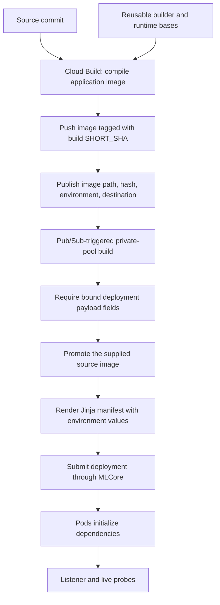

The app Dockerfile cross-compiles `search_2_1` for Linux ARM64 using the build platform's compiler, then copies the binary into the runtime image. The runtime uses an unprivileged user. Environment-specific values select projects, service names, caches, models, and vector deployments. This note intentionally points to those files rather than duplicating their entire configuration.[^deployment]

- `/health` and `/live` are mounted in all environments. Debug recall and reranker routes are mounted only when `APP_ENV` is not `Prod`.
- The manifest uses `/live` for both readiness and liveness. It is a process-level handler, not a dependency probe. Loss of one data source should be diagnosed through request behavior and telemetry.
- CPU/memory requests are essential to the manifest's percentage-based horizontal autoscaling targets. The renderer validates resource requirements.
- The present Cargo release profile favors iteration: application `opt-level=0`, dependency `opt-level=2`, and LTO off. Performance claims require the intended profile and matched runtime configuration.
- SIGINT/SIGTERM initiate graceful HTTP shutdown; after serving drains, the process flushes its trace provider and releases the logging guard.[^startup][^deployment]

The deployment Pub/Sub flow above is real checked-in infrastructure. It is separate from **search-result event publishing**, whose runtime adapter is still a no-op.

## Worked End-to-End Walkthrough

Consider `gaming laptop under 1000` with a fresh search ID, no prompts, and `ab_flag=test`. This is an illustrative trace; actual NER output, tier results, and order require a live request.

1. The API parses input and the domain validates the nonblank query and result count.
2. Location context is resolved if supplied. Rewriting may change the effective query; the original text is preserved for ranking context.
3. A session miss calls NER. **Assume** NER supplies an active laptop type and a valid maximum-price entity. Policy builds the corresponding type/price filters and any business adjustments.
4. Recall obtains dense/sparse vectors, possibly from the read-only embedding cache. Policy creates eligible filtered, broad, excluded-condition, and location tiers.
5. Tier outcomes merge in plan order. Raw parents are expanded in Spanner, first-seen SKU context is joined, and the service assembles grouped candidates.
6. If the filtered-match gate permits it, the full pool enters reranking. Redis supplies metadata; only a whole-call failure invokes metadata fallback.
7. ESCI and exact-query LTR lookup overlap. **Assume** the normalized query exists but only some candidates have metrics: query match is `EXACT`, while feature coverage is partial.
8. Type/class filtering selects the scoring cohort. Availability is fetched for surviving SKUs when locations exist; the test ONNX schema determines the ordered model matrix.
9. Raw outputs are normalized, business scoring and parent ordering are applied, and each parent gets its own ordered SKU list.
10. Public mapping emits IDs and display metadata, with diagnostic envelope fields but without individual scores. If the primary result is empty, the allowed broader retry can remove the price constraint; the fallback flag must therefore be read with the result.

> [!question]- Revision exercise
> Trace three changes to the example: (1) the session ID already exists with unrelated entities; (2) ESCI cache fails but model inference succeeds; (3) one vector tier fails. Identify which stages rerun, which errors propagate, and whether an HTTP 200 remains possible. Then explain why `available=null`, LTR `NONE`, and an empty `items` array each have multiple possible causes.

## Known Gaps and Review Questions

These are findings or explicit boundaries of the inspected revision, not instructions to change the serving repository as part of this note.

| Area | Source-backed current state | Follow-up needed |
|---|---|---|
| Applied prompts | `EmptyPromptProvider`; response prompts remain empty | Implement and verify the actual AppliedMerging contract if required |
| Search events | `NoopSearchEventPublisher` | Real prompt/overview event payload and publisher |
| Interim persistence | `NoopInterimResultsSink`; hook receives a final-result wrapper | Correct stage payload and real storage adapter |
| Moderation | `AllowAllTextModerator` | Clarify intended product behavior before claiming active moderation |
| Explicit attribute requests | Public DTO lacks the broader explicit categorical/numeric request contract discussed by migration notes | Verify required structured-retrieval scope |
| ESCI refresh | No per-request `cache_esci` field in the public DTO | Verify ownership of any scheduled refresh workflow separately |
| Requested result count | Validated but not consistently enforced downstream | Define response-size/pagination contract |
| Empty ESCI cohort | Default reranker result drops types and LTR summary | Preserve diagnostics if the intended contract requires them |
| Recall policies | No inner per-type tier expansion; filtered expansion lacks an inserted active guard | Compare the intended revision and matched Python behavior before changing either |
| Freshness and region behavior | Read staleness and caches are visible; upstream writers/replication were not traced | Establish catalogue, vector, feature, and inventory freshness contracts |
| Deployment and parity | Local code/config inspected; no live calls made | Match image, inputs, dependencies, cohorts, and ordering in the target environment |

Two documentation traps were resolved by reading code: the public API now sanitizes external errors to `upstream dependency failed`, although its endpoint note still describes a leak; and current recall policy gates differ from older statements that only `DenseAndSparse` unlocks tiers. More generally, old comments about remote reranker calls, unconditional model-load tolerance, public scores, KMeans, or Redis LTR should not override this checkout's executable path.[^api][^recall-policy][^onnx][^ltr]

### Review Boundary and Open Work

- Substantively reviewed: startup composition; product-search orchestration, filters and variants; recall tier/candidate code and key adapters; reranker pipeline/scoring and feature lookup; DTO mapping; cache/fallback behavior; observability; checked-in deployment wiring.
- Linked as prerequisites: the existing conceptual notes. This pass is not a fresh factual review of those notes or the whole vault.
- No Rust source was changed, no Rust tests or compile checks were run, and no deployment, model inference, benchmark, or live parity result is claimed.
- Documentation checks: all 14 diagrams passed the installed Mermaid parser in a parse-only harness; internal links, heading targets, footnotes, source targets, and Markdown structure were checked. The note opened in Obsidian, but a complete visual/layout and folding-interaction review was not completed because the app was in active use.
- #TODO Capture one matched, result-bearing request for each branch: ordinary baseline/test, lookup hit/miss, MLT found/missing, multiple type groups, prompt-selected empty result, and degraded dependencies.
- #TODO Trace the upstream writers and version/freshness contracts for the vector index, embedding/ESCI caches, metadata, availability, and LTR tables.

## References & Useful Links

All implementation statements above were checked against the local snapshot recorded at the top. Source links use the verified repository remote and the recorded commit, so switching the local branch does not change their target. They require access to the private repository; their contents were reviewed locally rather than fetched from GitHub.

[^map]: [serving-rs knowledge index](https://github.com/bby-corp/aml-ai-search/blob/1dfaa528621e7306135ffc62a0972508091cd4f9/serving-rs/knowledge/index.md) and [Rust architecture reference](https://github.com/bby-corp/aml-ai-search/blob/1dfaa528621e7306135ffc62a0972508091cd4f9/serving-rs/knowledge/architecture/rust-serving.md) — Repository concept map and intended boundaries; checked against executable source. [Historical Search 2.0 blueprint](https://github.com/bby-corp/aml-ai-search/blob/1dfaa528621e7306135ffc62a0972508091cd4f9/serving-rs/knowledge/architecture/search-2-production.md) — Migration context, not an authoritative statement of current runtime behavior.
[^startup]: [main.rs](https://github.com/bby-corp/aml-ai-search/blob/1dfaa528621e7306135ffc62a0972508091cd4f9/serving-rs/crates/api/src/main.rs), [app construction](https://github.com/bby-corp/aml-ai-search/blob/1dfaa528621e7306135ffc62a0972508091cd4f9/serving-rs/crates/api/src/lib.rs), and [AppState composition](https://github.com/bby-corp/aml-ai-search/blob/1dfaa528621e7306135ffc62a0972508091cd4f9/serving-rs/crates/api/src/state.rs) — Startup sequence, dependency construction, adapters, Redis ownership, and shutdown.
[^api]: [Product-search DTOs](https://github.com/bby-corp/aml-ai-search/blob/1dfaa528621e7306135ffc62a0972508091cd4f9/serving-rs/crates/api/src/dtos/product_search.rs), [handler](https://github.com/bby-corp/aml-ai-search/blob/1dfaa528621e7306135ffc62a0972508091cd4f9/serving-rs/crates/api/src/handlers/product_search.rs), [error mapping](https://github.com/bby-corp/aml-ai-search/blob/1dfaa528621e7306135ffc62a0972508091cd4f9/serving-rs/crates/api/src/handlers/error.rs), and [routes](https://github.com/bby-corp/aml-ai-search/blob/1dfaa528621e7306135ffc62a0972508091cd4f9/serving-rs/crates/api/src/routes/mod.rs) — Accepted inputs, slim serialization, generic 502, and route visibility.
[^product-search]: [ProductSearchService](https://github.com/bby-corp/aml-ai-search/blob/1dfaa528621e7306135ffc62a0972508091cd4f9/serving-rs/crates/domain/src/product_search/service.rs) — `search`, `recall_and_rerank`, `multi_type_group_search`, `broadened_fallback_filters`, and `publish_and_persist` define orchestration and recovery.
[^intent]: [Intent policy](https://github.com/bby-corp/aml-ai-search/blob/1dfaa528621e7306135ffc62a0972508091cd4f9/serving-rs/crates/domain/src/product_search/intent.rs) — Classifier, confidence metadata, and type thresholds; lookup is finalized by the orchestrator rather than by numeric syntax alone.
[^filters]: [Entity/business filter policy](https://github.com/bby-corp/aml-ai-search/blob/1dfaa528621e7306135ffc62a0972508091cd4f9/serving-rs/crates/domain/src/product_search/filters.rs) — NER projection, feature/model-family gating, membership mapping, stock rules, and numeric-range merging.
[^locations]: [Location resolution in product search](https://github.com/bby-corp/aml-ai-search/blob/1dfaa528621e7306135ffc62a0972508091cd4f9/serving-rs/crates/domain/src/product_search/service.rs) and [Redis location adapter](https://github.com/bby-corp/aml-ai-search/blob/1dfaa528621e7306135ffc62a0972508091cd4f9/serving-rs/crates/infra/src/location/redis.rs) — `resolve_location_id_map`, ZIP/store reads, and precedence.
[^session]: [Redis session cache](https://github.com/bby-corp/aml-ai-search/blob/1dfaa528621e7306135ffc62a0972508091cd4f9/serving-rs/crates/infra/src/cache/redis.rs) — Search-keyed stored NER/intent and 86,400-second TTL.
[^recall-wiring]: [Recall service construction](https://github.com/bby-corp/aml-ai-search/blob/1dfaa528621e7306135ffc62a0972508091cd4f9/serving-rs/crates/infra/src/recall.rs), [HTTP embedding adapter](https://github.com/bby-corp/aml-ai-search/blob/1dfaa528621e7306135ffc62a0972508091cd4f9/serving-rs/crates/infra/src/embeddings/http.rs), and [Vertex embedding adapter](https://github.com/bby-corp/aml-ai-search/blob/1dfaa528621e7306135ffc62a0972508091cd4f9/serving-rs/crates/infra/src/embeddings/vertex.rs) — Native recall, configurable dense source, sparse calls, and concurrent embeddings.
[^embedding-cache]: [Read-only embedding cache](https://github.com/bby-corp/aml-ai-search/blob/1dfaa528621e7306135ffc62a0972508091cd4f9/serving-rs/crates/infra/src/embeddings/cache.rs) — Key construction, cache miss versus error, JSON/sparse validation, and absence of write-back.
[^recall-policy]: [Recall policy](https://github.com/bby-corp/aml-ai-search/blob/1dfaa528621e7306135ffc62a0972508091cd4f9/serving-rs/crates/domain/src/recall/policy.rs) — `build_recall_tiers`, `transport_spec`, expansion filters, parent context, marketplace reduction, and empty-expansion behavior.
[^candidate]: [Candidate assembly](https://github.com/bby-corp/aml-ai-search/blob/1dfaa528621e7306135ffc62a0972508091cd4f9/serving-rs/crates/domain/src/recall/candidate.rs) and [recall service](https://github.com/bby-corp/aml-ai-search/blob/1dfaa528621e7306135ffc62a0972508091cd4f9/serving-rs/crates/domain/src/recall/service.rs) — Embedding identity, ordered merge, first-seen SKU context, error propagation, and funnel counts.
[^vector-port]: [Vector-search port and ordered fan-out](https://github.com/bby-corp/aml-ai-search/blob/1dfaa528621e7306135ffc62a0972508091cd4f9/serving-rs/crates/domain/src/ports/vector_search.rs) — One concurrent physical call per planned tier via `join_all`.
[^vector]: [Matching Engine adapter](https://github.com/bby-corp/aml-ai-search/blob/1dfaa528621e7306135ffc62a0972508091cd4f9/serving-rs/crates/infra/src/vector_search/matching_engine.rs) — Transport construction and `neighbors_to_raw_recalled_products` datapoint parsing.
[^expansion]: [Spanner recall variation adapter](https://github.com/bby-corp/aml-ai-search/blob/1dfaa528621e7306135ffc62a0972508091cd4f9/serving-rs/crates/infra/src/metadata/recall_variations.rs) — Typed SQL filters, parent expansion, and read-staleness setting; filter policy itself lives in `recall/policy.rs`.
[^rank]: [Reranker pipeline](https://github.com/bby-corp/aml-ai-search/blob/1dfaa528621e7306135ffc62a0972508091cd4f9/serving-rs/crates/domain/src/reranker/pipeline.rs) and [service](https://github.com/bby-corp/aml-ai-search/blob/1dfaa528621e7306135ffc62a0972508091cd4f9/serving-rs/crates/domain/src/reranker/service.rs) — Branch selection, candidate retention, availability timing, model execution, parent/SKU ordering, caps, and diagnostics.
[^metadata]: [Metadata fallback decorator](https://github.com/bby-corp/aml-ai-search/blob/1dfaa528621e7306135ffc62a0972508091cd4f9/serving-rs/crates/infra/src/metadata/fallback.rs) — Whole-call Redis-to-Spanner fallback; direct secondary delegation for LTR features.
[^esci]: [ESCI cache decorator](https://github.com/bby-corp/aml-ai-search/blob/1dfaa528621e7306135ffc62a0972508091cd4f9/serving-rs/crates/infra/src/esci/redis_caching.rs) and [HTTP adapter](https://github.com/bby-corp/aml-ai-search/blob/1dfaa528621e7306135ffc62a0972508091cd4f9/serving-rs/crates/infra/src/esci/http.rs) — Override/normal caches, misses, inference, and read-error behavior.
[^ltr]: [Spanner metadata/LTR adapter](https://github.com/bby-corp/aml-ai-search/blob/1dfaa528621e7306135ffc62a0972508091cd4f9/serving-rs/crates/infra/src/metadata/spanner.rs) — `LTR_FEATURE_QUERY`, exact-query normalization, 16 metrics, summary, and two-second timeout.
[^features]: [Feature construction](https://github.com/bby-corp/aml-ai-search/blob/1dfaa528621e7306135ffc62a0972508091cd4f9/serving-rs/crates/domain/src/reranker/features.rs) — Supported model feature names and missing-value conventions.
[^onnx]: [ONNX loaders/executors](https://github.com/bby-corp/aml-ai-search/blob/1dfaa528621e7306135ffc62a0972508091cd4f9/serving-rs/crates/infra/src/reranker/onnx_models.rs) — Default-branch failure policy, optional branch, sidecars, output extraction, and synchronized sessions.
[^scoring]: [Ranking/scoring functions](https://github.com/bby-corp/aml-ai-search/blob/1dfaa528621e7306135ffc62a0972508091cd4f9/serving-rs/crates/domain/src/reranker/scoring.rs) — Relevant-type selection, BM25, normalization, score factors, conditional formula, and ordinal policies.
[^availability]: [Availability cache](https://github.com/bby-corp/aml-ai-search/blob/1dfaa528621e7306135ffc62a0972508091cd4f9/serving-rs/crates/infra/src/availability/caching.rs) and [Spanner availability adapter](https://github.com/bby-corp/aml-ai-search/blob/1dfaa528621e7306135ffc62a0972508091cd4f9/serving-rs/crates/infra/src/availability/spanner.rs) — Canonical request keys, shared concurrent misses, cache limits, fulfillment reads, and staleness.
[^lookup]: [Lookup domain policy](https://github.com/bby-corp/aml-ai-search/blob/1dfaa528621e7306135ffc62a0972508091cd4f9/serving-rs/crates/domain/src/product_search/product_lookup.rs) and [Redis catalogue adapter](https://github.com/bby-corp/aml-ai-search/blob/1dfaa528621e7306135ffc62a0972508091cd4f9/serving-rs/crates/infra/src/catalog/redis.rs) — Identifier parsing, UPC/BSIN resolution, and parent grouping.
[^mlt]: [MLT transforms](https://github.com/bby-corp/aml-ai-search/blob/1dfaa528621e7306135ffc62a0972508091cd4f9/serving-rs/crates/domain/src/product_search/more_like_this.rs) and [Redis anchor adapter](https://github.com/bby-corp/aml-ai-search/blob/1dfaa528621e7306135ffc62a0972508091cd4f9/serving-rs/crates/infra/src/mlt/redis.rs) — Price/type constraints, filter whitelist, and anchor removal.
[^result]: [Domain response and model status](https://github.com/bby-corp/aml-ai-search/blob/1dfaa528621e7306135ffc62a0972508091cd4f9/serving-rs/crates/domain/src/product_search/result.rs) — Status code meanings; final precedence is in `service.rs::determine_model_status`.
[^http]: [Authenticated HTTP client](https://github.com/bby-corp/aml-ai-search/blob/1dfaa528621e7306135ffc62a0972508091cd4f9/serving-rs/crates/infra/src/clients/http.rs) — Identity-token requests, tracing context, and default per-call timeout.
[^telemetry]: [Shared observability](https://github.com/bby-corp/aml-ai-search/blob/1dfaa528621e7306135ffc62a0972508091cd4f9/serving-rs/crates/shared/src/observability.rs) and [HTTP trace middleware](https://github.com/bby-corp/aml-ai-search/blob/1dfaa528621e7306135ffc62a0972508091cd4f9/serving-rs/crates/api/src/middleware/http_trace.rs) — Exporter/sampling configuration, new ingress trace roots, outgoing propagation, and flush.
[^deployment]: [Image build](https://github.com/bby-corp/aml-ai-search/blob/1dfaa528621e7306135ffc62a0972508091cd4f9/serving-rs/deploy/product-search-deployment-image.yaml), [MLCore deployment build](https://github.com/bby-corp/aml-ai-search/blob/1dfaa528621e7306135ffc62a0972508091cd4f9/serving-rs/deploy/product-search-mlcore-sdk.yaml), [Dockerfile](https://github.com/bby-corp/aml-ai-search/blob/1dfaa528621e7306135ffc62a0972508091cd4f9/serving-rs/deploy/Dockerfile.Product_Search), [manifest template](https://github.com/bby-corp/aml-ai-search/blob/1dfaa528621e7306135ffc62a0972508091cd4f9/serving-rs/deploy/manifest/template/product-search.yaml.j2), [renderer](https://github.com/bby-corp/aml-ai-search/blob/1dfaa528621e7306135ffc62a0972508091cd4f9/serving-rs/deploy/manifest/render.py), [T02 values](https://github.com/bby-corp/aml-ai-search/blob/1dfaa528621e7306135ffc62a0972508091cd4f9/serving-rs/deploy/manifest/values/t02.yaml), [P03 values](https://github.com/bby-corp/aml-ai-search/blob/1dfaa528621e7306135ffc62a0972508091cd4f9/serving-rs/deploy/manifest/values/p03.yaml), [P04 values](https://github.com/bby-corp/aml-ai-search/blob/1dfaa528621e7306135ffc62a0972508091cd4f9/serving-rs/deploy/manifest/values/p04.yaml), and [Cargo profiles](https://github.com/bby-corp/aml-ai-search/blob/1dfaa528621e7306135ffc62a0972508091cd4f9/serving-rs/Cargo.toml) — Source-image handoff, environment configuration, runtime resources/probes, and current compilation profile.
[^rust-arc]: [Rust standard library: Arc](https://doc.rust-lang.org/std/sync/struct.Arc.html) — Shared ownership, cloning, and thread-safety constraints; consulted 26 September 2026.
[^format]: [Obsidian callouts](https://obsidian.md/help/callouts) and [Mermaid flowchart syntax](https://mermaid.js.org/syntax/flowchart.html) — Native foldable callouts and diagram notation; consulted 26 September 2026.
