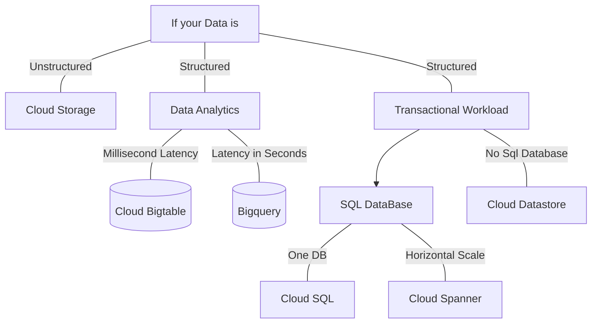

## Choosing the right DB

 Type | Cloud Storage | Cloud SQL | Datastore | Bigtable | BigQuery
 -|-|-|-|-|-|
 Capacity | Petabytes + | Gigabytes | Terabytes | Petabytes | Petabytes
 Access metaphor |Like files in a file system | Relational DB | Persistent Hashmap | Key-value,HBase API |Data warehouse
 Read | Have to copy to local disk | Select Rows | filter objects on property | scan rows | Select rows
 Write | One file | Insert row | put object | put row | Batch/stream
 Update granularity | An object (a file) | Field | Attribute | Row | Field
 Usage | Store blobs | No-ops SQL DB on Cloud | Structred data from App Engine apps | No-ops, high throughput, scalable, flattened data | Interactive SQL* querying fully managed warehouse
 
 ## Selection Flow Chart
 
